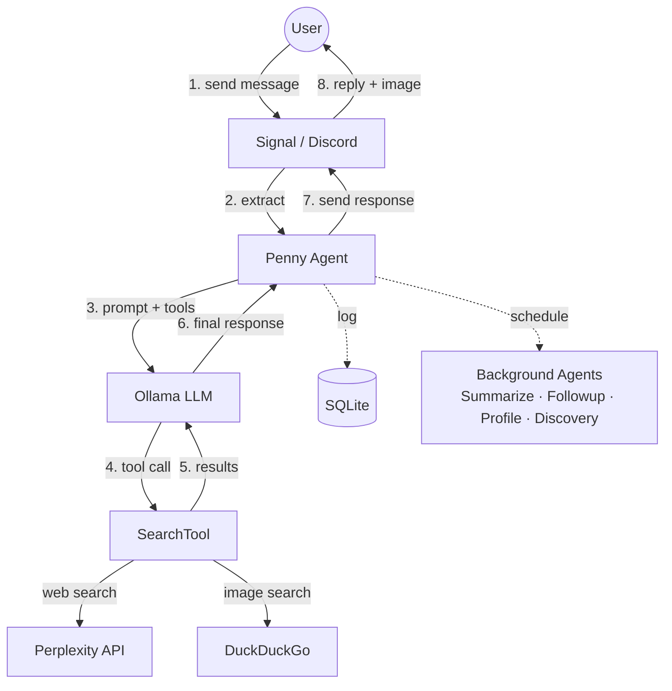

# CLAUDE.md — Penny Project Context

## Environment Notes

- **Logs**: Runtime logs are written to `data/penny.log` (not docker compose logs)

## Git Workflow

Branch protection is enabled on `main`. All changes must go through pull requests.

- **Never push directly to `main`** — always create a feature branch
- Create a descriptive branch name (e.g., `add-codeowners-filtering`, `fix-scheduler-bug`)
- Commit changes to the branch, then push and create a PR
- **Use `make token` for GitHub operations**: `GH_TOKEN=$(make token) gh pr create ...`
  - This generates a GitHub App installation token for authenticated `gh` CLI access
- The user will review and merge the PR

## Documentation Maintenance

**IMPORTANT**: Always update CLAUDE.md and README.md after making significant changes to the codebase. This includes:
- New features or modules
- Architecture changes
- Configuration changes
- API changes
- Directory structure changes

## What Is Penny

Penny is a local-first AI agent that communicates via Signal or Discord. Users send messages, Penny searches the web via Perplexity, reasons using Ollama (local LLM), and replies in a casual, lowercase, emoji-ending style. It runs in Docker with host networking.

## Architecture Overview



- **Channels**: Signal (WebSocket + REST) or Discord (discord.py bot)
- **Ollama**: Local LLM inference (default model: gpt-oss:20b)
- **Perplexity**: Web search — Penny always searches before answering, never uses model knowledge alone
- **DuckDuckGo**: Image search — runs in parallel with Perplexity, attaches a relevant image to every response
- **SQLite**: Logs all prompts, searches, and messages; stores thread history via parent-child links

## Directory Structure

```
app/
  penny/
    penny.py            — Entry point. Penny class: creates agents, channel, scheduler
    config.py           — Config dataclass loaded from .env, channel auto-detection
    constants.py        — System prompt, followup prompt, discovery prompt, summarize prompt
    agent/
      base.py           — Agent base class: agentic loop, tool execution, Ollama integration
      models.py         — ChatMessage, ControllerResponse, MessageRole
      agents/
        __init__.py     — Exports all agent subclasses
        message.py      — MessageAgent: handles incoming user messages
        summarize.py    — SummarizeAgent: background thread summarization
        followup.py     — FollowupAgent: spontaneous conversation followups
        profile.py      — ProfileAgent: background user profile generation
        discovery.py    — DiscoveryAgent: proactive content sharing based on user interests
    scheduler/
      base.py           — Schedule ABC: defines schedule interface
      scheduler.py      — BackgroundScheduler: runs scheduled tasks in priority order
      schedules.py      — IdleSchedule, TwoPhaseSchedule implementations
    tools/
      base.py           — Tool ABC, ToolRegistry, ToolExecutor
      models.py         — ToolCall, ToolResult, ToolDefinition, SearchResult
      builtin.py        — SearchTool (Perplexity text + DuckDuckGo images, run in parallel)
    channels/
      __init__.py       — create_channel() factory, channel type constants
      base.py           — MessageChannel ABC, IncomingMessage, shared message handling
      signal/
        channel.py      — SignalChannel: httpx for REST, websockets for receive
        models.py       — Signal WebSocket envelope Pydantic models
      discord/
        channel.py      — DiscordChannel: discord.py bot integration
        models.py       — DiscordMessage, DiscordUser Pydantic models
    database/
      database.py       — Database: SQLite via SQLModel, thread walking, summarization storage
      models.py         — PromptLog, SearchLog, MessageLog, UserProfile (SQLModel tables)
      migrate.py        — Idempotent SQLite migrations (ALTER TABLE with column-exists checks)
    ollama/
      client.py         — OllamaClient: wraps official ollama SDK async client
      models.py         — ChatResponse, ChatResponseMessage
    tests/
      conftest.py       — Pytest fixtures for mocks and test config
      mocks/
        signal_server.py  — Mock Signal WebSocket + REST server (aiohttp)
        ollama_patches.py — Ollama SDK monkeypatch (MockOllamaAsyncClient)
        search_patches.py — Perplexity + DuckDuckGo SDK monkeypatches
      integration/
        test_message_flow.py — End-to-end message flow tests
  Dockerfile            — Python 3.12-slim
  pyproject.toml        — Dependencies and project metadata
Makefile                — Dev commands (make up, make check, make prod)
docker-compose.yml      — signal-api + penny + team services
docker-compose.override.yml — Dev source volume overrides
scripts/
  watcher/
    Dockerfile          — Lightweight watcher image
    watch.sh            — Git fetch + rebuild loop
agents/
  orchestrator.py       — Agent lifecycle manager, runs on schedule
  base.py               — Agent base class: wraps Claude CLI, has_work() pre-check
  Dockerfile            — Agent container image
  entrypoint.sh         — Runtime dep install + orchestrator launch
  codeowners.py         — Parses .github/CODEOWNERS for trusted usernames
  issue_filter.py       — Pre-fetches and filters issue content by trusted authors
  logs/                  — Per-agent output logs (gitignored)
  product-manager/
    CLAUDE.md            — PM agent prompt (expands ideas → specs)
  worker/
    CLAUDE.md            — Worker agent prompt (implements approved issues)
.github/
  workflows/
    check.yml           — CI: runs make check on push/PR to main
.env / .env.example     — Configuration
data/agent.db           — SQLite database (runtime, gitignored)
```

## Agent Architecture

Penny uses a hierarchy of specialized agents:

### Agent Base Class (`agent/base.py`)
The base `Agent` class implements the core agentic loop:
- Builds message context with system prompt and history
- Calls Ollama with available tools
- Executes tool calls via `ToolExecutor`
- Handles duplicate tool call prevention
- Appends source URLs to responses when model omits them

### Specialized Agents

**MessageAgent** (`agent/agents/message.py`)
- Handles incoming user messages
- Prepares thread context from quoted messages
- Returns response with parent_id for thread linking

**SummarizeAgent** (`agent/agents/summarize.py`)
- Background task: summarizes conversation threads
- Finds unsummarized messages, walks thread, generates summary
- Stores summary in `MessageLog.parent_summary` for future context

**FollowupAgent** (`agent/agents/followup.py`)
- Background task: spontaneously follows up on conversations
- Picks random dangling conversation leaf
- Searches for something new about the topic
- Sends response via channel

**ProfileAgent** (`agent/agents/profile.py`)
- Background task: builds user profiles from message history
- Queries all messages from users needing profile updates
- Generates flat list of mentioned topics via LLM
- Stores in `UserProfile` table for use by DiscoveryAgent

**DiscoveryAgent** (`agent/agents/discovery.py`)
- Background task: shares new content based on user interests
- Picks random user with a profile, uses profile as search context
- Sends unsolicited but relevant content via channel
- Not threaded (sends as new conversation, not a reply)

## Scheduler System

The `scheduler/` module manages background tasks:

### BackgroundScheduler (`scheduler/base.py`)
- Runs tasks in priority order (summarize → profile → followup → discovery)
- Tracks global idle threshold (default: 300s)
- Notifies schedules when messages arrive (resets timers)
- Only runs one task per tick
- Passes `is_idle` boolean to schedules (whether system is past global idle threshold)

### Schedule Types (`scheduler/schedules.py`)

**ImmediateSchedule**
- Runs immediately when system becomes idle
- Used for summarization and profile generation
- No additional delay beyond global idle threshold

**DelayedSchedule**
- Runs after system becomes idle + random delay
- Used for followups (default: 3600-7200s delay after idle) and discovery (default: 7200-14400s delay after idle)
- Random delay prevents predictable bot behavior

## Channel System

Channels handle platform-specific message I/O:

### MessageChannel ABC (`channels/base.py`)
- Defines interface: `listen()`, `send_message()`, `send_typing()`, `extract_message()`
- Implements shared logic: `handle_message()`, `send_response()`, `_typing_loop()`
- Holds references to message agent, database, and scheduler

### SignalChannel (`channels/signal/channel.py`)
- WebSocket connection for receiving messages
- REST API for sending messages and typing indicators
- Handles quote-reply thread reconstruction

### DiscordChannel (`channels/discord/channel.py`)
- Uses discord.py for bot integration
- Listens to a single configured channel
- Handles 2000-character message limit by chunking
- Typing indicators auto-expire (no stop needed)

### Channel Factory (`channels/__init__.py`)
- `create_channel()` creates appropriate channel based on config
- Auto-detects channel type from credentials if not explicit

## Message Flow

1. Channel receives message → `extract_message()` → `IncomingMessage`
2. Channel calls `handle_message()`:
   - Notifies scheduler (resets idle timers)
   - Starts typing indicator loop
   - Calls `MessageAgent.handle()` which:
     - Finds parent message if quote-reply
     - Walks thread history or uses cached summary
     - Runs agentic loop with tools
   - Logs incoming message to DB
   - Sends response via `send_response()` (logs + sends)
   - Stops typing indicator

## Thread/Context System

- Quote-replying continues a conversation thread
- `MessageLog.parent_id` creates a chain of messages
- `Database.get_thread_context()` walks the chain (up to 20 messages) or returns a cached `parent_summary`
- Background `SummarizeAgent` runs when idle, summarizes threads, stores in `parent_summary`

## Code Style

- **Pydantic for all structured data**: All structured data (API payloads, config, internal messages) must be brokered through Pydantic models — no raw dicts
- **Constants for string literals**: All string literals must be defined as constants or enums — no magic strings in logic
- **Prefer f-strings**: Always use f-strings over string concatenation with `+`

## Key Design Decisions

- **Always search**: System prompt forces search on every message — no hallucinated answers
- **One search per message**: System prompt tells model it only gets one search, so it combines everything into a single comprehensive query
- **Parallel search + images**: Single `SearchTool` runs Perplexity (text) and DuckDuckGo (images) concurrently via `asyncio.gather`, image failures degrade gracefully to text-only
- **URL extraction**: URLs extracted from Perplexity results, appended as Sources list so the model can pick the most relevant one
- **URL fallback**: If the model's final response doesn't contain any URL, the agent appends the first source URL
- **Duplicate tool blocking**: Agent tracks called tools per message to prevent LLM tool-call loops
- **Specialized agents**: Each task type (message, summarize, followup, profile, discovery) has its own agent subclass
- **Priority scheduling**: Summarize → profile → followup → discovery (quick tasks first)
- **Global idle threshold**: Single configurable idle time (default: 300s) controls when all background tasks become eligible
- **Delayed scheduling**: Followup and discovery add random delays after idle threshold to prevent predictable bot behavior
- **Channel abstraction**: Signal and Discord share the same interface; easy to add more platforms
- **Async throughout**: asyncio, httpx.AsyncClient, ollama.AsyncClient, discord.py
- **Host networking**: Docker container uses --network host for simplicity (all services on localhost)
- **Pydantic everywhere**: All external data validated with Pydantic models
- **Table-to-bullets**: Markdown tables converted to bullet points in Python (saves model tokens vs. prompting "no tables")

## Dependencies

- `websockets`, `httpx`, `python-dotenv`, `pydantic`, `sqlmodel`, `ollama`, `perplexityai`, `duckduckgo-search`, `discord.py`
- Dev: `ruff` (lint/format), `ty` (type check), `pytest`, `pytest-asyncio`, `aiohttp` (mock Signal server)
- Python 3.12+

## Configuration (.env)

**Channel selection** (auto-detected if not set):
- `CHANNEL_TYPE`: "signal" or "discord"

**Signal** (required if using Signal):
- `SIGNAL_NUMBER`: Your registered Signal number
- `SIGNAL_API_URL`: signal-cli REST API endpoint (default: http://localhost:8080)

**Discord** (required if using Discord):
- `DISCORD_BOT_TOKEN`: Bot token from Discord Developer Portal
- `DISCORD_CHANNEL_ID`: Channel ID to listen to and send messages in

**Ollama**:
- `OLLAMA_API_URL`: Ollama API endpoint (default: http://host.docker.internal:11434)
- `OLLAMA_FOREGROUND_MODEL`: Fast model for user-facing messages (default: gpt-oss:20b)
- `OLLAMA_BACKGROUND_MODEL`: Smart model for background tasks (default: same as foreground)
- `OLLAMA_MAX_RETRIES`: Retry attempts on transient Ollama errors (default: 3)
- `OLLAMA_RETRY_DELAY`: Delay in seconds between retries (default: 0.5)

**API Keys**:
- `PERPLEXITY_API_KEY`: API key for web search
- `CLAUDE_CODE_OAUTH_TOKEN`: OAuth token for Claude CLI Max plan (agent containers, via `claude setup-token`)

**GitHub App** (required for agent containers):
- `GITHUB_APP_ID`: GitHub App ID for authenticated API access
- `GITHUB_APP_PRIVATE_KEY_PATH`: Path to GitHub App private key file
- `GITHUB_APP_INSTALLATION_ID`: GitHub App installation ID for the repository

**Behavior**:
- `MESSAGE_MAX_STEPS`: Max agent loop steps per message (default: 5)
- `IDLE_SECONDS`: Global idle threshold for all background tasks (default: 300)
- `FOLLOWUP_MIN_SECONDS`: Minimum random delay after idle for followup (default: 3600)
- `FOLLOWUP_MAX_SECONDS`: Maximum random delay after idle for followup (default: 7200)
- `DISCOVERY_MIN_SECONDS`: Minimum random delay after idle for discovery (default: 7200)
- `DISCOVERY_MAX_SECONDS`: Maximum random delay after idle for discovery (default: 14400)

**Logging**:
- `LOG_LEVEL`: DEBUG, INFO, WARNING, ERROR (default: INFO)
- `LOG_FILE`: Optional path to log file
- `DB_PATH`: SQLite database location (default: /app/data/penny.db)

## Running

The project runs inside Docker Compose. A top-level Makefile wraps all commands:

```bash
make up          # Start all services (penny + team) with Docker Compose
make prod        # Deploy penny only (no team, no override)
make kill        # Tear down containers and remove local images
make build       # Build the Docker image
make check       # Format check, lint, typecheck, and run tests
make pytest      # Run integration tests
make fmt         # Format with ruff
make lint        # Lint with ruff
make fix         # Format + autofix lint issues
make typecheck   # Type check with ty
```

On the host, dev tool commands run via `docker compose run --rm` in a temporary container. Inside agent containers (where `LOCAL=1` is set), the same `make` targets run tools directly — no Docker-in-Docker needed.

`make prod` starts the penny service only (skips `docker-compose.override.yml` and the `team` profile). The watcher container handles auto-deploy when running the full stack via `make up`.

Prerequisites: signal-cli-rest-api on :8080 (for Signal), Ollama on :11434, Perplexity API key in .env.

## CI

GitHub Actions runs `make check` (format, lint, typecheck, tests) on every push to `main` and on pull requests. The workflow builds the Docker image and runs all checks inside the container, same as local dev. Config is in `.github/workflows/check.yml`. CI only builds and runs the penny service — team services (pm, worker) are in the `team` profile and don't affect CI.

## Extending

- **New tool**: Subclass `Tool` in tools/, implement `name`, `description`, `parameters`, `async execute()`, add to agent's tool list in penny.py
- **New channel**: Implement `MessageChannel` ABC, create models, add to `create_channel()` factory
- **New agent type**: Subclass `Agent`, implement `execute()` for background tasks or custom `handle()` for message processing
- **New schedule type**: Subclass `Schedule`, implement `should_run()`, `reset()`, `mark_complete()`
- **New LLM**: Match `OllamaClient` interface (`async chat()`, `async generate()`)

## Recent Work

### Agent Architecture Refactoring

Refactored from single `AgentController` to agent hierarchy:
- Base `Agent` class with agentic loop in `agent/base.py`
- Specialized subclasses: `MessageAgent`, `SummarizeAgent`, `FollowupAgent`
- Removed `tool_executor.py` (integrated into Agent base class)
- Each agent owns its own `OllamaClient` instance

### Scheduler Module

New `scheduler/` module for background task management:
- `BackgroundScheduler` runs tasks in priority order
- `IdleSchedule` for time-based triggers
- `TwoPhaseSchedule` for idle + random delay (followups)
- Scheduler notified on each incoming message to reset timers

### Discord Integration

Full Discord channel implementation:
- `DiscordChannel` using discord.py library
- `DiscordMessage`, `DiscordUser` Pydantic models for validation
- Auto-detection of channel type based on which credentials are configured
- `create_channel()` factory function

### Channel Abstraction Enhancement

- Message handling logic moved into `MessageChannel.handle_message()`
- Channels hold references to message agent, database, and scheduler
- Added `send_response()` helper for logging + sending
- `_typing_loop()` moved to base class

### Configuration Updates

- `CHANNEL_TYPE` can be explicit or auto-detected
- Renamed `CONTINUE_*` → `FOLLOWUP_*` for clarity
- Added Discord configuration options

### User Profile System

New ProfileAgent for building persistent user profiles:
- `ProfileAgent` runs as background task after idle (default: 300s)
- Queries all messages from users needing profile updates
- Generates flat list of mentioned topics via LLM (bands, technologies, places, hobbies, etc.)
- Stores in new `UserProfile` database table
- Profiles used exclusively by `DiscoveryAgent` for personalized content discovery
- Incremental updates: only regenerates when new messages exist

### Signal Formatting Pipeline

Enhanced `SignalChannel.prepare_outgoing()` for better Signal rendering:
- **Table-to-bullets conversion**: Markdown tables are converted to bullet-point format (tables don't render well in Signal)
- **Tilde escaping**: Regular tildes (`~`) converted to tilde operator (U+223C) to prevent accidental strikethrough (e.g., "~$50" won't become strikethrough)
- **Strikethrough preservation**: Intentional `~~strikethrough~~` is converted to Signal's single-tilde format
- **Quote lookup**: Outgoing messages stored with formatting stripped; tilde operator normalized back to regular tilde for reliable prefix matching

### Integration Test Infrastructure

End-to-end integration tests with mocks for external services:

**Mocks** (in `tests/mocks/`):
- `MockSignalServer`: WebSocket + REST server using aiohttp, captures outgoing messages and typing events
- `MockOllamaAsyncClient`: Monkeypatches `ollama.AsyncClient`, configurable responses via `set_default_flow()` or `set_response_handler()`
- `MockPerplexity`, `MockDDGS`: Monkeypatches Perplexity and DuckDuckGo SDKs

**Fixtures** (in `tests/conftest.py`):
- `TEST_SENDER`: Standard test phone number constant
- `signal_server`: Starts mock Signal server on random port
- `mock_ollama`: Patches Ollama SDK with configurable responses
- `make_config`: Factory for creating test configs with custom overrides
- `running_penny`: Async context manager for running Penny with cleanup
- `setup_ollama_flow`: Factory to configure mock Ollama for message + background task flow (tool call → response → background response)

**Test Flow**:
1. Start mock Signal server (random port)
2. Monkeypatch Ollama and search SDKs
3. Create Penny with test config pointing to Signal mock
4. Push message through mock Signal WebSocket
5. Wait for response at mock Signal REST endpoint
6. Assert on captured messages, Ollama requests, DB state

**Current Tests** (`tests/integration/test_message_flow.py`):
- `test_basic_message_flow`: Full flow with tool call (message → search → response), verifies Ollama calls, typing indicators, DB logging
- `test_message_without_tool_call`: Direct response without tools
- `test_summarize_background_task`: Verifies SummarizeAgent generates thread summaries after idle
- `test_profile_background_task`: Verifies ProfileAgent generates user profiles after idle
- `test_followup_background_task`: Verifies FollowupAgent sends spontaneous follow-ups after idle + random delay

### Discovery Agent

New DiscoveryAgent for proactive content sharing:
- `DiscoveryAgent` runs as background task with TwoPhaseSchedule (default: 300s idle, then 7200-14400s random delay)
- Picks random user with a profile, uses profile as context for search
- Sends unsolicited but relevant content via channel (not threaded)
- Configuration: `DISCOVERY_IDLE_SECONDS`, `DISCOVERY_MIN_SECONDS`, `DISCOVERY_MAX_SECONDS`

### CI with GitHub Actions

Added GitHub Actions workflow for continuous integration:
- Runs `make check` (format, lint, typecheck, tests) in Docker on every push/PR to `main`
- Workflow creates empty `.env` and `data/` so docker compose volume mounts succeed in CI
- Migrated Makefile from `docker-compose` (v1, deprecated) to `docker compose` (v2 plugin)

### Agent Orchestrator

Python-based orchestrator (`agents/`) that manages autonomous Claude CLI agents:
- `agents/base.py`: Agent class wraps `claude -p <prompt> --dangerously-skip-permissions --verbose --output-format stream-json`
- `agents/orchestrator.py`: Main loop checks agents every 30s, runs those that are due
- `--agent <name>` flag: Run a single agent instead of the full orchestrator loop
- `has_work()` pre-check: Queries GitHub issue labels via `gh` CLI before invoking Claude CLI (~1s vs ~15-300s)
- Fail-open design: If `gh` fails, agent runs anyway
- Product Manager agent: Expands `idea` issues into specs, promotes to `approved` (5-min cycle, 600s timeout, requires `idea`/`draft` labels)
- Worker agent: Implements `approved` issues end-to-end — branches, code, tests, `make check`, PRs (5-min cycle, 1800s timeout, requires `approved`/`in-progress` labels)
- GitHub Issues as state machine: `backlog` → `idea` → `draft` → `approved` → `in-progress` → `review` → `shipped`
- Streaming output via `--verbose --output-format stream-json` for real-time terminal logging
- Agents run in Docker containers (pm and worker services in docker-compose.yml) with `profiles: [team]` — only started with `make up` or `docker compose --profile team up`
- SIGTERM forwarding for graceful shutdown of Claude CLI subprocesses

#### CODEOWNERS-Based Issue Filtering

Security layer to prevent prompt injection via public GitHub issues:
- `.github/CODEOWNERS` defines trusted maintainer usernames (trust anchor)
- `agents/codeowners.py`: Parses CODEOWNERS to extract `@username` tokens
- `agents/issue_filter.py`: Pre-fetches issues via `gh` JSON API, strips bodies from untrusted authors, drops comments from non-CODEOWNERS users
- Filtered issue content is injected into the agent prompt by `base.py`, so agents never need to call `gh issue view --comments` (which would bypass the filter)
- Agent CLAUDE.md prompts instruct agents to use pre-fetched content only and restrict `gh` to write operations
- Fails open without CODEOWNERS (backward compatible, logs warning)
- Requires GitHub branch protection on `main` requiring CODEOWNERS review to prevent unauthorized CODEOWNERS edits

### Database Migrations

Idempotent SQLite migration system (`database/migrate.py`):
- Runs on startup before `create_tables()` in `penny.py`
- Uses `PRAGMA table_info` to check column existence before `ALTER TABLE`
- Safe to run multiple times, no migration framework needed
- Current migrations: `is_reaction` (BOOLEAN) and `external_id` (VARCHAR) on MessageLog

### Auto-Deploy

Auto-deploy runs as a Docker service (`watcher`) defined in `scripts/watcher/`:
- The watcher container polls `git fetch origin main` periodically (configurable via `DEPLOY_INTERVAL`)
- On new commits: rebuilds penny via `git archive origin/main:app/ | docker build -t penny -` and restarts services
- Runs as part of the Docker Compose stack — Ctrl+C on `docker compose` stops everything
