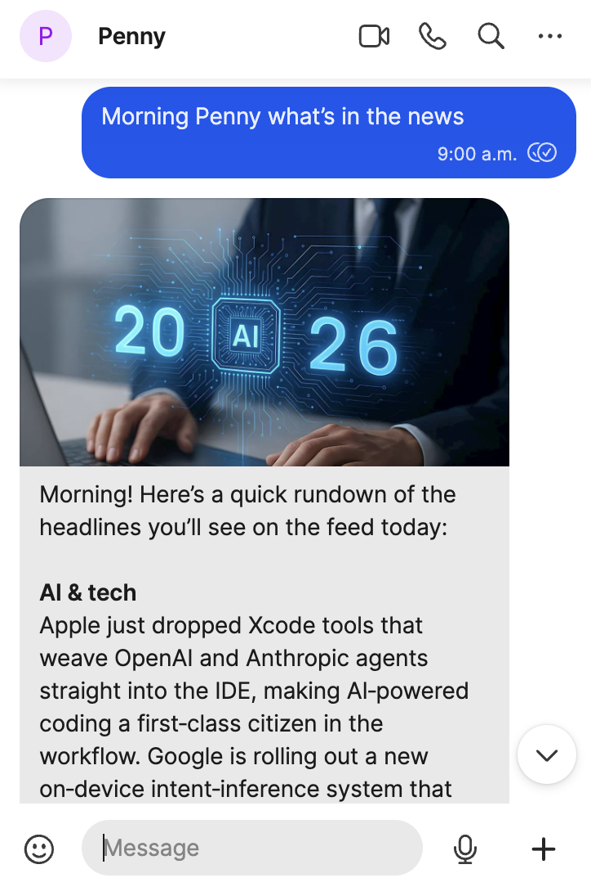
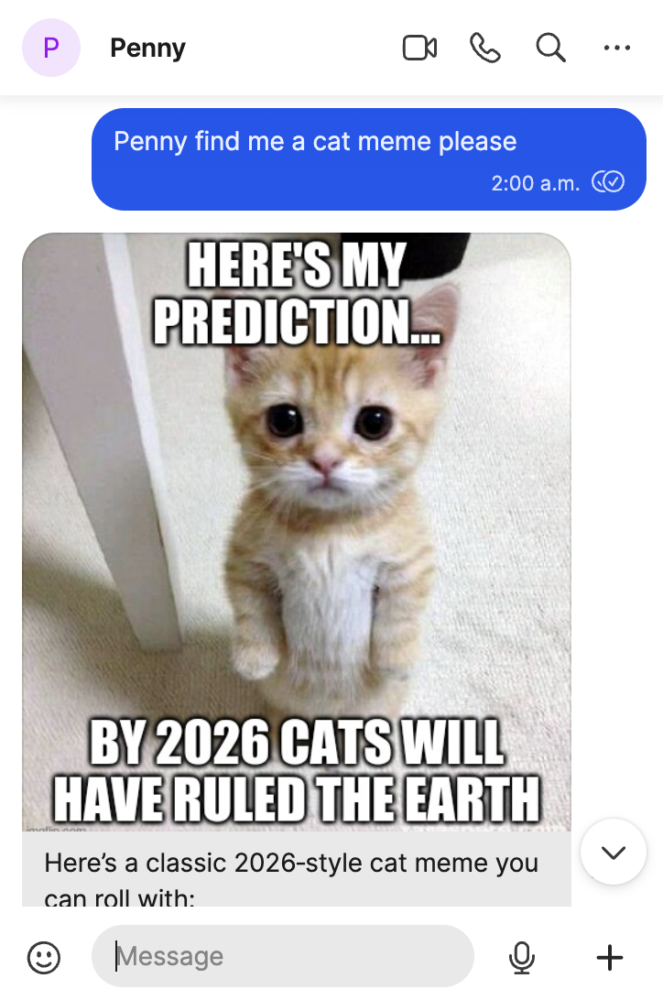
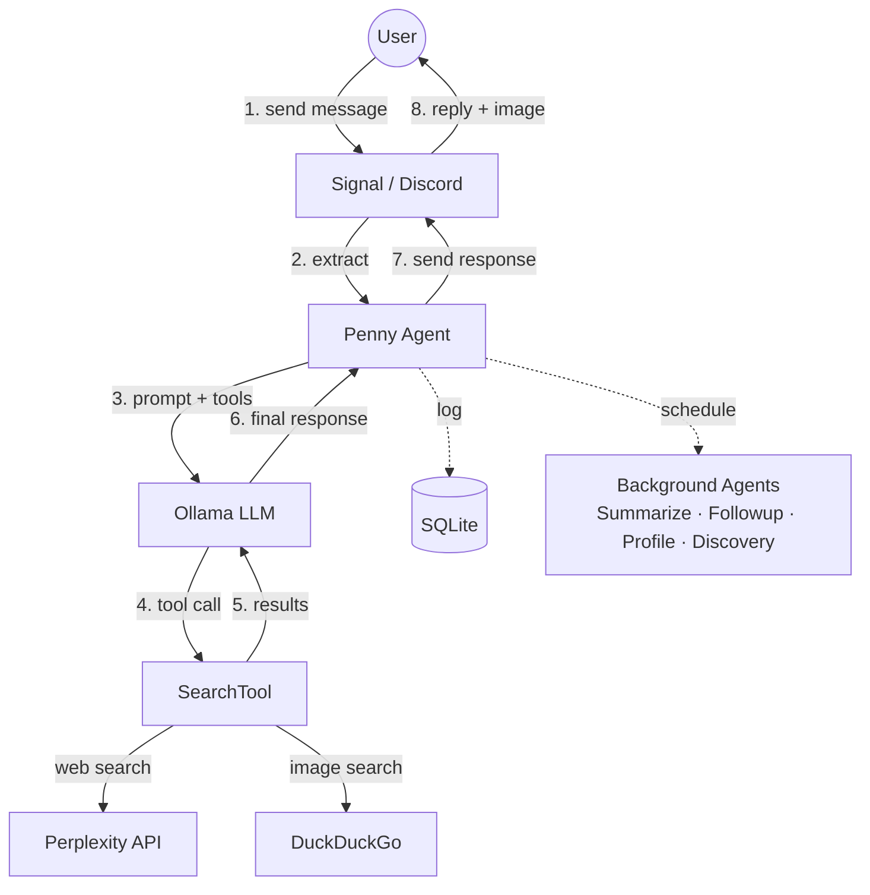

# Penny
**Your private, personalized internet companion.**
<br>

**Author:** Jared Lockhart

[](https://github.com/jaredlockhart/penny/actions/workflows/check.yml)


<p align="center">
  
  
  
</p>

## Overview

Ask Penny anything and she'll search the web and text you back, always with sources.

But she's not just a question-answering bot. She pays attention. She remembers your conversations, learns what you're into, and starts sharing things she thinks you'd like on her own. She follows up on old topics when she finds something new. She gets to know you over time and her responses get more personal because of it.

Penny is a feed only for you.  Private, personal, and local.

## Architecture

### Message Flow Diagram



### Agent Architecture

Penny uses specialized agent subclasses for different tasks:

- **MessageAgent**: Handles incoming user messages, prepares context, runs agentic loop
- **SummarizeAgent**: Background task that summarizes conversation threads when idle
- **FollowupAgent**: Background task that spontaneously follows up on conversations
- **PreferenceAgent**: Background task that extracts user preferences from messages and reactions
- **DiscoveryAgent**: Background task that shares new content based on user interests

Each agent owns its own OllamaClient instance and can have its own tools and prompts.

### Scheduler System

Background tasks are managed by a priority-based scheduler with a global idle threshold. The scheduler runs tasks in priority order:

1. **Summarize** (PeriodicSchedule) — runs periodically, summarizes conversation threads
2. **Preference** (PeriodicSchedule) — extracts user preferences from messages
3. **Followup** (DelayedSchedule) — spontaneous conversation followups
4. **Discovery** (DelayedSchedule) — proactive content sharing

**Global idle threshold** (default: 300s): All background tasks wait for the system to become idle before they can run.

Schedule types:
- **PeriodicSchedule**: Runs periodically while idle at a configurable interval (used for summarization and preference extraction, default: 300s)
- **DelayedSchedule**: Runs after system becomes idle + random delay (used for followups and discovery)

The scheduler resets all timers when a new message arrives.

### Message Flow

1. User sends message (Signal or Discord)
2. Channel extracts message → notifies scheduler (resets timers)
3. MessageAgent handles the message:
   - If quote-reply: look up quoted message, walk parent chain for history
   - Run agentic loop with tools (Perplexity search + DuckDuckGo images)
4. Log messages to database (linked via parent_id)
5. Send response back via channel with image attachment (if available)
6. Background: when idle, summarize threads, generate user profiles, follow up on conversations, and share new discoveries

### Design Decisions

- **Host Services**: signal-cli-rest-api, Discord bot, and Ollama run directly on host
- **Containerized Agent**: Only the Python agent runs in Docker
- **Networking**: `--network host` for simplicity
- **Persistence**: SQLite on host filesystem via volume mount
- **Channel Abstraction**: Signal and Discord share the same interface

### Commands

Penny supports slash commands sent as messages:

- **/commands**: List all available commands
- **/debug**: Show agent status, git commit, background task state
- **/config**: View and modify runtime settings (e.g., `/config idle_seconds 600`)
- **/draw**: Generate an image from a text description (requires `OLLAMA_IMAGE_MODEL`)
- **/test**: Enter isolated test mode with a separate DB for development

## Data Model

Penny stores four types of data in SQLite:

**PromptLog**: Every call to Ollama
- Model name, full message list (JSON), tool definitions (JSON), response (JSON)
- Thinking/reasoning trace (if model supports it)
- Call duration in milliseconds

**SearchLog**: Every Perplexity search
- Query text, response text, call duration

**MessageLog**: Every user message and agent response
- Direction (incoming/outgoing), sender, content
- Parent ID (foreign key to self) for threading
- Parent summary (cached thread summary for context reconstruction)
- External ID (platform-specific message ID for reaction lookup)
- Is-reaction flag (true if message is a reaction)

**UserProfile**: Cached user interest profiles
- Sender (unique), profile text (flat list of mentioned topics), last update timestamp
- Tracks `last_message_timestamp` so profiles are only regenerated when new messages exist
- Used exclusively by DiscoveryAgent for personalized content discovery

## Setup & Running

### Prerequisites

1. **For Signal**: signal-cli-rest-api running on host (port 8080)
2. **For Discord**: Discord bot token and channel ID
3. **Ollama** running on host (port 11434)
4. **Perplexity API key** (for web search)
5. Docker & Docker Compose installed

### Quick Start

```bash
# 1. Create .env file with your configuration
cp .env.example .env
# Edit .env with your settings (Signal or Discord credentials)

# 2. Start the agent
make up
```

### Make Commands

```bash
make up               # Build and start all services (foreground)
make prod             # Deploy penny only (no team, no override)
make kill             # Tear down containers and remove local images
make build            # Build the penny Docker image
make team-build       # Build the penny-team Docker image
make check            # Build, format check, lint, typecheck, and run tests
make pytest           # Run integration tests
make fmt              # Format with ruff
make lint             # Lint with ruff
make fix              # Format + autofix lint issues
make typecheck        # Type check with ty
make token            # Generate GitHub App installation token for gh CLI
make migrate-test     # Test database migrations against a copy of prod DB
make migrate-validate # Check for duplicate migration number prefixes
```

All dev tool commands run in temporary Docker containers via `docker compose run --rm`, with source volume-mounted so changes write back to the host filesystem.

`make prod` starts the penny service only (skips `docker-compose.override.yml` and the `team` profile). Use `make up` for the full stack including agents and watcher.

<details>
<summary><h2>Configuration</h2></summary>

Configuration is managed via a `.env` file in the project root:

```bash
# .env

# Channel type (optional - auto-detected from credentials)
# CHANNEL_TYPE="signal"  # or "discord"

# Signal Configuration (required for Signal)
SIGNAL_NUMBER="+1234567890"
SIGNAL_API_URL="http://localhost:8080"

# Discord Configuration (required for Discord)
DISCORD_BOT_TOKEN="your-bot-token"
DISCORD_CHANNEL_ID="your-channel-id"

# Ollama Configuration
OLLAMA_API_URL="http://host.docker.internal:11434"
OLLAMA_FOREGROUND_MODEL="gpt-oss:20b"    # Fast model for user-facing messages
OLLAMA_BACKGROUND_MODEL="gpt-oss:20b"    # Smarter model for background tasks (defaults to foreground)

# Perplexity Configuration
PERPLEXITY_API_KEY="your-api-key"

# Database & Logging
DB_PATH="/penny/data/penny.db"
LOG_LEVEL="INFO"
# LOG_FILE="/penny/data/penny.log"  # Optional

# Agent behavior (optional, defaults shown)
MESSAGE_MAX_STEPS=5
IDLE_SECONDS=300                    # Global idle threshold for background tasks
FOLLOWUP_MIN_SECONDS=3600           # Random delay after idle (followup)
FOLLOWUP_MAX_SECONDS=7200
DISCOVERY_MIN_SECONDS=7200          # Random delay after idle (discovery)
DISCOVERY_MAX_SECONDS=14400
```

### Channel Selection

Penny auto-detects which channel to use based on configured credentials:
- If `DISCORD_BOT_TOKEN` and `DISCORD_CHANNEL_ID` are set (and Signal is not), uses Discord
- If `SIGNAL_NUMBER` is set, uses Signal
- Set `CHANNEL_TYPE` explicitly to override auto-detection

### Configuration Reference

**Channel Selection:**
- `CHANNEL_TYPE`: "signal" or "discord" (auto-detected if not set)

**Signal (required if using Signal):**
- `SIGNAL_NUMBER`: Your registered Signal number
- `SIGNAL_API_URL`: signal-cli REST API endpoint (default: http://localhost:8080)

**Discord (required if using Discord):**
- `DISCORD_BOT_TOKEN`: Bot token from Discord Developer Portal
- `DISCORD_CHANNEL_ID`: Channel ID to listen to and send messages in

**Ollama:**
- `OLLAMA_API_URL`: Ollama API endpoint (default: http://host.docker.internal:11434)
- `OLLAMA_FOREGROUND_MODEL`: Fast model for user-facing messages (default: gpt-oss:20b)
- `OLLAMA_BACKGROUND_MODEL`: Smarter model for background tasks (default: same as foreground)
- `OLLAMA_VISION_MODEL`: Vision model for image understanding (e.g., qwen3-vl). Optional; if unset, image messages get an acknowledgment response
- `OLLAMA_IMAGE_MODEL`: Image generation model (e.g., x/flux2-klein). Optional; enables the `/draw` command when set
- `OLLAMA_MAX_RETRIES`: Retry attempts on transient Ollama errors (default: 3)
- `OLLAMA_RETRY_DELAY`: Delay in seconds between retries (default: 0.5)

**API Keys:**
- `PERPLEXITY_API_KEY`: API key for web search (without this, the agent has no tools)

**Behavior:**
- `MESSAGE_MAX_STEPS`: Max agent loop steps per message (default: 5)
- `IDLE_SECONDS`: Global idle threshold for all background tasks (default: 300)
- `FOLLOWUP_MIN_SECONDS`: Minimum random delay after idle for followup (default: 3600)
- `FOLLOWUP_MAX_SECONDS`: Maximum random delay after idle for followup (default: 7200)
- `DISCOVERY_MIN_SECONDS`: Minimum random delay after idle for discovery (default: 7200)
- `DISCOVERY_MAX_SECONDS`: Maximum random delay after idle for discovery (default: 14400)

**Logging:**
- `LOG_LEVEL`: DEBUG, INFO, WARNING, ERROR (default: INFO)
- `LOG_FILE`: Optional path to log file
- `DB_PATH`: SQLite database location (default: /penny/data/penny.db)

</details>

<details>
<summary><h2>Discord Setup</h2></summary>

1. Create a Discord application at https://discord.com/developers/applications
2. Create a bot for the application and copy the token
3. Enable these intents in the Bot settings:
   - Message Content Intent
   - Server Members Intent (optional)
4. Invite the bot to your server with the OAuth2 URL Generator:
   - Scopes: `bot`
   - Permissions: `Send Messages`, `Read Message History`
5. Get the channel ID (enable Developer Mode in Discord settings, right-click channel → Copy ID)
6. Add to your `.env`:
   ```bash
   DISCORD_BOT_TOKEN="your-token"
   DISCORD_CHANNEL_ID="your-channel-id"
   ```

</details>

<details>
<summary><h2>Testing & CI</h2></summary>

Penny includes end-to-end integration tests that mock all external services:

```bash
make pytest      # Run all tests
make check       # Run format, lint, typecheck, and tests
```

CI runs `make check` in Docker on every push to `main` and on pull requests via GitHub Actions.

**Test Coverage:**
- Message flow: tool calls, direct responses, typing indicators, DB logging
- Background tasks: summarization, user profile generation, spontaneous followups
- Commands: /debug, /config, /test, /commands
- Startup announcements, Signal channel integration

Tests use mock servers and SDK patches:
- `MockSignalServer`: Simulates Signal WebSocket + REST API
- `MockOllamaAsyncClient`: Configurable LLM responses
- `MockPerplexity`, `MockDDGS`: Search API mocks

</details>

<details>
<summary><h2>Agent Orchestrator</h2></summary>

Penny includes a Python-based agent orchestrator that manages autonomous Claude CLI agents. Agents process work from GitHub Issues on a schedule, using labels as a state machine:

```
backlog → requirements → specification → in-progress → in-review → closed   (features)
bug → in-review → closed                                                     (bug fixes)
```

**Agents:**
- **Product Manager**: Gathers requirements for `requirements` issues (5-min cycle, 600s timeout)
- **Architect**: Writes detailed specs for `specification` issues, handles spec feedback (5-min cycle, 600s timeout)
- **Worker**: Implements `in-progress` issues — creates branches, writes code/tests, runs `make check`, opens PRs; addresses PR feedback on `in-review` issues; fixes `bug` issues directly (5-min cycle, 1800s timeout)
- **Monitor**: Watches production logs for errors, deduplicates against existing issues, and files `bug` issues automatically (5-min cycle, 600s timeout)

Each agent checks for matching GitHub issue labels before waking Claude CLI, so idle cycles cost ~1 second instead of a full Claude invocation.

```bash
make up          # Run orchestrator with full stack
```

</details>

<details>
<summary><h2>Code Style</h2></summary>

- **Pydantic for all structured data**: All structured data (API payloads, config, internal messages) must be brokered through Pydantic models — no raw dicts
- **Constants for string literals**: All string literals must be defined as constants or enums — no magic strings in logic

</details>

<details>
<summary><h2>Technical Notes</h2></summary>

### Signal Formatting

signal-cli-rest-api supports markdown-style text formatting:
- `**bold**` → **bold**
- `*italic*` → *italic*
- `~strikethrough~` → ~~strikethrough~~ (note: single tilde, not double)
- `` `monospace` `` → `monospace`

**Formatting pipeline** (`SignalChannel.prepare_outgoing`):
1. **Table conversion**: Markdown tables are converted to bullet-point lists (tables don't render well in Signal)
2. **Tilde escaping**: Regular tildes converted to tilde operator (U+223C) to prevent accidental strikethrough (e.g., "~$50" stays as-is)
3. **Strikethrough**: Intentional `~~text~~` converted to Signal's single-tilde format
4. **Heading removal**: Markdown `#` headings stripped (keeps text)
5. **Link conversion**: `[text](url)` converted to `text (url)`

### Quote-Reply Thread Reconstruction

When a user quote-replies to a Penny message, Signal:
1. Converts markdown to native formatting (so `**bold**` becomes plain bold)
2. Strips all formatting when including the quoted text in the reply envelope
3. Truncates the quoted text (often to ~100 characters)

To reliably look up the original message:
- Outgoing messages are stored with markdown stripped (in `Database.log_message`)
- Tilde operators (U+223C) are normalized back to regular tildes for matching
- Quoted text is stripped before lookup (in `Database.find_outgoing_by_content`)
- Lookup uses prefix matching (`startswith`) instead of exact match

### Discord Specifics

- Messages are limited to 2000 characters (auto-chunked if longer)
- Typing indicators auto-expire after ~10 seconds
- Bot ignores its own messages and messages from other bots

</details>

## License

MIT
