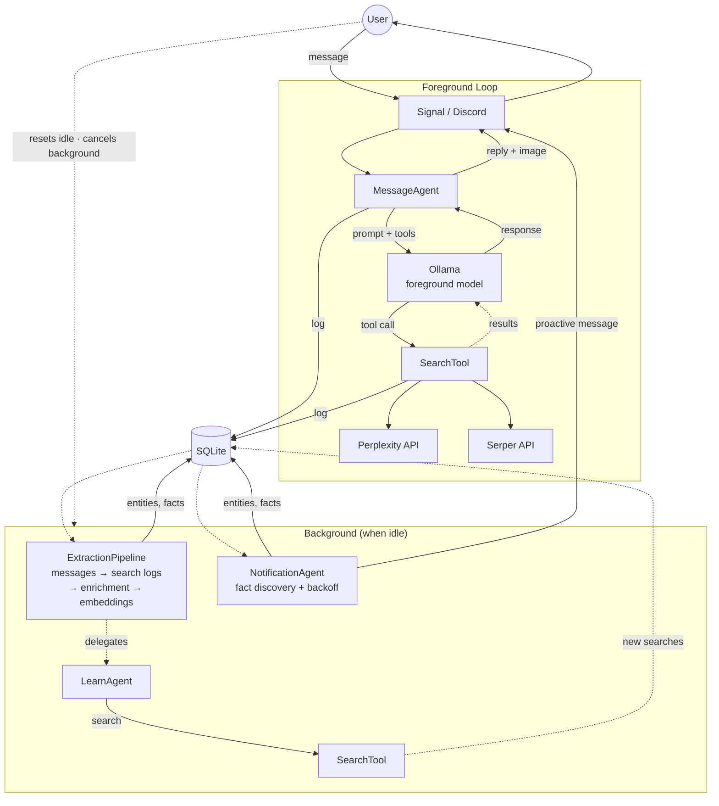

# Penny
**Your private, personalized internet companion.**
<br>

**Author:** Jared Lockhart

[](https://github.com/jaredlockhart/penny/actions/workflows/check.yml)


<p align="center">
  
  
  
</p>

## Overview

Ask Penny anything and she'll search the web and text you back, always with sources.

But she's not just a question-answering bot. She pays attention. She remembers your conversations, learns what you're into, and starts sharing things she thinks you'd like on her own. She follows up on old topics when she finds something new. She gets to know you over time and her responses get more personal because of it.

Penny is a feed only for you. Private, personal, and local.

## How It Works

### Conversations

When you send Penny a message, she always searches the web before responding — she never makes things up from model knowledge. A local LLM (via [Ollama](https://ollama.com)) reads the search results and writes a response in her own voice: casual, calm, with sources. Every response includes a relevant image when one is available.

Penny talks to you over [Signal](https://signal.org) or [Discord](https://discord.com) — the same apps you already use to message people. Quote-reply to continue a thread; she'll walk the conversation history for context.

### Knowledge

Every conversation leaves a trace. When you ask about something, Penny doesn't just answer — she remembers. Behind the scenes, a knowledge pipeline extracts **entities** (products, people, topics) and **facts** from every search result and message. These get stored in a local knowledge graph, deduplicated against what she already knows, and linked back to the conversations that produced them.

Entity creation is user-gated: only your messages and searches can introduce new entities. Penny's own background research can deepen knowledge about existing entities, but never widen the graph on its own. This keeps the knowledge base focused on what you actually care about.

Embeddings are central to knowledge quality. Every entity and fact gets an embedding vector (computed by a dedicated local embedding model), and these vectors are used throughout the system: validating that a candidate entity is semantically related to the query that surfaced it, catching duplicate entities at insertion time (token overlap + cosine similarity), detecting paraphrased facts before storing them, and pre-filtering the entity list so extraction only considers entities relevant to each search result. This keeps the knowledge graph clean without relying on exact string matching.

### Interest

Penny builds a model of what you're interested in — not from explicit "like" buttons, but from how you naturally interact. Searching for something, mentioning a topic, reacting with an emoji, expressing an opinion — these all generate **engagement signals** with different strengths and sentiments. An interest score decays over time (30-day half-life), so Penny's attention shifts as yours does.

Interest scores drive everything downstream: which entities get researched first, which discoveries get surfaced, and how entities are ranked when you browse your knowledge base.

### Learning

When Penny is idle, she researches the things you're most interested in. The **LearnAgent** picks the highest-priority entity (interest score weighted by how little she knows about it), searches the web for new information, extracts facts from the results, and deduplicates them against existing knowledge using embedding similarity.

You can also tell Penny to learn about something specific with `/learn <topic>`. She'll search immediately, discover entities from the results, and continue researching them in the background. When she's done, she sends a summary of what she found.

### Notifications

Penny proactively shares what she discovers. A **NotificationAgent** watches for un-notified facts, picks the most interesting entity, and composes a message — one at a time, with exponential backoff. If you don't respond, she backs off (up to an hour between messages). When you send a message, the backoff resets. She won't overwhelm you, but she won't go quiet either.

### Commands

Beyond regular conversation, Penny supports slash commands:

- **/learn** — express interest in a topic for background research
- **/memory** — browse your knowledge base, ranked by interest score
- **/schedule** — set up recurring tasks (e.g., `/schedule daily 9am weather forecast`)
- **/config** — tune runtime parameters (idle threshold, extraction settings, etc.)
- **/profile** — set your name, location, and timezone
- **/draw** — generate images via a local model
- **/bug**, **/feature** — file GitHub issues
- **/email** — search your Fastmail inbox

## Architecture



### Models

Penny uses up to five Ollama model roles, all running locally:

| Role | Purpose | Required? |
|---|---|---|
| **Foreground** | User-facing responses — fast model for real-time chat | Yes |
| **Background** | Entity/fact extraction, notification composition, learn queries | Yes (defaults to foreground) |
| **Embedding** | Semantic similarity for entity dedup, fact dedup, and validation | Optional (falls back to background) |
| **Vision** | Image captioning when users send photos | Optional |
| **Image** | Image generation via `/draw` | Optional |

### Extraction Pipeline

The knowledge pipeline runs as a single background task with four phases in strict priority order:

1. **User messages** — extract entities and sentiment from what the user said
2. **Search logs** — two-pass extraction (identify entities, then extract facts per entity) from search results
3. **Enrichment** — delegate to LearnAgent for background research on interesting entities (only runs when phases 1 and 2 are fully drained)
4. **Embedding backfill** — compute missing embeddings for new facts and entities

Extraction mode depends on what triggered the search. User-triggered searches can create new entities (after structural and semantic validation). Penny-triggered enrichment searches can only add facts to existing entities — they never create new ones.

New entities pass through three quality gates: a structural filter (rejects LLM artifacts, URLs, bare numbers, dates, locations), a semantic filter (embedding similarity to the triggering query), and post-fact pruning (LLM checks if extracted facts are actually relevant to the entity). Duplicates are caught at insertion time using token containment ratio + embedding cosine similarity.

### Scheduling

A priority-based scheduler runs background tasks when the system is idle (default: 60 seconds after the last message). Foreground messages immediately cancel the active background task to free Ollama for the user — cancelled work is idempotent and resumes next cycle.

User-created scheduled tasks (via `/schedule`) run on their own timer regardless of idle state, so a daily weather briefing won't be blocked by an active conversation.

### Runtime Configuration

38 parameters are tunable at runtime via `/config` — extraction thresholds, engagement strengths, notification backoff, scheduling intervals, and more. Values follow a three-tier lookup: database override → environment variable → default. Changes take effect immediately without restart.

## Setup & Running

### Prerequisites

1. **For Signal**: [signal-cli-rest-api](https://github.com/bbernhard/signal-cli-rest-api) running on host (port 8080)
2. **For Discord**: Discord bot token and channel ID
3. **[Ollama](https://ollama.com)** running on host (port 11434)
4. **[Perplexity API key](https://www.perplexity.ai)** (for web search)
5. Docker & Docker Compose installed

### Quick Start

```bash
# 1. Create .env file with your configuration
cp .env.example .env
# Edit .env with your settings (Signal or Discord credentials)

# 2. Start the agent
make up
```

### Make Commands

```bash
make up               # Build and start all services (foreground)
make prod             # Deploy penny only (no team, no override)
make kill             # Tear down containers and remove local images
make build            # Build the penny Docker image
make check            # Build, format check, lint, typecheck, and run tests
make pytest           # Run integration tests
make fmt              # Format with ruff
make fix              # Format + autofix lint issues
make typecheck        # Type check with ty
make token            # Generate GitHub App installation token for gh CLI
make migrate-test     # Test database migrations against a copy of prod DB
```

All dev tool commands run in temporary Docker containers via `docker compose run --rm`, with source volume-mounted so changes write back to the host filesystem.

<details>
<summary><h2>Configuration</h2></summary>

Configuration is managed via a `.env` file in the project root:

```bash
# .env

# Channel type (optional - auto-detected from credentials)
# CHANNEL_TYPE="signal"  # or "discord"

# Signal Configuration (required for Signal)
SIGNAL_NUMBER="+1234567890"
SIGNAL_API_URL="http://localhost:8080"

# Discord Configuration (required for Discord)
DISCORD_BOT_TOKEN="your-bot-token"
DISCORD_CHANNEL_ID="your-channel-id"

# Ollama Configuration
OLLAMA_API_URL="http://host.docker.internal:11434"
OLLAMA_FOREGROUND_MODEL="gpt-oss:20b"    # Fast model for user-facing messages
OLLAMA_BACKGROUND_MODEL="gpt-oss:20b"    # Smarter model for background tasks (defaults to foreground)

# Perplexity Configuration
PERPLEXITY_API_KEY="your-api-key"

# Database & Logging
DB_PATH="/penny/data/penny/penny.db"
LOG_LEVEL="INFO"
# LOG_FILE="/penny/data/penny/logs/penny.log"  # Optional

# Agent behavior (optional, defaults shown)
MESSAGE_MAX_STEPS=5
IDLE_SECONDS=60                     # Global idle threshold for background tasks

# Fastmail JMAP (optional, enables /email command)
# FASTMAIL_API_TOKEN="your-api-token"

# GitHub App (optional, enables /bug command and agent containers)
# GITHUB_APP_ID="12345"
# GITHUB_APP_PRIVATE_KEY_PATH="path/to/key.pem"
# GITHUB_APP_INSTALLATION_ID="67890"
```

### Channel Selection

Penny auto-detects which channel to use based on configured credentials:
- If `DISCORD_BOT_TOKEN` and `DISCORD_CHANNEL_ID` are set (and Signal is not), uses Discord
- If `SIGNAL_NUMBER` is set, uses Signal
- Set `CHANNEL_TYPE` explicitly to override auto-detection

### Configuration Reference

**Ollama:**
- `OLLAMA_API_URL`: Ollama API endpoint (default: http://host.docker.internal:11434)
- `OLLAMA_FOREGROUND_MODEL`: Fast model for user-facing messages (default: gpt-oss:20b)
- `OLLAMA_BACKGROUND_MODEL`: Smarter model for background tasks (default: same as foreground)
- `OLLAMA_VISION_MODEL`: Vision model for image understanding (e.g., qwen3-vl). Optional
- `OLLAMA_IMAGE_MODEL`: Image generation model (e.g., x/z-image-turbo). Optional; enables `/draw`
- `OLLAMA_EMBEDDING_MODEL`: Dedicated embedding model (e.g., nomic-embed-text). Optional; if unset, uses background model
- `OLLAMA_MAX_RETRIES`: Retry attempts on transient Ollama errors (default: 3)
- `OLLAMA_RETRY_DELAY`: Delay in seconds between retries (default: 0.5)

**API Keys:**
- `PERPLEXITY_API_KEY`: API key for web search
- `SERPER_API_KEY`: API key for Serper image search (optional; if unset, responses won't include images)
- `FASTMAIL_API_TOKEN`: API token for Fastmail JMAP email search (optional, enables `/email`)

**GitHub App** (optional, enables `/bug` and `/feature`; required for agent containers):
- `GITHUB_APP_ID`, `GITHUB_APP_PRIVATE_KEY_PATH`, `GITHUB_APP_INSTALLATION_ID`

**Behavior:**
- `MESSAGE_MAX_STEPS`: Max agent loop steps per message (default: 5)
- `IDLE_SECONDS`: Global idle threshold for all background tasks (default: 60)
- `TOOL_TIMEOUT`: Tool execution timeout in seconds (default: 60)
- Many more parameters are runtime-configurable via `/config` (38 total)

**Logging:**
- `LOG_LEVEL`: DEBUG, INFO, WARNING, ERROR (default: INFO)
- `LOG_FILE`: Optional path to log file
- `LOG_MAX_BYTES`: Maximum log file size before rotation (default: 10 MB)
- `LOG_BACKUP_COUNT`: Number of rotated backup files to keep (default: 5)
- `DB_PATH`: SQLite database location (default: /penny/data/penny/penny.db)

</details>

<details>
<summary><h2>Discord Setup</h2></summary>

1. Create a Discord application at https://discord.com/developers/applications
2. Create a bot for the application and copy the token
3. Enable these intents in the Bot settings:
   - Message Content Intent
   - Server Members Intent (optional)
4. Invite the bot to your server with the OAuth2 URL Generator:
   - Scopes: `bot`
   - Permissions: `Send Messages`, `Read Message History`
5. Get the channel ID (enable Developer Mode in Discord settings, right-click channel → Copy ID)
6. Add to your `.env`:
   ```bash
   DISCORD_BOT_TOKEN="your-token"
   DISCORD_CHANNEL_ID="your-channel-id"
   ```

</details>

<details>
<summary><h2>Testing & CI</h2></summary>

Penny includes end-to-end integration tests that mock all external services:

```bash
make pytest      # Run all tests
make check       # Run format, lint, typecheck, and tests
```

CI runs `make check` in Docker on every push to `main` and on pull requests via GitHub Actions.

Tests cover the full message flow (search, response, threading, typing indicators), all background agents (extraction, learn, notification, scheduler coordination), every slash command, vision processing, and tool edge cases. External services are replaced with mock servers and SDK patches — a mock Signal WebSocket server, a mock Ollama client with configurable responses, and mock search APIs.

</details>

<details>
<summary><h2>Agent Orchestrator</h2></summary>

Penny includes a Python-based agent orchestrator that manages autonomous Claude CLI agents. Agents process work from GitHub Issues on a schedule, using labels as a state machine:

```
backlog → requirements → specification → in-progress → in-review → closed   (features)
bug → in-review → closed                                                     (bug fixes)
```

**Agents:**
- **Product Manager**: Gathers requirements for `requirements` issues
- **Architect**: Writes detailed specs for `specification` issues, handles spec feedback
- **Worker**: Implements `in-progress` issues — creates branches, writes code/tests, runs `make check`, opens PRs; addresses PR feedback on `in-review` issues; fixes `bug` issues directly
- **Monitor**: Watches production logs for errors, deduplicates against existing issues, and files `bug` issues automatically

Each agent checks for matching GitHub issue labels before waking Claude CLI, so idle cycles cost ~1 second instead of a full Claude invocation.

```bash
make up          # Run orchestrator with full stack
```

</details>

## License

MIT
