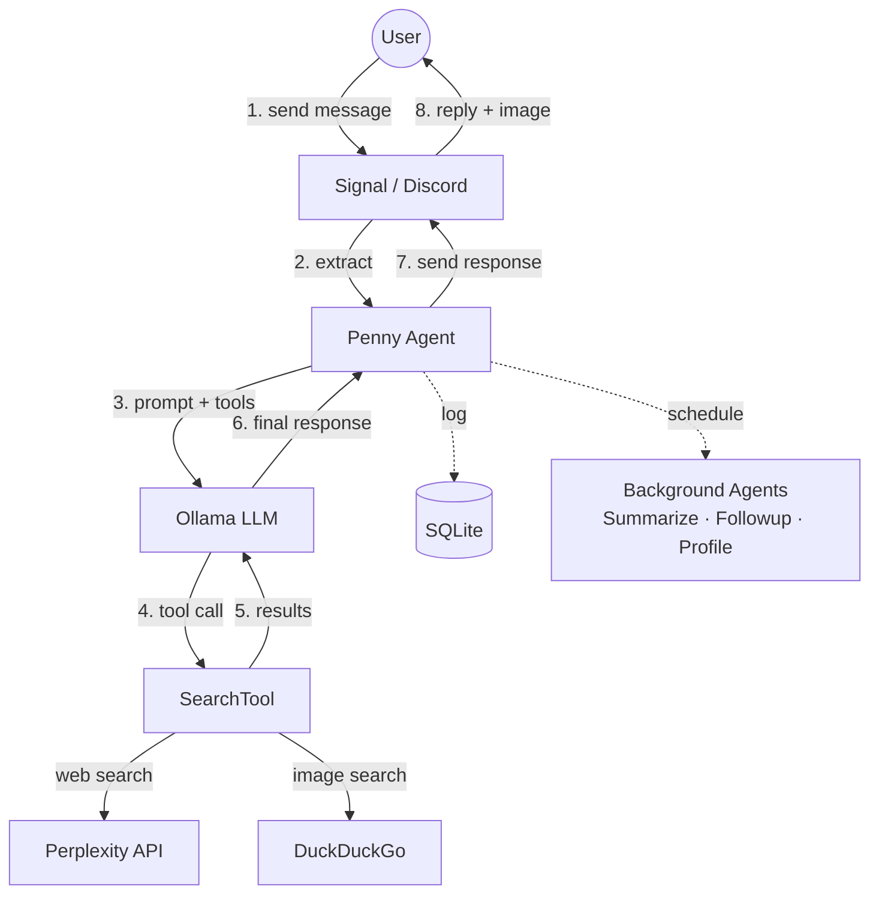

# Penny

A local-first AI agent that communicates via Signal or Discord and runs entirely on your machine.

**Author:** Jared Lockhart

## Overview

Penny is a personal AI agent built with simplicity and privacy in mind. It runs locally, uses open-source models via Ollama, and communicates through Signal or Discord for a secure, familiar interface.

**How it works:**

You send a message on Signal or Discord. Penny searches the web via Perplexity and finds a relevant image via DuckDuckGo — both in parallel — then responds in a casual, lowercase style with the image attached. If you reply to one of Penny's messages, it rebuilds the conversation thread for context.

**Key Features:**
- **Multi-Platform**: Works with Signal (via signal-cli-rest-api) or Discord (via discord.py)
- **Perplexity Search**: Every response is grounded in a web search — Penny never answers from model knowledge alone
- **Image Attachments**: Every response includes a relevant image from DuckDuckGo (degrades gracefully if unavailable)
- **Source URLs**: URLs extracted from Perplexity search results, presented as a Sources list so the model picks the most relevant one
- **Thread-Based Context**: Quote-reply to continue a conversation; Penny walks the message chain to rebuild history
- **Spontaneous Followups**: Penny randomly follows up on idle conversations by searching for something new about the topic (configurable idle timeout and random delay)
- **Proactive Discovery**: Penny shares new content based on user interests — searches for things users would enjoy and sends them unprompted
- **User Profiles**: Background task builds personality profiles from message history (interests, preferences, communication patterns) and injects them into conversation context
- **Thread Summarization**: Background task summarizes idle threads via Ollama and caches the summary for future context
- **Dual Model Support**: Separate models for user-facing messages (fast) and background tasks (smart) via `OLLAMA_FOREGROUND_MODEL` / `OLLAMA_BACKGROUND_MODEL`
- **Full Logging**: Every Ollama prompt, Perplexity search, and user/agent message is logged to SQLite
- **Agent Loop**: Multi-step reasoning with tool calling (up to 5 steps), with duplicate tool call protection
- **Retry on Failure**: Ollama client retries up to 3 times on transient errors (configurable)

## Architecture

### Message Flow Diagram



### Agent Architecture

Penny uses specialized agent subclasses for different tasks:

- **MessageAgent**: Handles incoming user messages, prepares context, runs agentic loop
- **SummarizeAgent**: Background task that summarizes conversation threads when idle
- **FollowupAgent**: Background task that spontaneously follows up on conversations
- **ProfileAgent**: Background task that builds user profiles from message history
- **DiscoveryAgent**: Background task that shares new content based on user interests

Each agent owns its own OllamaClient instance and can have its own tools and prompts.

### Scheduler System

Background tasks are managed by a priority-based scheduler that runs tasks in priority order:

1. **Summarize** (IdleSchedule) — runs first, quick task
2. **Profile** (IdleSchedule) — generates user profiles
3. **Followup** (TwoPhaseSchedule) — spontaneous conversation followups
4. **Discovery** (TwoPhaseSchedule) — proactive content sharing

Schedule types:
- **IdleSchedule**: Triggers after a fixed idle period (used for summarization and profile generation)
- **TwoPhaseSchedule**: Idle threshold + random delay (used for followups and discovery)

The scheduler resets all timers when a new message arrives.

### Message Flow

1. User sends message (Signal or Discord)
2. Channel extracts message → notifies scheduler (resets timers)
3. MessageAgent handles the message:
   - If quote-reply: look up quoted message, walk parent chain for history
   - Run agentic loop with tools (Perplexity search + DuckDuckGo images)
4. Log messages to database (linked via parent_id)
5. Send response back via channel with image attachment (if available)
6. Background: when idle, summarize threads, generate user profiles, follow up on conversations, and share new discoveries

### Design Decisions

- **Host Services**: signal-cli-rest-api, Discord bot, and Ollama run directly on host
- **Containerized Agent**: Only the Python agent runs in Docker
- **Networking**: `--network host` for simplicity
- **Persistence**: SQLite on host filesystem via volume mount
- **Channel Abstraction**: Signal and Discord share the same interface

## Data Model

Penny stores four types of data in SQLite:

**PromptLog**: Every call to Ollama
- Model name, full message list (JSON), tool definitions (JSON), response (JSON)
- Thinking/reasoning trace (if model supports it)
- Call duration in milliseconds

**SearchLog**: Every Perplexity search
- Query text, response text, call duration

**MessageLog**: Every user message and agent response
- Direction (incoming/outgoing), sender, content
- Parent ID (foreign key to self) for threading
- Parent summary (cached thread summary for context reconstruction)

**UserProfile**: Cached user personality profiles
- Sender (unique), profile text, last update timestamp
- Tracks `last_message_timestamp` so profiles are only regenerated when new messages exist

## Setup & Running

### Prerequisites

1. **For Signal**: signal-cli-rest-api running on host (port 8080)
2. **For Discord**: Discord bot token and channel ID
3. **Ollama** running on host (port 11434)
4. **Perplexity API key** (for web search)
5. Docker & Docker Compose installed

### Quick Start

```bash
# 1. Create .env file with your configuration
cp .env.example .env
# Edit .env with your settings (Signal or Discord credentials)

# 2. Start the agent
make up
```

### Make Commands

```bash
make up          # Build and start all services (foreground)
make kill        # Tear down containers and remove local images
make build       # Build the Docker image
make check       # Build, format check, lint, typecheck, and run tests
make pytest      # Run integration tests
make fmt         # Format with ruff
make lint        # Lint with ruff
make fix         # Format + autofix lint issues
make typecheck   # Type check with ty
```

All dev tool commands run in temporary Docker containers via `docker compose run --rm`, with source volume-mounted so changes write back to the host filesystem.

## Configuration

Configuration is managed via a `.env` file in the project root:

```bash
# .env

# Channel type (optional - auto-detected from credentials)
# CHANNEL_TYPE="signal"  # or "discord"

# Signal Configuration (required for Signal)
SIGNAL_NUMBER="+1234567890"
SIGNAL_API_URL="http://localhost:8080"

# Discord Configuration (required for Discord)
DISCORD_BOT_TOKEN="your-bot-token"
DISCORD_CHANNEL_ID="your-channel-id"

# Ollama Configuration
OLLAMA_API_URL="http://host.docker.internal:11434"
OLLAMA_FOREGROUND_MODEL="gpt-oss:20b"    # Fast model for user-facing messages
OLLAMA_BACKGROUND_MODEL="gpt-oss:20b"    # Smarter model for background tasks (defaults to foreground)

# Perplexity Configuration
PERPLEXITY_API_KEY="your-api-key"

# Database & Logging
DB_PATH="/app/data/penny.db"
LOG_LEVEL="INFO"
# LOG_FILE="/app/data/penny.log"  # Optional

# Agent behavior (optional, defaults shown)
MESSAGE_MAX_STEPS=5
SUMMARIZE_IDLE_SECONDS=300
PROFILE_IDLE_SECONDS=3600
FOLLOWUP_IDLE_SECONDS=1200
FOLLOWUP_MIN_SECONDS=0
FOLLOWUP_MAX_SECONDS=2400
DISCOVERY_IDLE_SECONDS=1800
DISCOVERY_MIN_SECONDS=0
DISCOVERY_MAX_SECONDS=3600
```

### Channel Selection

Penny auto-detects which channel to use based on configured credentials:
- If `DISCORD_BOT_TOKEN` and `DISCORD_CHANNEL_ID` are set (and Signal is not), uses Discord
- If `SIGNAL_NUMBER` is set, uses Signal
- Set `CHANNEL_TYPE` explicitly to override auto-detection

### Configuration Reference

**Channel Selection:**
- `CHANNEL_TYPE`: "signal" or "discord" (auto-detected if not set)

**Signal (required if using Signal):**
- `SIGNAL_NUMBER`: Your registered Signal number
- `SIGNAL_API_URL`: signal-cli REST API endpoint (default: http://localhost:8080)

**Discord (required if using Discord):**
- `DISCORD_BOT_TOKEN`: Bot token from Discord Developer Portal
- `DISCORD_CHANNEL_ID`: Channel ID to listen to and send messages in

**Ollama:**
- `OLLAMA_API_URL`: Ollama API endpoint (default: http://host.docker.internal:11434)
- `OLLAMA_FOREGROUND_MODEL`: Fast model for user-facing messages (default: gpt-oss:20b)
- `OLLAMA_BACKGROUND_MODEL`: Smarter model for background tasks (default: same as foreground)
- `OLLAMA_MAX_RETRIES`: Retry attempts on transient Ollama errors (default: 3)
- `OLLAMA_RETRY_DELAY`: Delay in seconds between retries (default: 0.5)

**API Keys:**
- `PERPLEXITY_API_KEY`: API key for web search (without this, the agent has no tools)

**Behavior:**
- `MESSAGE_MAX_STEPS`: Max agent loop steps per message (default: 5)
- `SUMMARIZE_IDLE_SECONDS`: Idle time before summarizing threads (default: 300)
- `PROFILE_IDLE_SECONDS`: Idle time before generating user profiles (default: 3600)
- `FOLLOWUP_IDLE_SECONDS`: Idle time before followup is eligible (default: 1200)
- `FOLLOWUP_MIN_SECONDS`: Minimum random delay for followup (default: 0)
- `FOLLOWUP_MAX_SECONDS`: Maximum random delay for followup (default: 2400)
- `DISCOVERY_IDLE_SECONDS`: Idle time before discovery is eligible (default: 1800)
- `DISCOVERY_MIN_SECONDS`: Minimum random delay for discovery (default: 0)
- `DISCOVERY_MAX_SECONDS`: Maximum random delay for discovery (default: 3600)

**Logging:**
- `LOG_LEVEL`: DEBUG, INFO, WARNING, ERROR (default: INFO)
- `LOG_FILE`: Optional path to log file
- `DB_PATH`: SQLite database location (default: /app/data/penny.db)

## Discord Setup

1. Create a Discord application at https://discord.com/developers/applications
2. Create a bot for the application and copy the token
3. Enable these intents in the Bot settings:
   - Message Content Intent
   - Server Members Intent (optional)
4. Invite the bot to your server with the OAuth2 URL Generator:
   - Scopes: `bot`
   - Permissions: `Send Messages`, `Read Message History`
5. Get the channel ID (enable Developer Mode in Discord settings, right-click channel → Copy ID)
6. Add to your `.env`:
   ```bash
   DISCORD_BOT_TOKEN="your-token"
   DISCORD_CHANNEL_ID="your-channel-id"
   ```

## Testing & CI

Penny includes end-to-end integration tests that mock all external services:

```bash
make pytest      # Run all tests
make check       # Run format, lint, typecheck, and tests
```

CI runs `make check` in Docker on every push to `main` and on pull requests via GitHub Actions.

**Test Coverage:**
- Message flow: tool calls, direct responses, typing indicators, DB logging
- Background tasks: summarization, user profile generation, spontaneous followups

Tests use mock servers and SDK patches:
- `MockSignalServer`: Simulates Signal WebSocket + REST API
- `MockOllamaAsyncClient`: Configurable LLM responses
- `MockPerplexity`, `MockDDGS`: Search API mocks

## Code Style

- **Pydantic for all structured data**: All structured data (API payloads, config, internal messages) must be brokered through Pydantic models — no raw dicts
- **Constants for string literals**: All string literals must be defined as constants or enums — no magic strings in logic

## Technical Notes

### Signal Formatting

signal-cli-rest-api supports markdown-style text formatting:
- `**bold**` → **bold**
- `*italic*` → *italic*
- `~strikethrough~` → ~~strikethrough~~ (note: single tilde, not double)
- `` `monospace` `` → `monospace`

**Formatting pipeline** (`SignalChannel.prepare_outgoing`):
1. **Table conversion**: Markdown tables are converted to bullet-point lists (tables don't render well in Signal)
2. **Tilde escaping**: Regular tildes converted to tilde operator (U+223C) to prevent accidental strikethrough (e.g., "~$50" stays as-is)
3. **Strikethrough**: Intentional `~~text~~` converted to Signal's single-tilde format
4. **Heading removal**: Markdown `#` headings stripped (keeps text)
5. **Link conversion**: `[text](url)` converted to `text (url)`

### Quote-Reply Thread Reconstruction

When a user quote-replies to a Penny message, Signal:
1. Converts markdown to native formatting (so `**bold**` becomes plain bold)
2. Strips all formatting when including the quoted text in the reply envelope
3. Truncates the quoted text (often to ~100 characters)

To reliably look up the original message:
- Outgoing messages are stored with markdown stripped (in `Database.log_message`)
- Tilde operators (U+223C) are normalized back to regular tildes for matching
- Quoted text is stripped before lookup (in `Database.find_outgoing_by_content`)
- Lookup uses prefix matching (`startswith`) instead of exact match

### Discord Specifics

- Messages are limited to 2000 characters (auto-chunked if longer)
- Typing indicators auto-expire after ~10 seconds
- Bot ignores its own messages and messages from other bots

## License

MIT
