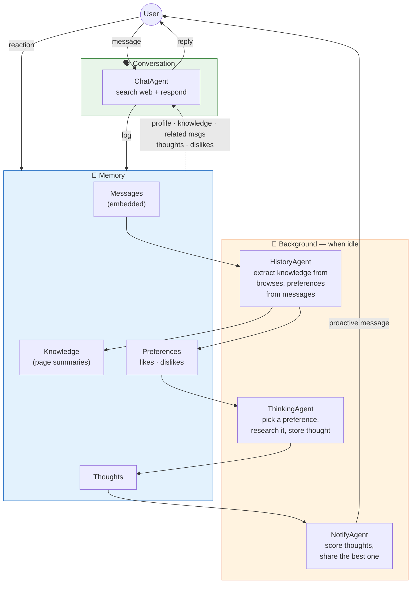

<p align="center">
  
</p>

# Penny
**Your private, personalized internet companion.**
<br>

**Author:** Jared Lockhart

[](https://github.com/jaredlockhart/penny/actions/workflows/check.yml)


<p align="center">
  
  
  
</p>

## Overview

Ask Penny anything and she'll search the web and text you back, always with sources.

But she's not just a question-answering bot. She pays attention. She remembers your conversations, learns what you're into, and starts sharing things she thinks you'd like on her own. She follows up on old topics when she finds something new. She gets to know you over time and her responses get more personal because of it.

Penny communicates via Signal, Discord, or a Firefox browser extension — all channels share the same conversation history. The browser extension gives her direct access to the web: she can browse pages with the full rendering engine and your session, see what you're currently looking at, and present her discoveries as a browsable feed of thought cards.

Penny is a feed only for you. Private, personal, and local.

## How It Works

### Conversations

When you send Penny a message, she always searches the web before responding — she never makes things up from model knowledge. A local LLM reads the search results and writes a response in her own voice: casual, calm, with sources. Penny uses the OpenAI Python SDK against any OpenAI-compatible endpoint — [Ollama](https://ollama.com) by default, but [omlx](https://github.com/madroidmaq/omlx), OpenAI cloud, or anything else that speaks the protocol works too.

Penny talks to you over [Signal](https://signal.org), [Discord](https://discord.com), or a [Firefox sidebar extension](docs/browser-extension-architecture.md) — the same apps you already use. All channels share conversation history: ask on Signal, follow up in the browser. Quote-reply to continue a thread; she'll walk the conversation history for context.

### Preferences

Penny builds a model of what you care about. The **HistoryAgent** runs continuously in the background, scanning unprocessed messages and reactions and extracting preference topics in a two-pass LLM pipeline — first identify candidate topics, then classify each as positive or negative. New topics are deduplicated against existing entries via token containment ratio + embedding similarity, and only become "thinking candidates" once they cross a mention-count threshold (so a one-off comment doesn't drive autonomous research).

You can also manage preferences directly: `/like dark roast coffee`, `/dislike cold weather`, `/unlike`, `/undislike`. These drive what Penny thinks about and what she shares with you.

### Thinking

When Penny is idle, she thinks. The **ThinkingAgent** picks a random topic from your positive preferences, searches the web, and has an inner monologue — reasoning through what she finds. The result is stored as a **thought**, linked back to the preference that seeded it.

Thoughts bleed into chat context, so Penny has continuity of her own reasoning. When she finds something interesting, the **NotifyAgent** shares it with you — scoring candidates by novelty (avoiding repeats) and sentiment (preference alignment), with exponential backoff so she doesn't overwhelm you.

### Memory

Penny's memory has three layers, all assembled into chat context on every message:

- **Knowledge** — when Penny browses a page (search results, article reads), the **HistoryAgent** summarizes the page into a prose paragraph and stores it with an embedding, keyed by URL. On the next chat turn, the most semantically relevant entries are pulled into context, scored as `max(weighted_decay_against_conversation, current_message_cosine)` with an absolute floor that suppresses noise on greetings and uncovered topics.
- **Related past messages** — the embedding of every outgoing/incoming message is cached. When you ask something, prior messages are scored by `cosine_to_current_message − α × centrality` (centrality = mean cosine to the rest of the corpus, suppressing centroid-magnet boilerplate), then expanded to ±5-minute neighbors so conversational follow-ups travel together.
- **Preferences** — the **HistoryAgent** also extracts likes/dislikes from your text messages and emoji reactions in two passes (identify topics, then classify valence), deduplicated against existing entries via TCR + embedding similarity.

The old daily/weekly summary tables were dropped — knowledge extraction and embedding-based message retrieval replaced them.

### Commands

Beyond regular conversation, Penny supports slash commands:

- **/commands** — list every command available in this deployment
- **/profile** — set your name, location, and timezone (required before chat)
- **/like**, **/dislike** — view or add preferences
- **/unlike**, **/undislike** — remove preferences
- **/schedule** — set up recurring tasks (e.g., `/schedule daily 9am weather forecast`); uses LLM to parse natural-language timing
- **/unschedule** — list and delete scheduled tasks
- **/config** — view or tune runtime parameters (30+ values: scheduling intervals, notification backoff, dedup thresholds, email pagination limits, etc.)
- **/debug** — show agent status, git commit, system info, background task state
- **/mute**, **/unmute** — silence or resume autonomous notifications
- **/draw** — generate images via a local model (requires `LLM_IMAGE_MODEL`)
- **/email** — search your Fastmail inbox via JMAP (requires `FASTMAIL_API_TOKEN`)
- **/zoho** — search your Zoho Mail inbox (requires `ZOHO_API_ID`/`ZOHO_API_SECRET`/`ZOHO_REFRESH_TOKEN`)
- **/bug**, **/feature** — file GitHub issues (requires GitHub App credentials)
- **/test** — enter isolated test mode (separate DB, fresh agents) for development

## Penny's Mind

How information flows through Penny's cognitive systems — from perception to memory to thought to action.


```mermaid
flowchart TB
    User((User)) -->|message| Chat
    User -->|reaction| Memory

    subgraph Conversation["🗣 Conversation"]
        Chat[ChatAgent<br>search web + respond]
    end

    Memory -.->|"profile · knowledge · related msgs<br>thoughts · dislikes"| Chat
    Chat -->|reply| User
    Chat -->|log| Memory

    subgraph Memory["🧠 Memory"]
        Messages["Messages<br>(embedded)"]
        Knowledge["Knowledge<br>(page summaries)"]
        Preferences["Preferences<br>likes · dislikes"]
        Thoughts[Thoughts]
    end

    subgraph Background["💭 Background — when idle"]
        History["HistoryAgent<br>extract knowledge from<br>browses, preferences<br>from messages"]
        Thinking["ThinkingAgent<br>pick a preference,<br>research it, store thought"]
        Notify["NotifyAgent<br>score thoughts,<br>share the best one"]
    end

    Messages --> History
    History --> Knowledge
    History --> Preferences
    Preferences --> Thinking
    Thinking --> Thoughts
    Thoughts --> Notify
    Notify -->|proactive message| User

    style Conversation fill:#e8f5e9,stroke:#2e7d32
    style Memory fill:#e3f2fd,stroke:#1565c0
    style Background fill:#fff3e0,stroke:#e65100
```

### The Cognitive Cycle

1. **Conversation** — user sends a message, ChatAgent searches the web and responds. Context is assembled from memory: profile, related knowledge (semantically-relevant page summaries), related past messages (embedding similarity with centrality penalty + ±5-minute neighbor expansion), recent thoughts, and topics to avoid
2. **Digestion** — when idle, HistoryAgent summarizes browsed pages into knowledge entries (one per URL, deduplicated and embedded), and extracts preferences (likes/dislikes) from text messages and emoji reactions in a two-pass LLM pipeline
3. **Reflection** — ThinkingAgent picks a random positive preference, searches the web, and reasons through what it finds. The result is stored as a thought
4. **Initiative** — NotifyAgent scores un-notified thoughts by novelty (avoiding repeats) and preference alignment, composes a message, and sends it with exponential backoff
5. **Repeat** — the user's reaction feeds back into conversation, digestion, and reflection

### Models

Penny uses up to four LLM model roles, all running locally by default:

| Role | Env | Purpose | Required? |
|---|---|---|---|
| **Text** | `LLM_MODEL` | Single model for all agents — chat, thinking, history, notify, schedules | Yes |
| **Embedding** | `LLM_EMBEDDING_MODEL` | Embeddings for knowledge retrieval, message similarity, and preference dedup | Optional |
| **Vision** | `LLM_VISION_MODEL` | Image captioning when users send photos | Optional |
| **Image** | `LLM_IMAGE_MODEL` | Image generation via `/draw` (uses Ollama's native REST API) | Optional |

Each model can point at a different OpenAI-compatible endpoint via the corresponding `LLM_*_API_URL` / `LLM_*_API_KEY` overrides — useful when running text on one machine and embeddings on another.

### Scheduling

Background agents run in priority order when idle (default: 60s after last message): schedule executor (always) → history → notify → thinking. Agents with no work are skipped. Foreground messages cancel the active background task immediately.

User-created scheduled tasks (via `/schedule`) run on their own timer regardless of idle state, so a daily weather briefing won't be blocked by an active conversation.

### Runtime Configuration

30+ parameters are tunable at runtime via `/config` — scheduling intervals, notification backoff, preference dedup thresholds, inner monologue settings, email pagination limits, and more. Values follow a three-tier lookup: database override → environment variable → default. Changes take effect immediately without restart.

## Browser Extension

The Firefox extension adds a visual, interactive layer on top of Penny's existing architecture:

- **Sidebar chat** — same conversation as Signal/Discord, with HTML-formatted responses, images, clickable links, and live in-flight tool status (e.g., "Searching…", "Reading example.com…")
- **Active tab context** — Penny can see the page you're currently viewing (via [Defuddle](https://github.com/kepano/defuddle) content extraction). Toggle "Include page content" to ask questions about any page
- **Browser tools** — `browse_url` opens pages in hidden tabs with the full web engine and your session. Per-addon "tool use" toggle controls whether each browser participates in tool dispatch
- **Domain permissions** — first-time access to a new domain triggers an approve/deny prompt. Approvals persist server-side and sync across all connected addons; prompts can also be answered from Signal so you don't need a browser open. `/config DOMAIN_PERMISSION_MODE allow_all` skips prompting entirely
- **Thoughts feed** — a browsable card grid of Penny's discoveries, with images, seed-topic bylines, and a modal viewer. Thumbs up/down reactions feed directly into the preference extraction pipeline. Browser tabs receive unread thought counts as a badge
- **Schedule manager** — UI for creating, editing, and deleting `/schedule` cron tasks without touching the chat
- **Settings panel** — domain allowlist, runtime config params (the same 30+ values `/config` exposes), and addon-level toggles
- **Prompt log viewer** — every LLM call Penny makes is browseable from the extension, grouped by run ID with input messages, response, thinking field, and outcome badge. Useful for debugging "why did Penny say that"
- **Multi-device** — each browser registers as a device (e.g., "firefox macbook 16"). All devices share the same user identity and conversation history. In-flight progress reactions on Signal also surface on the user's message via emoji morphing (💭 → 🔍 → 📖 → cleared on completion)

```bash
cd browser
npm install
npm run dev    # Build, watch, and launch Firefox with auto-reload
```

See [docs/browser-extension-architecture.md](docs/browser-extension-architecture.md) for the full architecture and security model.

## Setup & Running

### Prerequisites

1. **For Signal**: [signal-cli-rest-api](https://github.com/bbernhard/signal-cli-rest-api) running on host (port 8080)
2. **For Discord**: Discord bot token and channel ID
3. **An OpenAI-compatible LLM** running on host — [Ollama](https://ollama.com) on port 11434 by default; [omlx](https://github.com/madroidmaq/omlx) or any other compatible endpoint also works (set `LLM_API_URL`)
4. **Browser extension** loaded in Firefox (for web search, page reading, and the visual UI)
5. Docker & Docker Compose installed

### Quick Start

```bash
# 1. Create .env file with your configuration
cp .env.example .env
# Edit .env with your settings (Signal or Discord credentials)

# 2. Start the agent
make up
```

### Make Commands

```bash
make up               # Build and start all services (foreground)
make prod             # Deploy penny only (no team, no override)
make kill             # Tear down containers and remove local images
make build            # Build the penny Docker image
make team-build       # Build the penny-team Docker image
make browser-build    # Bundle the browser extension content script
make check            # Format check, lint, typecheck, migrate-validate, pytest (penny + team), tsc (browser)
make pytest           # Run integration tests (penny + team)
make fix              # Format + autofix lint issues (penny + team)
make typecheck        # Type check with ty (penny + team)
make token            # Generate GitHub App installation token for gh CLI
make signal-avatar    # Set Penny's Signal profile picture
make migrate-test     # Test database migrations against a copy of prod DB
make migrate-validate # Check for duplicate migration number prefixes
```

All dev tool commands run in temporary Docker containers via `docker compose run --rm`, with source volume-mounted so changes write back to the host filesystem.

<details>
<summary><h2>Configuration</h2></summary>

Configuration is managed via a `.env` file in the project root:

```bash
# .env

# Channel type (optional — auto-detected from credentials)
# CHANNEL_TYPE="signal"  # or "discord"

# Signal Configuration (required for Signal)
SIGNAL_NUMBER="+1234567890"
SIGNAL_API_URL="http://localhost:8080"

# Discord Configuration (required for Discord)
DISCORD_BOT_TOKEN="your-bot-token"
DISCORD_CHANNEL_ID="your-channel-id"

# Browser Extension (optional)
BROWSER_ENABLED=true
BROWSER_HOST="0.0.0.0"                    # Use 0.0.0.0 in Docker
BROWSER_PORT=9090

# LLM Configuration — works with Ollama (default), omlx, OpenAI cloud, or any
# OpenAI-compatible endpoint. LLM_* are the canonical names; OLLAMA_* fall
# back for backwards compatibility with older configs.
LLM_API_URL="http://host.docker.internal:11434/v1"
LLM_MODEL="gpt-oss:20b"                   # Single model for all agents
# LLM_API_KEY="not-needed"                # Default fine for local Ollama
# LLM_VISION_MODEL="qwen3-vl"             # Optional, enables vision/image messages
# LLM_IMAGE_MODEL="x/z-image-turbo"       # Optional, enables /draw
# LLM_EMBEDDING_MODEL="embeddinggemma"    # Optional, enables preference dedup

# Database & Logging
DB_PATH="/penny/data/penny/penny.db"
LOG_LEVEL="INFO"
# LOG_FILE="/penny/data/penny/logs/penny.log"

# Fastmail JMAP (optional, enables /email)
# FASTMAIL_API_TOKEN="your-api-token"

# Zoho Mail (optional, enables /zoho)
# ZOHO_API_ID="..."
# ZOHO_API_SECRET="..."
# ZOHO_REFRESH_TOKEN="..."

# GitHub App (optional, enables /bug, /feature, and agent containers)
# GITHUB_APP_ID="12345"
# GITHUB_APP_PRIVATE_KEY_PATH="data/private/github-app.pem"
# GITHUB_APP_INSTALLATION_ID="67890"

# Penny-team agent containers (optional, leave blank to disable)
# CLAUDE_CODE_OAUTH_TOKEN="..."           # From `claude setup-token` (Max plan)
# OLLAMA_BACKGROUND_MODEL="..."           # Optional, enables team Quality agent
```

### Channel Selection

Penny auto-detects which channel to use based on configured credentials:
- If `DISCORD_BOT_TOKEN` and `DISCORD_CHANNEL_ID` are set (and Signal is not), uses Discord
- If `SIGNAL_NUMBER` is set, uses Signal
- Set `CHANNEL_TYPE` explicitly to override auto-detection

### Configuration Reference

**LLM** — Penny talks to any OpenAI-compatible endpoint via the OpenAI Python SDK. `LLM_*` are the canonical env names; `OLLAMA_*` are accepted as fallbacks for backwards compatibility with older configs.
- `LLM_API_URL` / `OLLAMA_API_URL`: API endpoint (default: `http://host.docker.internal:11434`)
- `LLM_MODEL` / `OLLAMA_MODEL`: Single text model for all agents (default: `gpt-oss:20b`)
- `LLM_API_KEY`: API key (default: `"not-needed"`, fine for local Ollama)
- `LLM_VISION_MODEL` / `OLLAMA_VISION_MODEL`: Vision model for image understanding (e.g., `qwen3-vl`). Optional
- `LLM_VISION_API_URL` / `LLM_VISION_API_KEY`: Override API URL/key for vision model (if running on a different host)
- `LLM_IMAGE_MODEL` / `OLLAMA_IMAGE_MODEL`: Image generation model (e.g., `x/z-image-turbo`). Optional; enables `/draw`. Image generation uses Ollama's native REST API
- `LLM_EMBEDDING_MODEL` / `OLLAMA_EMBEDDING_MODEL`: Dedicated embedding model (e.g., `embeddinggemma`). Optional; enables preference/knowledge/message embeddings
- `LLM_EMBEDDING_API_URL` / `LLM_EMBEDDING_API_KEY`: Override API URL/key for embedding model

**API Keys:**
- `FASTMAIL_API_TOKEN`: enables `/email`
- `ZOHO_API_ID`, `ZOHO_API_SECRET`, `ZOHO_REFRESH_TOKEN`: enables `/zoho` (obtain via Zoho's OAuth flow)

**GitHub App** (optional, enables `/bug` and `/feature`; required for agent containers):
- `GITHUB_APP_ID`, `GITHUB_APP_PRIVATE_KEY_PATH`, `GITHUB_APP_INSTALLATION_ID`

**Browser Extension** (optional):
- `BROWSER_ENABLED`: `true` to start the WebSocket server (default: false)
- `BROWSER_HOST`: bind address (default: `localhost`; use `0.0.0.0` in Docker)
- `BROWSER_PORT`: WebSocket port (default: `9090`)

**Behavior:**
- `TOOL_TIMEOUT`: Tool execution timeout in seconds (default: 120)
- `MESSAGE_MAX_STEPS` / `IDLE_SECONDS`: also accepted as env vars, but these are runtime-configurable via `/config` so DB overrides win
- 30+ parameters are runtime-configurable via `/config` — scheduling intervals, notification cooldowns/candidates, preference dedup thresholds, history context limits, email body/search/list pagination limits, related-message retrieval thresholds, and more

**Logging:**
- `LOG_LEVEL`: DEBUG, INFO, WARNING, ERROR (default: INFO)
- `LOG_FILE`: Optional path to log file
- `LOG_MAX_BYTES`: Maximum log file size before rotation (default: 10 MB)
- `LOG_BACKUP_COUNT`: Number of rotated backup files to keep (default: 5)
- `DB_PATH`: SQLite database location (default: `/penny/data/penny/penny.db`)

</details>

<details>
<summary><h2>Discord Setup</h2></summary>

1. Create a Discord application at https://discord.com/developers/applications
2. Create a bot for the application and copy the token
3. Enable these intents in the Bot settings:
   - Message Content Intent
   - Server Members Intent (optional)
4. Invite the bot to your server with the OAuth2 URL Generator:
   - Scopes: `bot`
   - Permissions: `Send Messages`, `Read Message History`
5. Get the channel ID (enable Developer Mode in Discord settings, right-click channel → Copy ID)
6. Add to your `.env`:
   ```bash
   DISCORD_BOT_TOKEN="your-token"
   DISCORD_CHANNEL_ID="your-channel-id"
   ```

</details>

<details>
<summary><h2>Testing & CI</h2></summary>

Penny includes end-to-end integration tests that mock all external services:

```bash
make pytest      # Run all tests
make check       # Run format, lint, typecheck, and tests
```

CI runs `make check` in Docker on every push to `main` and on pull requests via GitHub Actions.

Tests cover the full message flow (search, response, threading, typing indicators), all background agents (history, thinking, notify, scheduler coordination), every slash command, vision processing, and tool edge cases. External services are replaced with mock servers and SDK patches — a mock Signal WebSocket server and a mock LLM client (`MockLlmClient`, patches `openai.AsyncOpenAI`) with configurable responses.

</details>

<details>
<summary><h2>Agent Orchestrator</h2></summary>

Penny includes a Python-based agent orchestrator that manages autonomous Claude CLI agents. Agents process work from GitHub Issues on a schedule, using labels as a state machine:

```
backlog → requirements → specification → in-progress → in-review → closed   (features)
bug → in-review → closed                                                     (bug fixes)
```

**Agents:**
- **Product Manager**: Gathers requirements for `requirements` issues
- **Architect**: Writes detailed specs for `specification` issues, handles spec feedback
- **Worker**: Implements `in-progress` issues — creates branches, writes code/tests, runs `make check`, opens PRs; addresses PR feedback on `in-review` issues; fixes `bug` issues directly
- **Monitor**: Watches production logs for errors, deduplicates against existing issues, and files `bug` issues automatically
- **Quality**: Evaluates Penny's response quality via Ollama, files `bug` issues for low-quality output (optional, requires `OLLAMA_BACKGROUND_MODEL`)

Each agent checks for matching GitHub issue labels before waking Claude CLI, so idle cycles cost ~1 second instead of a full Claude invocation.

```bash
make up          # Run orchestrator with full stack
```

</details>

## License

MIT
