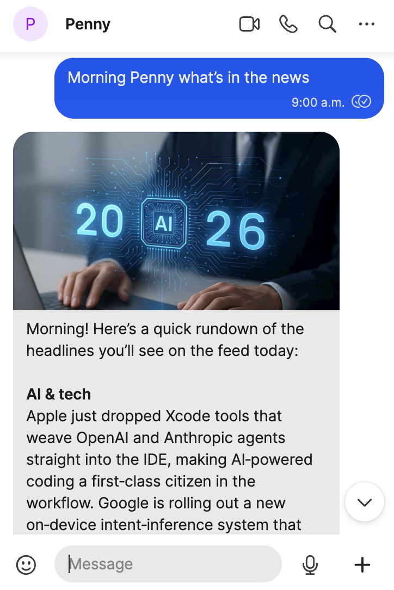
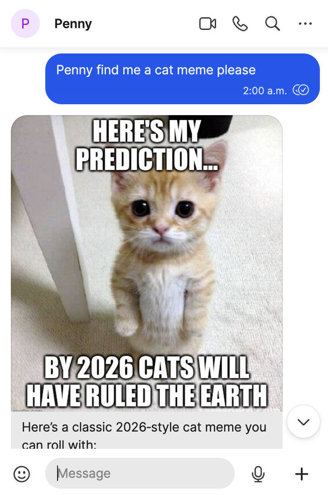
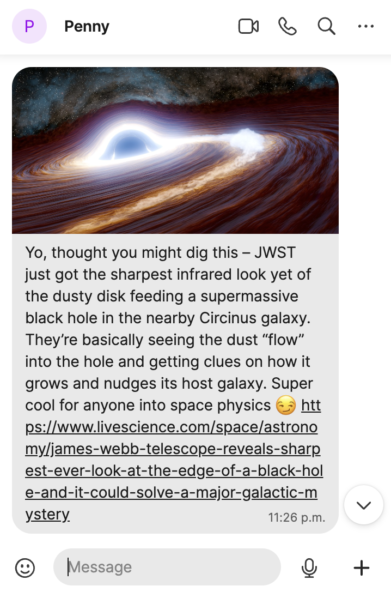
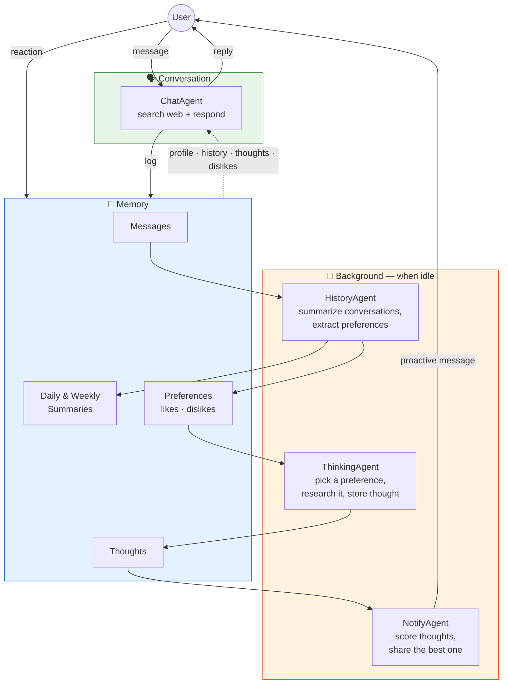

<p align="center">
  
</p>

# Penny
**Your private, personalized internet companion.**
<br>

**Author:** Jared Lockhart

[](https://github.com/jaredlockhart/penny/actions/workflows/check.yml)


<p align="center">
  
  
  
</p>

## Overview

Ask Penny anything and she'll search the web and text you back, always with sources.

But she's not just a question-answering bot. She pays attention. She remembers your conversations, learns what you're into, and starts sharing things she thinks you'd like on her own. She follows up on old topics when she finds something new. She gets to know you over time and her responses get more personal because of it.

Penny is a feed only for you. Private, personal, and local.

## How It Works

### Conversations

When you send Penny a message, she always searches the web before responding — she never makes things up from model knowledge. A local LLM (via [Ollama](https://ollama.com)) reads the search results and writes a response in her own voice: casual, calm, with sources.

Penny talks to you over [Signal](https://signal.org) or [Discord](https://discord.com) — the same apps you already use to message people. Quote-reply to continue a thread; she'll walk the conversation history for context.

### Preferences

Penny builds a model of what you care about. After each day's conversations, the **HistoryAgent** extracts preference topics from what you said and how you reacted — things you expressed interest in, opinions you shared, emoji reactions you left. Each preference is classified as positive or negative and deduplicated against what she already knows using token overlap and embedding similarity.

You can also manage preferences directly: `/like dark roast coffee`, `/dislike cold weather`, `/unlike`, `/undislike`. These drive what Penny thinks about and what she shares with you.

### Thinking

When Penny is idle, she thinks. The **ThinkingAgent** picks a random topic from your positive preferences, searches the web, and has an inner monologue — reasoning through what she finds. The result is stored as a **thought**, linked back to the preference that seeded it.

Thoughts bleed into chat context, so Penny has continuity of her own reasoning. When she finds something interesting, the **NotifyAgent** shares it with you — scoring candidates by novelty (avoiding repeats) and sentiment (preference alignment), with exponential backoff so she doesn't overwhelm you.

### Memory

The **HistoryAgent** also summarizes each day's conversations into topic bullets. Once a week completes, daily summaries are rolled up into weekly entries. This gives Penny a sliding window of context — recent daily detail plus older weekly summaries — so she remembers what you've talked about over weeks, not just the last few messages.

### Commands

Beyond regular conversation, Penny supports slash commands:

- **/like**, **/dislike** — view or add preferences
- **/unlike**, **/undislike** — remove preferences
- **/schedule** — set up recurring tasks (e.g., `/schedule daily 9am weather forecast`)
- **/config** — tune runtime parameters (scheduling intervals, notification settings, etc.)
- **/profile** — set your name, location, and timezone
- **/draw** — generate images via a local model
- **/bug**, **/feature** — file GitHub issues
- **/email** — search your Fastmail inbox
- **/mute**, **/unmute** — silence or resume notifications

## Penny's Mind

How information flows through Penny's cognitive systems — from perception to memory to thought to action.


```mermaid
flowchart TB
    User((User)) -->|message| Chat
    User -->|reaction| Memory

    subgraph Conversation["🗣 Conversation"]
        Chat[ChatAgent<br>search web + respond]
    end

    Memory -.->|"profile · history · thoughts · dislikes"| Chat
    Chat -->|reply| User
    Chat -->|log| Memory

    subgraph Memory["🧠 Memory"]
        Messages[Messages]
        Summaries["Daily & Weekly<br>Summaries"]
        Preferences["Preferences<br>likes · dislikes"]
        Thoughts[Thoughts]
    end

    subgraph Background["💭 Background — when idle"]
        History["HistoryAgent<br>summarize conversations,<br>extract preferences"]
        Thinking["ThinkingAgent<br>pick a preference,<br>research it, store thought"]
        Notify["NotifyAgent<br>score thoughts,<br>share the best one"]
    end

    Messages --> History
    History --> Summaries
    History --> Preferences
    Preferences --> Thinking
    Thinking --> Thoughts
    Thoughts --> Notify
    Notify -->|proactive message| User

    style Conversation fill:#e8f5e9,stroke:#2e7d32
    style Memory fill:#e3f2fd,stroke:#1565c0
    style Background fill:#fff3e0,stroke:#e65100
```

### The Cognitive Cycle

1. **Conversation** — user sends a message, ChatAgent searches the web and responds. Context is assembled from memory: profile, daily + weekly summaries, recent thoughts, and topics to avoid
2. **Digestion** — when idle, HistoryAgent summarizes conversations into daily and weekly entries, and extracts preferences (likes/dislikes) from what the user said and reacted to
3. **Reflection** — ThinkingAgent picks a random positive preference, searches the web, and reasons through what it finds. The result is stored as a thought
4. **Initiative** — NotifyAgent scores un-notified thoughts by novelty and preference alignment, composes a message, and sends it with exponential backoff
5. **Repeat** — the user's reaction feeds back into conversation, digestion, and reflection

### Models

Penny uses up to four Ollama model roles, all running locally:

| Role | Purpose | Required? |
|---|---|---|
| **Model** | Single model for all agents — chat, thinking, history, notify, schedules | Yes |
| **Embedding** | Semantic similarity for preference dedup and history embeddings | Optional |
| **Vision** | Image captioning when users send photos | Optional |
| **Image** | Image generation via `/draw` | Optional |

### Scheduling

Background agents run in priority order when idle (default: 60s after last message): schedule executor (always) → history → notify → thinking. Agents with no work are skipped. Foreground messages cancel the active background task immediately.

User-created scheduled tasks (via `/schedule`) run on their own timer regardless of idle state, so a daily weather briefing won't be blocked by an active conversation.

### Runtime Configuration

23 parameters are tunable at runtime via `/config` — scheduling intervals, notification backoff, preference dedup thresholds, inner monologue settings, and more. Values follow a three-tier lookup: database override → environment variable → default. Changes take effect immediately without restart.

## Setup & Running

### Prerequisites

1. **For Signal**: [signal-cli-rest-api](https://github.com/bbernhard/signal-cli-rest-api) running on host (port 8080)
2. **For Discord**: Discord bot token and channel ID
3. **[Ollama](https://ollama.com)** running on host (port 11434)
4. **[Perplexity API key](https://www.perplexity.ai)** (for web search)
5. Docker & Docker Compose installed

### Quick Start

```bash
# 1. Create .env file with your configuration
cp .env.example .env
# Edit .env with your settings (Signal or Discord credentials)

# 2. Start the agent
make up
```

### Make Commands

```bash
make up               # Build and start all services (foreground)
make prod             # Deploy penny only (no team, no override)
make kill             # Tear down containers and remove local images
make build            # Build the penny Docker image
make check            # Build, format check, lint, typecheck, and run tests
make pytest           # Run integration tests
make fmt              # Format with ruff
make fix              # Format + autofix lint issues
make typecheck        # Type check with ty
make token            # Generate GitHub App installation token for gh CLI
make migrate-test     # Test database migrations against a copy of prod DB
```

All dev tool commands run in temporary Docker containers via `docker compose run --rm`, with source volume-mounted so changes write back to the host filesystem.

<details>
<summary><h2>Configuration</h2></summary>

Configuration is managed via a `.env` file in the project root:

```bash
# .env

# Channel type (optional - auto-detected from credentials)
# CHANNEL_TYPE="signal"  # or "discord"

# Signal Configuration (required for Signal)
SIGNAL_NUMBER="+1234567890"
SIGNAL_API_URL="http://localhost:8080"

# Discord Configuration (required for Discord)
DISCORD_BOT_TOKEN="your-bot-token"
DISCORD_CHANNEL_ID="your-channel-id"

# Ollama Configuration
OLLAMA_API_URL="http://host.docker.internal:11434"
OLLAMA_MODEL="gpt-oss:20b"               # Single model for all agents

# Perplexity Configuration
PERPLEXITY_API_KEY="your-api-key"

# Database & Logging
DB_PATH="/penny/data/penny/penny.db"
LOG_LEVEL="INFO"
# LOG_FILE="/penny/data/penny/logs/penny.log"  # Optional

# Agent behavior (optional, defaults shown)
MESSAGE_MAX_STEPS=8
IDLE_SECONDS=60                     # Global idle threshold for background tasks

# Fastmail JMAP (optional, enables /email command)
# FASTMAIL_API_TOKEN="your-api-token"

# GitHub App (optional, enables /bug command and agent containers)
# GITHUB_APP_ID="12345"
# GITHUB_APP_PRIVATE_KEY_PATH="path/to/key.pem"
# GITHUB_APP_INSTALLATION_ID="67890"
```

### Channel Selection

Penny auto-detects which channel to use based on configured credentials:
- If `DISCORD_BOT_TOKEN` and `DISCORD_CHANNEL_ID` are set (and Signal is not), uses Discord
- If `SIGNAL_NUMBER` is set, uses Signal
- Set `CHANNEL_TYPE` explicitly to override auto-detection

### Configuration Reference

**Ollama:**
- `OLLAMA_API_URL`: Ollama API endpoint (default: http://host.docker.internal:11434)
- `OLLAMA_MODEL`: Single model for all agents (default: gpt-oss:20b)
- `OLLAMA_VISION_MODEL`: Vision model for image understanding (e.g., qwen3-vl). Optional
- `OLLAMA_IMAGE_MODEL`: Image generation model (e.g., x/z-image-turbo). Optional; enables `/draw`
- `OLLAMA_EMBEDDING_MODEL`: Dedicated embedding model (e.g., embeddinggemma). Optional
- `OLLAMA_MAX_RETRIES`: Retry attempts on transient Ollama errors (default: 3)
- `OLLAMA_RETRY_DELAY`: Delay in seconds between retries (default: 0.5)

**API Keys:**
- `PERPLEXITY_API_KEY`: API key for web search
- `SERPER_API_KEY`: API key for Serper image search (optional; if unset, notifications won't include images)
- `NEWS_API_KEY`: API key for TheNewsAPI.com (optional; enables news search tool)
- `FASTMAIL_API_TOKEN`: API token for Fastmail JMAP email search (optional, enables `/email`)

**GitHub App** (optional, enables `/bug` and `/feature`; required for agent containers):
- `GITHUB_APP_ID`, `GITHUB_APP_PRIVATE_KEY_PATH`, `GITHUB_APP_INSTALLATION_ID`

**Behavior:**
- `MESSAGE_MAX_STEPS`: Max agent loop steps per message (default: 8)
- `IDLE_SECONDS`: Global idle threshold for all background tasks (default: 60)
- `TOOL_TIMEOUT`: Tool execution timeout in seconds (default: 60)
- 23 parameters are runtime-configurable via `/config`

**Logging:**
- `LOG_LEVEL`: DEBUG, INFO, WARNING, ERROR (default: INFO)
- `LOG_FILE`: Optional path to log file
- `LOG_MAX_BYTES`: Maximum log file size before rotation (default: 10 MB)
- `LOG_BACKUP_COUNT`: Number of rotated backup files to keep (default: 5)
- `DB_PATH`: SQLite database location (default: /penny/data/penny/penny.db)

</details>

<details>
<summary><h2>Discord Setup</h2></summary>

1. Create a Discord application at https://discord.com/developers/applications
2. Create a bot for the application and copy the token
3. Enable these intents in the Bot settings:
   - Message Content Intent
   - Server Members Intent (optional)
4. Invite the bot to your server with the OAuth2 URL Generator:
   - Scopes: `bot`
   - Permissions: `Send Messages`, `Read Message History`
5. Get the channel ID (enable Developer Mode in Discord settings, right-click channel → Copy ID)
6. Add to your `.env`:
   ```bash
   DISCORD_BOT_TOKEN="your-token"
   DISCORD_CHANNEL_ID="your-channel-id"
   ```

</details>

<details>
<summary><h2>Testing & CI</h2></summary>

Penny includes end-to-end integration tests that mock all external services:

```bash
make pytest      # Run all tests
make check       # Run format, lint, typecheck, and tests
```

CI runs `make check` in Docker on every push to `main` and on pull requests via GitHub Actions.

Tests cover the full message flow (search, response, threading, typing indicators), all background agents (history, thinking, notify, scheduler coordination), every slash command, vision processing, and tool edge cases. External services are replaced with mock servers and SDK patches — a mock Signal WebSocket server, a mock Ollama client with configurable responses, and mock search APIs.

</details>

<details>
<summary><h2>Agent Orchestrator</h2></summary>

Penny includes a Python-based agent orchestrator that manages autonomous Claude CLI agents. Agents process work from GitHub Issues on a schedule, using labels as a state machine:

```
backlog → requirements → specification → in-progress → in-review → closed   (features)
bug → in-review → closed                                                     (bug fixes)
```

**Agents:**
- **Product Manager**: Gathers requirements for `requirements` issues
- **Architect**: Writes detailed specs for `specification` issues, handles spec feedback
- **Worker**: Implements `in-progress` issues — creates branches, writes code/tests, runs `make check`, opens PRs; addresses PR feedback on `in-review` issues; fixes `bug` issues directly
- **Monitor**: Watches production logs for errors, deduplicates against existing issues, and files `bug` issues automatically
- **Quality**: Evaluates Penny's response quality via Ollama, files `bug` issues for low-quality output (optional, requires `OLLAMA_BACKGROUND_MODEL`)

Each agent checks for matching GitHub issue labels before waking Claude CLI, so idle cycles cost ~1 second instead of a full Claude invocation.

```bash
make up          # Run orchestrator with full stack
```

</details>

## License

MIT
