# Knowledge System v2 — Sequence Diagrams

## Flow 1: User Message → Search → Entity + Fact Discovery

User sends a message that triggers a search. The search creates a SearchLog tagged `trigger=user_message`. The extraction pipeline processes it later and can create new entities and facts.

```mermaid
sequenceDiagram
    actor User
    participant Penny as Penny<br/>(Message Handler)
    participant Search as SearchTool
    participant DB as Database
    participant Extract as Extraction Pipeline
    participant LLM as Ollama

    Note over User,LLM: ── User sends a message ──

    User->>Penny: "what's a good bookshelf speaker?"
    Penny->>DB: embed message, find similar entities
    DB-->>Penny: (no close matches or partial matches)
    Note over Penny: Knowledge sufficiency check → search needed
    Penny->>Search: search("good bookshelf speaker")
    Search->>DB: log_search(query, response, trigger="user_message")
    Note over DB: SearchLog created<br/>trigger=user_message<br/>extracted=false
    Search-->>Penny: search results
    Penny->>LLM: generate response with results
    LLM-->>Penny: "A few great options: the KEF LS50 Meta..."
    Penny->>User: response
    Penny->>DB: log incoming + outgoing messages

    Note over Extract,LLM: ── Extraction pipeline runs (next idle tick) ──

    Extract->>DB: get_unprocessed_search_logs()
    DB-->>Extract: SearchLog (trigger=user_message)
    Note over Extract: trigger=user_message → allow new entities ✓

    Extract->>LLM: Pass 1 — identify entities in search results<br/>(full identification prompt + known entities list)
    LLM-->>Extract: known: [], new: [KEF LS50 Meta, Wharfedale Denton 85]
    Extract->>DB: get_or_create_entity("kef ls50 meta")
    Extract->>DB: get_or_create_entity("wharfedale denton 85")

    Extract->>LLM: Pass 2 — extract facts for "kef ls50 meta"
    LLM-->>Extract: ["costs $1,599", "12th gen Uni-Q driver", "bookshelf speaker"]
    Extract->>DB: add_fact(entity=kef_ls50, content=..., source_search_log_id=...)

    Extract->>LLM: Pass 2 — extract facts for "wharfedale denton 85"
    LLM-->>Extract: ["classic warm sound", "85th anniversary edition", "6.5-inch woofer"]
    Extract->>DB: add_fact(entity=wharfedale, content=..., source_search_log_id=...)

    Extract->>DB: add_engagement(type=SEARCH_INITIATED, entity=kef_ls50, strength=0.6)
    Extract->>DB: add_engagement(type=SEARCH_INITIATED, entity=wharfedale, strength=0.6)
    Extract->>DB: mark_search_extracted(search_log_id)

    Note over Extract,User: ── Fact discovery notification ──

    Extract->>LLM: compose notification about new discoveries
    Extract->>User: "I just discovered kef ls50 meta and wharfedale denton 85<br/>and learned some stuff about them"
```



## Flow 2: /learn → Search Sequence → Entity + Fact Discovery

User uses `/learn` to express interest. Penny generates multiple varied search queries, executes them, and the extraction pipeline processes the results.

```mermaid
sequenceDiagram
    actor User
    participant Penny as Penny<br/>(/learn Command)
    participant Search as SearchTool
    participant DB as Database
    participant LLM as Ollama
    participant Extract as Extraction Pipeline

    Note over User,Extract: ── User sends /learn ──

    User->>Penny: "/learn ai conferences in europe"
    Penny->>DB: create LearnPrompt(user, "ai conferences in europe", status=active)
    DB-->>Penny: LearnPrompt(id=1)
    Penny->>User: "Okay, I'll learn more about ai conferences in europe"

    Note over Penny,LLM: ── Background: generate search sequence ──

    Penny->>LLM: generate 3-5 varied search queries from prompt
    LLM-->>Penny: queries: [<br/>  "top AI conferences Europe 2026",<br/>  "ML Prague conference schedule speakers",<br/>  "European AI summit agenda registration",<br/>  "AI research conferences EU academic industry",<br/>  "NeurIPS ICML ICLR European alternatives"<br/>]
    Penny->>DB: update_learn_prompt_remaining(id=1, count=5)

    Note over Penny,DB: ── Execute searches sequentially ──

    loop For each search query
        Penny->>Search: search(query, trigger="learn_command", learn_prompt_id=1)
        Search->>DB: log_search(query, response,<br/>trigger="learn_command", learn_prompt_id=1)
        Note over DB: SearchLog created<br/>trigger=learn_command<br/>learn_prompt_id=1
        Penny->>DB: decrement_learn_prompt_remaining(id=1)
    end

    Penny->>DB: complete_learn_prompt(id=1)

    Note over Extract,LLM: ── Extraction pipeline processes SearchLogs ──

    Extract->>DB: get_unprocessed_search_logs()
    DB-->>Extract: 5 SearchLogs (trigger=learn_command)
    Note over Extract: trigger=learn_command → allow new entities ✓

    loop For each SearchLog
        Extract->>LLM: identify entities (full mode)
        LLM-->>Extract: known + new entities
        Extract->>DB: create new entities
        Extract->>LLM: extract facts per entity
        Extract->>DB: store facts with source_search_log_id
        Extract->>DB: create SEARCH_INITIATED engagements
    end

    Note over Extract,User: ── Fact discovery notification ──

    Extract->>User: "I just learned a bunch of stuff about<br/>ml prague 2026, neurips, and more..."
```



## Flow 3: /learn Status View (Provenance Chain)

User queries `/learn` with no args to see what's being learned and what's been discovered.


## Flow 4: Penny Enrichment → Fact-Only Extraction (No New Entities)

Penny's learn loop picks a known entity, searches for more facts, and sends a proactive message. The SearchLog is tagged `penny_enrichment` so the extraction pipeline won't create new entities from it.

```mermaid
sequenceDiagram
    actor User
    participant Loop as Learn Loop<br/>(Penny Enrichment)
    participant Search as SearchTool
    participant DB as Database
    participant LLM as Ollama
    participant Extract as Extraction Pipeline

    Note over Loop,LLM: ── Learn loop picks highest-priority entity ──

    Loop->>DB: get all entities + engagements
    DB-->>Loop: entities with interest scores
    Loop->>Loop: score entities:<br/>interest × (1/fact_count) × staleness
    Note over Loop: Top candidate: "kef ls50 meta"<br/>(interest=1.6, facts=5, stale=3 days)
    Note over Loop: fact_count=5 → enrichment mode

    Loop->>Search: search("kef ls50 meta reviews comparisons",<br/>trigger="penny_enrichment")
    Search->>DB: log_search(query, response, trigger="penny_enrichment")
    Note over DB: SearchLog created<br/>trigger=penny_enrichment<br/>extracted=false

    Note over Loop,LLM: ── Learn loop extracts facts inline ──

    Loop->>DB: get_entity_facts("kef ls50 meta")
    DB-->>Loop: 5 existing facts
    Loop->>LLM: extract new facts (excluding known facts)
    LLM-->>Loop: 3 new facts about amp pairing, room placement
    Loop->>DB: add_fact × 3 (source_search_log_id=...)
    Loop->>DB: update_entity_embedding()

    Note over Loop,User: ── Learn loop sends proactive message ──

    Loop->>LLM: compose casual message about findings
    LLM-->>Loop: "Found some more on the LS50 Meta..."
    Loop->>User: proactive message + image

    Note over Extract,LLM: ── Extraction pipeline processes same SearchLog later ──

    Extract->>DB: get_unprocessed_search_logs()
    DB-->>Extract: SearchLog (trigger=penny_enrichment)
    Note over Extract: trigger=penny_enrichment → known entities ONLY ✗ no new entities

    Extract->>LLM: identify entities (known-only prompt)
    LLM-->>Extract: known: [kef ls50 meta], new: []
    Note over Extract: Skips any new entities the LLM might mention
    Extract->>LLM: extract facts for "kef ls50 meta"
    Note over Extract: Facts deduplicated against existing<br/>(learn loop already stored them)
    Extract->>DB: mark_search_extracted(search_log_id)
    Note over Extract: No notification sent<br/>(trigger=penny_enrichment, learn loop already messaged)
```

## Flow 5: Passive Learning Across Conversations

User never uses `/learn`. Knowledge builds purely from conversation patterns and message-triggered searches.

```mermaid
sequenceDiagram
    actor User
    participant Penny as Penny<br/>(Message Handler)
    participant DB as Database
    participant Extract as Extraction Pipeline
    participant Loop as Learn Loop

    Note over User,Loop: ── Week 1: User asks about obsidian ──

    User->>Penny: "search for obsidian markdown plugins"
    Note over Penny: SearchLog created (trigger=user_message)
    Note over Extract: Extraction: creates Entity("obsidian"), 3 facts<br/>Engagement: SEARCH_INITIATED (0.6)

    User->>Penny: "what's the best way to do daily notes in obsidian?"
    Note over Penny: Retrieves "obsidian" entity, injects 3 known facts
    Note over Penny: Knowledge insufficient → searches again
    Note over Extract: Extraction: 4 more facts for "obsidian"<br/>Engagement: FOLLOW_UP_QUESTION (0.5)

    User->>Penny: "can you compare notion vs obsidian?"
    Note over Penny: SearchLog created (trigger=user_message)
    Note over Extract: Extraction: creates Entity("notion"), adds facts<br/>More facts for "obsidian"<br/>Engagement: SEARCH_INITIATED for both (0.6)

    Note over DB: Obsidian: interest=1.7 (search + follow-up + search)<br/>Notion: interest=0.6 (one search)<br/>No /learn, no /like — just conversation

    Note over Loop,DB: ── Learn loop notices the pattern ──

    Loop->>DB: score entities
    Note over Loop: Obsidian: high interest (1.7) × moderate gaps<br/>→ top enrichment candidate
    Loop->>DB: search for more obsidian facts (trigger=penny_enrichment)
    Note over Loop: Enrichment mode: fills knowledge gaps
    Loop->>User: "By the way — Obsidian released a new plugin<br/>for canvas-based PKM workflows"

    User->>Penny: 👍
    Note over DB: Engagement: EMOJI_REACTION (0.5, proactive message)<br/>Interest reinforced organically
```

## Flow 6: /like and /dislike Shape Research Priorities

User preferences steer Penny's enrichment away from uninteresting directions.

```mermaid
sequenceDiagram
    actor User
    participant Penny as Penny<br/>(Commands)
    participant DB as Database
    participant Loop as Learn Loop

    User->>Penny: "/like mechanical keyboards"
    Penny->>DB: create Preference("mechanical keyboards", type=like)
    Penny->>DB: get_or_create_entity("mechanical keyboards")
    Penny->>DB: create LIKE_COMMAND engagement (0.8) for entity
    Penny->>DB: find additional matching entities via embedding similarity
    Note over DB: Also matches: "keychron q1", "cherry mx switches"
    Penny->>DB: create LIKE_COMMAND engagement (0.8) for each match
    Penny->>User: "Added 'mechanical keyboards' to your likes"

    User->>Penny: "/dislike sports"
    Penny->>DB: create Preference("sports", type=dislike)
    Penny->>DB: create DISLIKE_COMMAND engagement (negative, 0.8)
    Penny->>User: "Noted — I'll avoid sports content"

    Note over Loop,DB: ── Learn loop ──

    Loop->>DB: score entities
    Note over Loop: keychron q1: boosted by /like engagement<br/>sports entities: negative interest → SKIP
    Loop->>DB: pick "keychron q1" for enrichment
    Note over Loop: Researches keyboards, NOT sports

    Note over User,DB: ── Later: new entity matches preference ──

    User->>Penny: "what do you know about the nuphy air75?"
    Note over DB: New entity: "nuphy air75" created (user-triggered)<br/>Embedding similarity → matches "mechanical keyboards" preference<br/>→ inherits interest boost
    Note over Loop: nuphy air75 gets moderate priority<br/>(preference-linked + thin knowledge)
```

## Flow 7: Thumbs-Down Stops Proactive Messages

User reacts negatively to a proactive message, suppressing that entity from research.

```mermaid
sequenceDiagram
    actor User
    participant Loop as Learn Loop
    participant DB as Database

    Note over Loop,DB: ── Learn loop sends proactive message ──

    Loop->>User: "Found something interesting about sourdough<br/>starters — there's a new technique..."

    Note over User,DB: ── User doesn't care ──

    User->>DB: 👎 (reaction on proactive message)
    Note over DB: Entity: "sourdough starters"<br/>Proactive message + negative reaction<br/>= strong negative engagement (0.8)

    Note over DB: "sourdough starters" interest drops<br/>Was 0.7 → now effectively -0.1

    Note over Loop,DB: ── Next enrichment cycle ──

    Loop->>DB: score entities
    Note over Loop: "sourdough starters": negative interest → SKIP<br/>Penny stops researching sourdough
```

## Flow 8: Entity Creation Boundary — What Gets Blocked

Demonstrates the key architectural boundary: penny-triggered searches cannot create entities even when the search results contain new topics.

```mermaid
sequenceDiagram
    participant Loop as Learn Loop
    participant Search as SearchTool
    participant DB as Database
    participant Extract as Extraction Pipeline
    participant LLM as Ollama

    Note over Loop,LLM: ── Learn loop enriches "ml prague 2026" ──

    Loop->>Search: search("ML Prague 2026 speakers schedule",<br/>trigger="penny_enrichment")
    Search->>DB: log_search(trigger="penny_enrichment")

    Note over DB: Search results mention:<br/>- ML Prague 2026 (KNOWN entity)<br/>- Sanofi (NOT an entity)<br/>- Bloomreach (NOT an entity)<br/>- NVIDIA (KNOWN entity)

    Note over Extract,LLM: ── Extraction processes the SearchLog ──

    Extract->>DB: get SearchLog (trigger=penny_enrichment)
    Note over Extract: trigger=penny_enrichment<br/>→ KNOWN ENTITIES ONLY

    Extract->>LLM: identify entities (known-only prompt)
    LLM-->>Extract: known: [ml prague 2026, nvidia]<br/>new: [sanofi, bloomreach]
    Note over Extract: ✗ DISCARDS sanofi, bloomreach<br/>(penny cannot create new entities)

    Extract->>LLM: extract facts for "ml prague 2026"
    Extract->>DB: add new facts for ml prague 2026
    Extract->>LLM: extract facts for "nvidia"
    Extract->>DB: add new facts for nvidia

    Note over Extract: ✓ New facts stored for known entities<br/>✗ No new entities created<br/>✗ No engagements created<br/>✗ No notification sent

    Extract->>DB: mark_search_extracted()
```
