# Knowledge System — Example Flows

## Scenario 1: First Conversation → Knowledge Building → Enrichment

User asks about something Penny doesn't know yet. Over time, Penny builds knowledge and starts proactively sharing.

```mermaid
sequenceDiagram
    actor User
    participant Penny as Penny<br/>(Message Handler)
    participant DB as Knowledge Store
    participant Search as Perplexity
    participant LLM as Ollama
    participant Extract as Extraction Loop
    participant Enrich as Enrichment Loop

    Note over User,Enrich: ── User asks about something new ──

    User->>Penny: "what's a good bookshelf speaker for a desk?"
    Penny->>DB: retrieve entities matching message (embedding similarity)
    DB-->>Penny: (no matches — empty knowledge)
    Penny->>Search: search "good bookshelf speaker for desk"
    Search-->>Penny: results mentioning KEF LS50 Meta, Edifier S3000Pro, etc.
    Penny->>LLM: generate response with search results
    LLM-->>Penny: "A few great options: the KEF LS50 Meta ($1,600)..."
    Penny->>User: response
    Penny->>DB: store SearchLog, MessageLog

    Note over Extract,DB: ── Extraction loop runs (next idle tick) ──

    Extract->>DB: get unprocessed SearchLogs + MessageLogs
    DB-->>Extract: search results about speakers
    Extract->>LLM: extract entities + facts from search results
    LLM-->>Extract: entities: [KEF LS50 Meta, Edifier S3000Pro, JBL 4305P]
    Extract->>LLM: extract facts per entity
    LLM-->>Extract: KEF LS50 Meta: [costs $1600, 12th gen Uni-Q driver, ...]
    Extract->>DB: create Entity("kef ls50 meta") + Fact rows with source URLs
    Extract->>LLM: generate embeddings for entities + facts
    LLM-->>Extract: embedding vectors
    Extract->>DB: store embeddings
    Extract->>LLM: extract signals from user message
    LLM-->>Extract: signal: search_initiated, "bookshelf speakers", medium strength
    Extract->>DB: create Signal(user, entity=null, type=search_initiated, strength=0.6)

    Note over User,Enrich: ── User follows up (interest signal strengthens) ──

    User->>Penny: "tell me more about the kef ls50 meta"
    Penny->>DB: retrieve entities matching message
    DB-->>Penny: Entity("kef ls50 meta") + 5 facts
    Note over Penny: Injects known facts into prompt
    Penny->>Search: search "KEF LS50 Meta detailed review"
    Search-->>Penny: deeper results
    Penny->>LLM: generate response with known facts + new search results
    LLM-->>Penny: "Building on what I know — the LS50 Meta uses a MAT driver..."
    Penny->>User: enriched response (references existing knowledge)
    Penny->>DB: store SearchLog, MessageLog

    Note over Extract,DB: ── Extraction loop processes new data ──

    Extract->>DB: get unprocessed content
    Extract->>LLM: extract new facts (informed by existing facts to avoid dupes)
    Extract->>DB: add 4 new Fact rows to KEF LS50 Meta
    Extract->>DB: create Signal(user, entity=kef_ls50, type=follow_up, strength=0.5)
    Extract->>LLM: regenerate entity embedding (facts changed)
    Extract->>DB: update embedding

    Note over User,Penny: ── User reacts positively ──

    User->>Penny: 👍 (reaction to LS50 Meta message)
    Penny->>DB: lookup message content, match entities via embeddings
    Penny->>DB: create Signal(user, entity=kef_ls50, type=emoji_reaction, valence=positive, strength=0.3)

    Note over DB: KEF LS50 Meta interest score is now HIGH<br/>(search + follow_up + reaction = ~1.4)

    Note over Enrich,DB: ── Enrichment loop runs (idle period) ──

    Enrich->>DB: score all entities: interest × (1/fact_count) × staleness
    DB-->>Enrich: top candidate: KEF LS50 Meta (high interest, moderate facts)
    Enrich->>DB: get existing facts for KEF LS50 Meta
    DB-->>Enrich: 9 facts about price, driver, design...
    Enrich->>Search: "KEF LS50 Meta reviews comparisons pros cons" (targeting gaps)
    Search-->>Enrich: new results about sound signature, room placement, amp pairing
    Enrich->>LLM: extract facts NOT already known
    LLM-->>Enrich: 3 new facts about amp pairing + room placement
    Enrich->>DB: store new Facts with source URLs, update last_verified on confirmed facts
    Enrich->>LLM: compose message about findings
    LLM-->>Enrich: "Found some more on the LS50 Meta — they pair really well with..."
    Enrich->>User: proactive message with new findings
```

## Scenario 2: /learn Command → Enrichment Cycle → Interest Decay

User explicitly asks to learn about something. Enrichment researches aggressively at first, then cools off.

```mermaid
sequenceDiagram
    actor User
    participant Penny as Penny<br/>(Message Handler)
    participant DB as Knowledge Store
    participant Search as Perplexity
    participant LLM as Ollama
    participant Extract as Extraction Loop
    participant Enrich as Enrichment Loop

    Note over User,Enrich: ── User uses /learn ──

    User->>Penny: "/learn decent de1 espresso machine"
    Penny->>DB: find or create Entity("decent de1")
    Penny->>LLM: generate embedding for "decent de1 espresso machine"
    Penny->>DB: create Signal(user, entity=de1, type=learn_command, strength=1.0)
    Penny->>User: "Got it, I'll look into the Decent DE1 and let you know what I find."

    Note over DB: Decent DE1: interest=1.0, facts=0<br/>Priority = 1.0 × (1/0) × 1.0 = MAXIMUM

    Note over Enrich,DB: ── Enrichment cycle 1 (minutes later) ──

    Enrich->>DB: score entities → Decent DE1 is #1 priority (max interest, zero facts)
    Enrich->>DB: get existing facts → (none)
    Enrich->>Search: "Decent DE1 espresso machine overview features price"
    Search-->>Enrich: comprehensive results
    Enrich->>LLM: extract all facts
    LLM-->>Enrich: 8 facts: price $3,500, pressure profiling, flow control, tablet UI, ...
    Enrich->>DB: store 8 Fact rows with sources
    Enrich->>LLM: generate embeddings for new facts
    Enrich->>DB: store embeddings, update entity embedding
    Enrich->>LLM: compose findings message
    Enrich->>User: "Here's what I found about the Decent DE1: it's a $3,500 espresso machine with real-time pressure profiling..."

    Note over User,Penny: ── User engages with findings ──

    User->>Penny: 👍 (reaction)
    Penny->>DB: create Signal(user, entity=de1, type=emoji_reaction, strength=0.3)

    Note over DB: DE1 interest refreshed: 1.0 + 0.3 = 1.3

    Note over Enrich,DB: ── Enrichment cycle 2 (next idle period) ──

    Enrich->>DB: score entities → DE1 still top (high interest, but now has 8 facts)
    Enrich->>DB: get existing facts (8 facts about price, features, UI)
    Enrich->>Search: "Decent DE1 user reviews workflow comparison to other machines"
    Search-->>Enrich: results about user experience, comparison to Lelit Bianca
    Enrich->>LLM: extract facts NOT already known (compare against existing via embeddings)
    LLM-->>Enrich: 4 new facts: workflow differences, learning curve, community support
    Enrich->>DB: store new facts
    Enrich->>User: "More on the DE1 — users say the learning curve is steep but the community is great..."

    Note over Enrich,DB: ── Enrichment cycle 3 (later) ──

    Enrich->>DB: score entities → DE1: interest decaying (1.3 × 0.8 recency), 12 facts now
    Note over Enrich: Priority dropping: less interest decay × more facts = lower score
    Enrich->>DB: get existing facts (12 facts — pretty comprehensive now)
    Enrich->>Search: "Decent DE1 accessories maintenance tips"
    Search-->>Enrich: some new info about maintenance
    Enrich->>LLM: extract genuinely new facts
    LLM-->>Enrich: 1 new fact about descaling schedule
    Enrich->>DB: store fact, update last_verified on others
    Note over Enrich: Only 1 new fact — not substantial enough to message
    Note over Enrich: (no message sent to user)

    Note over Enrich,DB: ── Subsequent cycles ──

    Note over DB: DE1 interest continues decaying (no new user signals)<br/>DE1 has 13 facts, all recently verified<br/>Priority score now LOW — other entities get attention
    Note over Enrich: DE1 naturally transitions from "actively researching"<br/>to "known entity, monitor for changes" (briefing territory)
```

## Scenario 3: Briefing Detects Genuine News + Entity Cleaner

Time passes. Briefing finds something genuinely new. Meanwhile, entity cleaner merges duplicates.

```mermaid
sequenceDiagram
    actor User
    participant Penny as Penny<br/>(Message Handler)
    participant DB as Knowledge Store
    participant Search as Perplexity
    participant LLM as Ollama
    participant Clean as Entity Cleaner
    participant Brief as Briefing Loop

    Note over Clean,DB: ── Entity Cleaner runs (daily) ──

    Clean->>DB: get all entities for user
    DB-->>Clean: [..., "kef ls50 meta", "kef ls50", "ls50 meta", ...]
    Clean->>LLM: identify duplicate groups, pick canonical names
    LLM-->>Clean: merge group: ["kef ls50 meta", "kef ls50", "ls50 meta"] → "kef ls50 meta"
    Clean->>DB: merge facts (deduplicate via embedding similarity)
    Clean->>DB: reassign signals from duplicates to canonical entity
    Clean->>DB: delete duplicate entities
    Clean->>LLM: regenerate embedding for merged entity
    Clean->>DB: update embedding

    Note over Brief,DB: ── Briefing loop runs (every few hours) ──

    Brief->>DB: find high-interest, knowledge-rich entities with oldest last_verified
    DB-->>Brief: KEF LS50 Meta (interest=0.9, facts=15, last_verified=3 days ago)
    Brief->>Search: "KEF LS50 Meta news updates 2026"
    Search-->>Brief: result: "KEF releases LS50 Meta firmware v2.1 with improved DSP"
    Brief->>LLM: extract candidate facts
    LLM-->>Brief: "firmware v2.1 released Feb 2026 with improved DSP processing"
    Brief->>DB: get existing facts for KEF LS50 Meta
    Brief->>LLM: compare candidate fact embeddings against existing fact embeddings
    LLM-->>Brief: similarity < threshold for all existing facts → GENUINELY NEW
    Brief->>DB: store new Fact with source URL
    Brief->>LLM: compose brief message
    LLM-->>Brief: "Heads up — KEF just pushed firmware v2.1 for the LS50 Meta with improved DSP."
    Brief->>User: proactive message

    Note over User,Penny: ── User engages ──

    User->>Penny: "oh nice, what does the dsp update actually change?"
    Penny->>DB: retrieve KEF LS50 Meta entity (16 facts now, including firmware update)
    Note over Penny: Injects all known facts including the new firmware one
    Penny->>Search: "KEF LS50 Meta firmware v2.1 DSP changes details"
    Search-->>Penny: detailed changelog
    Penny->>LLM: respond using known facts + new search results
    Penny->>User: "The v2.1 update refines the crossover tuning and adds..."
    Penny->>DB: store SearchLog, MessageLog

    Note over DB: Follow-up question about KEF LS50 Meta<br/>→ new signal (follow_up, strength=0.5)<br/>→ interest score refreshed, stays in briefing rotation
```

## Scenario 4: Passive Learning Across Conversations

User never uses /learn or /like. System builds knowledge purely from conversation patterns.

```mermaid
sequenceDiagram
    actor User
    participant Penny as Penny<br/>(Message Handler)
    participant DB as Knowledge Store
    participant Extract as Extraction Loop
    participant Enrich as Enrichment Loop

    Note over User,Enrich: ── Week 1: Scattered mentions ──

    User->>Penny: "search for obsidian markdown plugins"
    Note over Extract: → Entity: "obsidian", Signal: search_initiated (0.6)
    User->>Penny: "what's the best way to do daily notes in obsidian?"
    Note over Extract: → Signal: follow_up for "obsidian" (0.5), new facts extracted
    User->>Penny: "can you find a comparison of notion vs obsidian?"
    Note over Extract: → Entity: "notion", Signal: search_initiated (0.6)<br/>→ Signal: another follow_up for "obsidian" (0.5)

    Note over DB: Obsidian: interest = 1.6 (three interactions)<br/>Notion: interest = 0.6 (one interaction)<br/>No /learn, no /like — just conversation signals

    Note over User,Enrich: ── Week 2: User mentions it in passing ──

    User->>Penny: "I was organizing my obsidian vault and found this article about PKM"
    Note over Extract: → Signal: message_mention for "obsidian" (0.2)<br/>→ Entity: "PKM" (personal knowledge management)

    Note over DB: Obsidian: interest = 1.8 (still accumulating)<br/>Obsidian has 8 facts from previous searches<br/>PKM: interest = 0.2 (single weak mention)

    Note over Enrich,DB: ── Enrichment notices the pattern ──

    Enrich->>DB: score entities
    Note over Enrich: Obsidian: high interest (1.8) × moderate gaps = top candidate
    Enrich->>DB: get known facts about Obsidian
    Note over Enrich: Knows about: plugins, daily notes, vs Notion<br/>Gaps: advanced workflows, community templates, new features
    Enrich->>Penny: "By the way — Obsidian released a new plugin for canvas-based PKM workflows. Thought you'd find it interesting since you've been digging into this."

    User->>Penny: 👍
    Note over DB: Signal: emoji_reaction for "obsidian" (0.3)<br/>Interest reinforced without user ever explicitly saying "I like Obsidian"
```

## Scenario 5: /like and /dislike Shape What Penny Investigates

User preferences steer enrichment away from uninteresting directions.

```mermaid
sequenceDiagram
    actor User
    participant Penny as Penny<br/>(Message Handler)
    participant DB as Knowledge Store
    participant Enrich as Enrichment Loop
    participant Brief as Briefing Loop

    User->>Penny: "/like mechanical keyboards"
    Penny->>DB: create Preference(user, "mechanical keyboards", type=like)
    Penny->>DB: find matching entities via embedding similarity
    Note over DB: Links preference to: "keychron q1", "cherry mx switches"<br/>(entities from previous conversations)
    Penny->>DB: create Signal(user, type=like_command, strength=0.8) for each linked entity
    Penny->>User: "Added 'mechanical keyboards' to your likes."

    User->>Penny: "/dislike sports"
    Penny->>DB: create Preference(user, "sports", type=dislike)
    Penny->>DB: create Signal(user, type=dislike_command, valence=negative, strength=0.8)
    Penny->>User: "Noted — I'll avoid sports content."

    Note over Enrich,DB: ── Enrichment loop ──

    Enrich->>DB: score entities (interest × knowledge_gap × staleness)
    Note over Enrich: Entities with positive signals: keychron q1 (boosted by /like link)<br/>Entities with negative signals: anything sports-related (suppressed)<br/>Negative interest score = SKIP entirely
    Enrich->>DB: pick "keychron q1" — boosted interest, thin knowledge
    Note over Enrich: (researches keyboards, NOT sports)

    Note over Brief,DB: ── Briefing loop ──

    Brief->>DB: find briefing candidates
    Note over Brief: Filters out entities linked to dislike preferences<br/>Only monitors entities with positive interest
    Note over Brief: (will never proactively send sports content)

    Note over User,Enrich: ── Later: new entity matches existing preference ──

    User->>Penny: "what do you know about the nuphy air75?"
    Note over DB: New entity: "nuphy air75"<br/>Extraction links it to "mechanical keyboards" preference via embedding similarity<br/>→ Inherits interest boost from the /like
    Note over Enrich: nuphy air75 immediately gets moderate priority<br/>(preference-linked interest + thin knowledge)
```

