# Knowledge System v2 — Sequence Diagrams

## Flow 1: User Message → Search → Entity + Fact Discovery

User sends a message that triggers a search. The extraction pipeline processes it later, creating new entities and facts.

```mermaid
sequenceDiagram
    actor User
    participant Penny
    participant DB as Database
    participant Extract as Extraction Pipeline

    User->>Penny: "what's a good bookshelf speaker?"
    Penny->>DB: search + log (trigger=user_message)
    Penny->>User: response

    Note over Extract: ── Next idle tick ──

    Extract->>DB: get unprocessed SearchLogs
    Note over Extract: trigger=user_message → full mode (new entities allowed)
    Extract->>DB: create entities, extract facts, record engagements
    Extract->>User: "I just discovered kef ls50 meta and wharfedale denton 85"
```

## Flow 2: /learn → Search Sequence → Entity + Fact Discovery

User uses `/learn` to express interest. Penny generates multiple search queries, executes them, and the extraction pipeline processes the results.

```mermaid
sequenceDiagram
    actor User
    participant Penny
    participant DB as Database
    participant Extract as Extraction Pipeline

    User->>Penny: "/learn ai conferences in europe"
    Penny->>DB: create LearnPrompt(status=active)
    Penny->>User: "Okay, I'll learn more about ai conferences in europe"

    Note over Penny: ── Background ──

    Penny->>DB: generate 3-5 search queries, execute each
    Note over DB: SearchLogs created (trigger=learn_command, learn_prompt_id=1)
    Penny->>DB: complete LearnPrompt

    Note over Extract: ── Next idle tick ──

    Extract->>DB: get unprocessed SearchLogs
    Note over Extract: trigger=learn_command → full mode (new entities allowed)
    Extract->>DB: create entities, extract facts, record engagements
    Extract->>User: "I just learned a bunch about ml prague 2026, neurips..."
```

## Flow 3: /learn Status View (Provenance Chain)

User queries `/learn` with no args to see what's been discovered.

```mermaid
sequenceDiagram
    actor User
    participant Penny
    participant DB as Database

    User->>Penny: "/learn"
    Penny->>DB: get LearnPrompts → linked SearchLogs → linked Facts → Entities
    DB-->>Penny: entities + fact counts per LearnPrompt

    Penny->>User: 1) 'speakers' ✓ — wharfedale (17), kef (8)<br/>2) 'ai conferences' ... — ml prague (3)
```

## Flow 4: Penny Enrichment → Fact-Only Extraction (No New Entities)

Learn loop picks a known entity, searches for more facts, and sends a proactive message. The SearchLog is tagged `penny_enrichment` so extraction won't create new entities.

```mermaid
sequenceDiagram
    actor User
    participant LL as Learn Loop
    participant DB as Database
    participant Extract as Extraction Pipeline

    LL->>DB: score entities, pick top candidate
    LL->>DB: search + log (trigger=penny_enrichment)
    LL->>DB: extract + store new facts
    LL->>User: proactive message about findings

    Note over Extract: ── Later ──

    Extract->>DB: get unprocessed SearchLogs
    Note over Extract: trigger=penny_enrichment → known-only mode (no new entities)
    Extract->>DB: extract facts for known entities only, deduplicate
```

## Flow 5: Passive Learning Across Conversations

Knowledge builds purely from conversation patterns — no `/learn`, no `/like`.

```mermaid
sequenceDiagram
    actor User
    participant Penny
    participant DB as Database
    participant LL as Learn Loop

    User->>Penny: "search for obsidian markdown plugins"
    Note over DB: Entity("obsidian") created, 3 facts, SEARCH_INITIATED engagement

    User->>Penny: "best way to do daily notes in obsidian?"
    Note over DB: 4 more facts, FOLLOW_UP_QUESTION engagement

    User->>Penny: "compare notion vs obsidian?"
    Note over DB: Entity("notion") created, SEARCH_INITIATED for both

    Note over DB: Obsidian interest=1.7, Notion interest=0.6

    LL->>DB: score entities → obsidian is top candidate
    LL->>User: "By the way — Obsidian released a new plugin..."

    User->>Penny: 👍
    Note over DB: EMOJI_REACTION engagement → interest reinforced
```

## Flow 6: /like and /dislike Shape Research Priorities

User preferences steer enrichment toward interesting topics and away from uninteresting ones.

## Flow 7: Thumbs-Down Stops Proactive Messages

User reacts negatively to a proactive message, suppressing that entity from research.

## Flow 8: Entity Creation Boundary — What Gets Blocked

Penny-triggered searches cannot create entities even when results mention new topics.

```mermaid
sequenceDiagram
    participant LL as Learn Loop
    participant DB as Database
    participant Extract as Extraction Pipeline

    LL->>DB: search for "ML Prague 2026" (trigger=penny_enrichment)
    Note over DB: Results mention: ML Prague (known), Sanofi (unknown), NVIDIA (known)

    Extract->>DB: get SearchLog (trigger=penny_enrichment)
    Note over Extract: Known-only mode → discard Sanofi
    Extract->>DB: extract facts for ML Prague + NVIDIA only
```

