# Knowledge System — Example Flows

## Scenario 1: First Conversation → Knowledge Building → Research

User asks about something Penny doesn't know yet. Over time, Penny builds knowledge and starts proactively sharing.

```mermaid
sequenceDiagram
    actor User
    participant Penny as Penny<br/>(Message Handler)
    participant DB as Knowledge Store
    participant Search as Perplexity
    participant LLM as Ollama
    participant Extract as Extraction Loop
    participant Research as Research Loop

    Note over User,Research: ── User asks about something new ──

    User->>Penny: "what's a good bookshelf speaker for a desk?"
    Penny->>DB: retrieve entities matching message (embedding similarity)
    DB-->>Penny: (no matches — empty knowledge)
    Note over Penny: Knowledge sufficiency check: no relevant facts → search needed
    Penny->>Search: search "good bookshelf speaker for desk"
    Search-->>Penny: results mentioning KEF LS50 Meta, Edifier S3000Pro, etc.
    Penny->>LLM: generate response with search results
    LLM-->>Penny: "A few great options: the KEF LS50 Meta ($1,600)..."
    Penny->>User: response
    Penny->>DB: store SearchLog, MessageLog

    Note over Extract,DB: ── Extraction loop runs (next idle tick) ──

    Extract->>DB: get unprocessed SearchLogs + MessageLogs (filtered for substance)
    DB-->>Extract: search results about speakers
    Extract->>LLM: extract entities + facts from search results
    LLM-->>Extract: entities: [KEF LS50 Meta, Edifier S3000Pro, JBL 4305P]
    Extract->>LLM: extract facts per entity
    LLM-->>Extract: KEF LS50 Meta: [costs $1600, 12th gen Uni-Q driver, ...]
    Extract->>DB: create Entity("kef ls50 meta") + Fact rows with source URLs
    Extract->>DB: mark SearchLog as extracted
    Extract->>LLM: generate embeddings for entities + facts
    LLM-->>Extract: embedding vectors
    Extract->>DB: store embeddings
    Extract->>LLM: extract engagements from user message
    LLM-->>Extract: engagement: search_initiated, "bookshelf speakers", medium strength
    Extract->>DB: create Engagement(user, entity=null, type=search_initiated, strength=0.6)

    Note over User,Research: ── User follows up (interest strengthens) ──

    User->>Penny: "tell me more about the kef ls50 meta"
    Penny->>DB: retrieve entities matching message
    DB-->>Penny: Entity("kef ls50 meta") + 5 facts
    Note over Penny: Injects known facts into prompt
    Note over Penny: Knowledge sufficiency check: has basic facts but user wants more → search
    Penny->>Search: search "KEF LS50 Meta detailed review"
    Search-->>Penny: deeper results
    Penny->>LLM: generate response with known facts + new search results
    LLM-->>Penny: "Building on what I know — the LS50 Meta uses a MAT driver..."
    Penny->>User: enriched response (references existing knowledge)
    Penny->>DB: store SearchLog, MessageLog

    Note over Extract,DB: ── Extraction loop processes new data ──

    Extract->>DB: get unprocessed content
    Extract->>LLM: extract new facts (deduplicate via embedding similarity)
    Extract->>DB: add 4 new Fact rows to KEF LS50 Meta with sources
    Extract->>DB: create Engagement(user, entity=kef_ls50, type=follow_up, strength=0.5)
    Extract->>LLM: regenerate entity embedding (facts changed)
    Extract->>DB: update embedding

    Note over User,Penny: ── User reacts positively ──

    User->>Penny: 👍 (reaction to LS50 Meta message)
    Penny->>DB: lookup message content, match entities via embeddings
    Penny->>DB: create Engagement(user, entity=kef_ls50, type=emoji_reaction, valence=positive, strength=0.3)

    Note over DB: KEF LS50 Meta interest score is now HIGH<br/>(search + follow_up + reaction = ~1.4)

    Note over Research,DB: ── Research loop runs (idle period) — enrichment mode ──

    Research->>DB: score all entities: interest × (1/fact_count) × staleness
    DB-->>Research: top candidate: KEF LS50 Meta (high interest, 9 facts — enrichment mode)
    Research->>DB: get existing facts for KEF LS50 Meta
    DB-->>Research: 9 facts about price, driver, design...
    Research->>Search: "KEF LS50 Meta reviews comparisons pros cons" (targeting gaps)
    Search-->>Research: new results about sound signature, room placement, amp pairing
    Research->>LLM: extract facts NOT already known (compare via embeddings)
    LLM-->>Research: 3 new facts about amp pairing + room placement
    Research->>DB: store new Facts with source URLs, update last_verified on confirmed facts
    Research->>LLM: compose message about findings
    LLM-->>Research: "Found some more on the LS50 Meta — they pair really well with..."
    Research->>User: proactive message with new findings
```

## Scenario 2: /learn Command → Research Cycle → Interest Decay

User explicitly asks to learn about something. Research loop investigates aggressively at first, then cools off as knowledge fills in.

## Scenario 3: Research Loop Finds News + Entity Cleaner

Time passes. Research loop (in briefing mode) finds something genuinely new about a well-known entity. Entity cleaner merges duplicates.

```mermaid
sequenceDiagram
    actor User
    participant Penny as Penny<br/>(Message Handler)
    participant DB as Knowledge Store
    participant Search as Perplexity
    participant LLM as Ollama
    participant Clean as Entity Cleaner
    participant Research as Research Loop

    Note over Clean,DB: ── Entity Cleaner runs (daily) ──

    Clean->>DB: get all entities for user
    DB-->>Clean: [..., "kef ls50 meta", "kef ls50", "ls50 meta", ...]
    Clean->>LLM: identify duplicate groups, pick canonical names
    LLM-->>Clean: merge group: ["kef ls50 meta", "kef ls50", "ls50 meta"] → "kef ls50 meta"
    Clean->>DB: merge facts (deduplicate via embedding similarity)
    Clean->>DB: reassign engagements from duplicates to canonical entity
    Clean->>DB: delete duplicate entities
    Clean->>LLM: regenerate embedding for merged entity
    Clean->>DB: update embedding

    Note over Research,DB: ── Research loop runs — briefing mode ──

    Research->>DB: score entities (interest × 1/fact_count × staleness)
    DB-->>Research: KEF LS50 Meta (interest=0.9, facts=15, last_verified=3 days ago)
    Note over Research: fact_count=15, stale → briefing mode ("what's new?")
    Research->>Search: "KEF LS50 Meta news updates 2026"
    Search-->>Research: result: "KEF releases LS50 Meta firmware v2.1 with improved DSP"
    Research->>LLM: extract candidate facts
    LLM-->>Research: "firmware v2.1 released Feb 2026 with improved DSP processing"
    Research->>DB: get existing facts for KEF LS50 Meta
    Research->>LLM: compare candidate fact embeddings against existing fact embeddings
    LLM-->>Research: similarity < threshold for all existing facts → GENUINELY NEW
    Research->>DB: store new Fact with source URL, update last_verified on others
    Research->>LLM: compose brief message
    LLM-->>Research: "Heads up — KEF just pushed firmware v2.1 for the LS50 Meta with improved DSP."
    Research->>User: proactive message

    Note over User,Penny: ── User engages ──

    User->>Penny: "oh nice, what does the dsp update actually change?"
    Penny->>DB: retrieve KEF LS50 Meta entity (16 facts now, including firmware update)
    Note over Penny: Injects all known facts including the new firmware one
    Note over Penny: Knowledge sufficiency check: knows about update but not details → search
    Penny->>Search: "KEF LS50 Meta firmware v2.1 DSP changes details"
    Search-->>Penny: detailed changelog
    Penny->>LLM: respond using known facts + new search results
    Penny->>User: "The v2.1 update refines the crossover tuning and adds..."
    Penny->>DB: store SearchLog, MessageLog

    Note over DB: Follow-up question about KEF LS50 Meta<br/>→ new engagement (follow_up, strength=0.5)<br/>→ interest score refreshed, stays in research rotation
```

## Scenario 4: Passive Learning Across Conversations

User never uses /learn or /like. System builds knowledge purely from conversation patterns.

```mermaid
sequenceDiagram
    actor User
    participant Penny as Penny<br/>(Message Handler)
    participant DB as Knowledge Store
    participant Extract as Extraction Loop
    participant Research as Research Loop

    Note over User,Research: ── Week 1: Scattered mentions ──

    User->>Penny: "search for obsidian markdown plugins"
    Note over Extract: → Entity: "obsidian", Engagement: search_initiated (0.6)
    User->>Penny: "what's the best way to do daily notes in obsidian?"
    Note over Penny: Retrieves "obsidian" entity, injects 3 known facts
    Note over Penny: Knowledge sufficiency: partial → search for more
    Note over Extract: → Engagement: follow_up for "obsidian" (0.5), new facts extracted
    User->>Penny: "can you find a comparison of notion vs obsidian?"
    Note over Extract: → Entity: "notion", Engagement: search_initiated (0.6)<br/>→ Engagement: another follow_up for "obsidian" (0.5)

    Note over DB: Obsidian: interest = 1.6 (three interactions)<br/>Notion: interest = 0.6 (one interaction)<br/>No /learn, no /like — just conversation engagements

    Note over User,Research: ── Week 2: User mentions it in passing ──

    User->>Penny: "I was organizing my obsidian vault and found this article about PKM"
    Note over Penny: Retrieves "obsidian" entity (8 facts now), injects into prompt
    Note over Penny: Knowledge sufficiency: user is sharing, not asking → no search needed
    Note over Extract: → Engagement: message_mention for "obsidian" (0.2)<br/>→ Entity: "PKM" (personal knowledge management)

    Note over DB: Obsidian: interest = 1.8 (still accumulating)<br/>Obsidian has 8 facts from previous searches<br/>PKM: interest = 0.2 (single weak mention)

    Note over Research,DB: ── Research loop notices the pattern — enrichment mode ──

    Research->>DB: score entities
    Note over Research: Obsidian: high interest (1.8) × moderate gaps = top candidate
    Research->>DB: get known facts about Obsidian
    Note over Research: Knows about: plugins, daily notes, vs Notion<br/>Gaps: advanced workflows, community templates, new features
    Research->>User: "By the way — Obsidian released a new plugin for canvas-based PKM workflows. Thought you'd find it interesting since you've been digging into this."

    User->>Penny: 👍
    Note over DB: Engagement: emoji_reaction for "obsidian" (0.5, proactive message)<br/>Interest reinforced without user ever explicitly saying "I like Obsidian"
```

## Scenario 5: /like and /dislike Shape What Penny Investigates

User preferences steer research away from uninteresting directions.

```mermaid
sequenceDiagram
    actor User
    participant Penny as Penny<br/>(Message Handler)
    participant DB as Knowledge Store
    participant Research as Research Loop

    User->>Penny: "/like mechanical keyboards"
    Penny->>DB: create Preference(user, "mechanical keyboards", type=like)
    Penny->>DB: find matching entities via embedding similarity
    Note over DB: Matches: "keychron q1", "cherry mx switches"<br/>(entities from previous conversations)
    Penny->>DB: create Engagement(user, type=like_command, strength=0.8) for each matched entity
    Penny->>User: "Added 'mechanical keyboards' to your likes."

    User->>Penny: "/dislike sports"
    Penny->>DB: create Preference(user, "sports", type=dislike)
    Penny->>DB: create Engagement(user, type=dislike_command, valence=negative, strength=0.8)
    Penny->>User: "Noted — I'll avoid sports content."

    Note over Research,DB: ── Research loop ──

    Research->>DB: score entities (interest × knowledge_gap × staleness)
    Note over Research: Entities with positive engagements: keychron q1 (boosted by /like)<br/>Entities with negative engagements: anything sports-related (suppressed)<br/>Negative interest score = SKIP entirely
    Research->>DB: pick "keychron q1" — boosted interest, thin knowledge
    Note over Research: (researches keyboards, NOT sports)

    Note over User,Research: ── Later: new entity matches existing preference ──

    User->>Penny: "what do you know about the nuphy air75?"
    Note over DB: New entity: "nuphy air75"<br/>Extraction matches to "mechanical keyboards" preference via embedding similarity<br/>→ Inherits interest boost from the /like
    Note over Research: nuphy air75 immediately gets moderate priority<br/>(preference-linked interest + thin knowledge)
```

## Scenario 6: Thumbs-Down Stops Proactive Messages

User tells Penny to stop talking about something by reacting negatively to a proactive message.

```mermaid
sequenceDiagram
    actor User
    participant Penny as Penny<br/>(Message Handler)
    participant DB as Knowledge Store
    participant Research as Research Loop

    Note over Research,DB: ── Research loop sends proactive message ──

    Research->>User: "Found something interesting about sourdough starters — there's a new technique using..."

    Note over User,Penny: ── User doesn't care ──

    User->>Penny: 👎 (reaction on proactive message)
    Penny->>DB: lookup message content, match entities via embeddings
    Note over Penny: Entity: "sourdough starters"<br/>Proactive message + negative reaction = strong negative engagement
    Penny->>DB: create Engagement(user, entity=sourdough, type=emoji_reaction, valence=negative, strength=0.8)

    Note over DB: "sourdough starters" interest score drops sharply<br/>Was 0.7 → now effectively -0.1 (negative)

    Note over Research,DB: ── Next research cycle ──

    Research->>DB: score entities
    Note over Research: "sourdough starters": negative interest → SKIP<br/>Penny stops researching and messaging about sourdough
    Note over Research: (picks a different entity with positive interest)
```

