# Knowledge System v2 — Sequence Diagrams

## Search Triggers

### User Message Search

### /learn Search Sequence

### Enrichment Search

## Extraction Pipeline

### Full Mode (user_message, learn_command)

New entities allowed. Validates candidates before creation.

### Known-Only Mode (penny_enrichment)

No new entities. Facts only for known entities.

## Engagement Signals

### SEARCH_INITIATED

Recorded by extraction when it finds entities in a user-triggered search.

### FOLLOW_UP_QUESTION

User asks about an entity Penny already knows.

### LIKE_COMMAND / DISLIKE_COMMAND

Explicit preference. /like also creates the entity if it doesn't exist.

### EMOJI_REACTION

Reactions on messages. Positive reinforces; negative suppresses.

```mermaid
sequenceDiagram
    actor User
    participant DB as Database

    User->>DB: 👍 on message about "obsidian"
    Note over DB: add_engagement(EMOJI_REACTION, strength=0.5, entity=obsidian)

    User->>DB: 👎 on proactive message about "sourdough"
    Note over DB: add_engagement(EMOJI_REACTION, strength=-0.8, entity=sourdough)
```

## Maintenance

### Entity Cleaner

Daily pass. Deduplicates entities and facts, merges engagement history.

## Views

### /learn Status (Provenance Chain)

```mermaid
sequenceDiagram
    actor User
    participant Penny
    participant DB as Database

    User->>Penny: "/learn"
    Penny->>DB: LearnPrompt → SearchLogs → Facts → Entities

    Penny->>User: 1) 'speakers' ✓ — wharfedale (17), kef (8)<br/>2) 'ai conferences' ... — ml prague (3)
```

