```mermaid
sequenceDiagram
    actor User
    participant Penny
    participant DB as Database

    User->>Penny: "/learn"
    Penny->>DB: LearnPrompt → SearchLogs → Facts → Entities

    Penny->>User: 1) 'speakers' ✓ — wharfedale (17), kef (8)<br/>2) 'ai conferences' ... — ml prague (3)
```

# Knowledge System v2 — Sequence Diagrams

## 1. Search Triggers

All paths that create SearchLogs. The `trigger` field determines how extraction processes them.

## 2. Extraction Pipeline

Processes unprocessed SearchLogs. Mode depends on `trigger`.

```mermaid
sequenceDiagram
    participant DB as Database
    participant Extract as Extraction Pipeline
    participant LLM as Ollama

    Extract->>DB: get unprocessed SearchLogs

    Note over Extract: ── Full mode (user_message, learn_command) ──

    Extract->>LLM: identify entities in search results
    LLM-->>Extract: known + new candidates
    Note over Extract: Validate new candidates (structural + semantic filters)
    Extract->>DB: create validated entities
    Extract->>DB: extract + store facts
    Extract->>DB: record SEARCH_INITIATED engagements

    Note over Extract: ── Known-only mode (penny_enrichment) ──

    Extract->>LLM: match against known entities only
    Extract->>DB: extract + store facts (no new entities)

    Extract->>DB: mark SearchLogs as processed
```

## 3. Engagement Signals

All the ways interest is recorded. Positive signals boost entities for enrichment; negative signals suppress them.

```mermaid
sequenceDiagram
    actor User
    participant Penny
    participant DB as Database

    Note over User,DB: ── Conversation signals ──

    User->>Penny: message that triggers search
    Note over DB: SEARCH_INITIATED (0.6) — user caused a search about this entity

    User->>Penny: follow-up about known entity
    Note over DB: FOLLOW_UP_QUESTION (0.5) — sustained interest

    Note over User,DB: ── Preference signals ──

    User->>Penny: "/like espresso machines"
    Note over DB: LIKE_COMMAND (0.8) — strong positive, boosts entity + similar entities

    User->>Penny: "/dislike sports"
    Note over DB: DISLIKE_COMMAND (-0.8) — strong negative, suppresses entity

    Note over User,DB: ── Reaction signals ──

    User->>Penny: 👍 on proactive message
    Note over DB: EMOJI_REACTION (0.5) — positive reinforcement

    User->>Penny: 👎 on proactive message
    Note over DB: EMOJI_REACTION (-0.8) — strong negative, stops enrichment
```

## 4. Enrichment Loop

Periodic during idle. Picks the highest-priority entity, searches, extracts via known-only mode, then sends a proactive message.

```mermaid
sequenceDiagram
    actor User
    participant LL as Learn Loop
    participant DB as Database
    participant Extract as Extraction Pipeline

    LL->>DB: score entities (interest x 1/fact_count x staleness)
    LL->>DB: search top candidate + log (trigger=penny_enrichment)

    Extract->>DB: get unprocessed SearchLogs
    Note over Extract: trigger=penny_enrichment → known-only mode
    Extract->>DB: extract facts for known entities only

    LL->>User: proactive message about findings
```

## 5. Entity Cleaner

Daily maintenance pass. Deduplicates entities and facts, merges engagement history.

## 6. Provenance Chain (/learn status)

`/learn` with no args shows what's been discovered, traced through the full chain.

