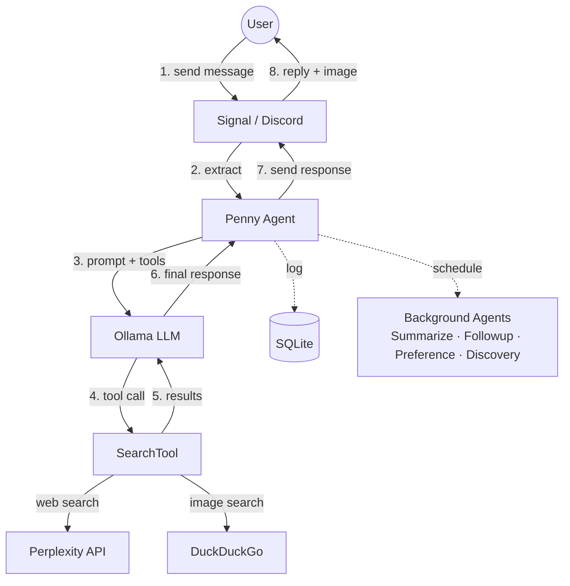

# CLAUDE.md — Penny Chat Agent

## Architecture Overview



- **Channels**: Signal (WebSocket + REST) or Discord (discord.py bot)
- **Ollama**: Local LLM inference (default model: gpt-oss:20b)
- **Vision**: Optional vision model (e.g., qwen3-vl) for processing image attachments from Signal
- **Image Generation**: Optional image model (e.g., x/z-image-turbo) for generating images via `/draw` command
- **Perplexity**: Web search — Penny always searches before answering, never uses model knowledge alone
- **DuckDuckGo**: Image search — runs in parallel with Perplexity, attaches a relevant image to every response
- **SQLite**: Logs all prompts, searches, and messages; stores thread history via parent-child links

## Directory Structure

```
penny/
  penny.py            — Entry point. Penny class: creates agents, channel, scheduler
  config.py           — Config dataclass loaded from .env, channel auto-detection
  config_params.py    — ConfigParam definitions for runtime-configurable settings
  constants.py        — System prompt, followup prompt, discovery prompt, summarize prompt
  startup.py          — Startup announcement message generation (git commit info)
  agents/
    base.py           — Agent base class: agentic loop, tool execution, Ollama integration
    models.py         — ChatMessage, ControllerResponse, MessageRole
    message.py        — MessageAgent: handles incoming user messages
    summarize.py      — SummarizeAgent: background thread summarization
    followup.py       — FollowupAgent: spontaneous conversation followups
    preference.py     — PreferenceAgent: extracts user preferences from messages and reactions
    discovery.py      — DiscoveryAgent: proactive content sharing based on user interests
  scheduler/
    base.py           — BackgroundScheduler + Schedule ABC
    schedules.py      — PeriodicSchedule, DelayedSchedule implementations
  commands/
    __init__.py       — create_command_registry() factory
    base.py           — Command ABC, CommandRegistry
    models.py         — CommandContext, CommandResult, CommandError
    config.py         — /config: view and modify runtime settings
    debug.py          — /debug: show agent status, git commit, system info
    index.py          — /commands: list available commands
    test.py           — /test: isolated test mode for development
    draw.py           — /draw: generate images via Ollama image model
    email.py          — /email: search Fastmail email via JMAP
  tools/
    base.py           — Tool ABC, ToolRegistry, ToolExecutor
    models.py         — ToolCall, ToolResult, ToolDefinition, SearchResult
    builtin.py        — SearchTool (Perplexity text + DuckDuckGo images, run in parallel)
    email.py          — SearchEmailsTool, ReadEmailTool (Fastmail JMAP)
  jmap/
    client.py         — JmapClient: Fastmail JMAP API client (httpx)
    models.py         — JmapSession, EmailAddress, EmailSummary, EmailDetail
  channels/
    __init__.py       — create_channel() factory, channel type constants
    base.py           — MessageChannel ABC, IncomingMessage, shared message handling
    signal/
      channel.py      — SignalChannel: httpx for REST, websockets for receive
      models.py       — Signal WebSocket envelope Pydantic models
    discord/
      channel.py      — DiscordChannel: discord.py bot integration
      models.py       — DiscordMessage, DiscordUser Pydantic models
  database/
    database.py       — Database: SQLite via SQLModel, thread walking, summarization storage
    models.py         — PromptLog, SearchLog, MessageLog, Preference (SQLModel tables)
    migrate.py        — Migration runner: file discovery, tracking table, validation
    migrations/       — Numbered migration files (0001_*.py, 0002_*.py, ...)
  ollama/
    client.py         — OllamaClient: wraps official ollama SDK async client
    models.py         — ChatResponse, ChatResponseMessage
  tests/
    conftest.py       — Pytest fixtures for mocks and test config
    mocks/
      signal_server.py  — Mock Signal WebSocket + REST server (aiohttp)
      ollama_patches.py — Ollama SDK monkeypatch (MockOllamaAsyncClient)
      search_patches.py — Perplexity + DuckDuckGo SDK monkeypatches
    agents/           — Per-agent integration tests
      test_message.py, test_summarize.py, test_followup.py, test_preference.py, test_discovery.py
    channels/         — Channel integration tests
      test_signal_channel.py, test_signal_reactions.py, test_signal_vision.py, test_startup_announcement.py
    commands/         — Per-command tests
      test_commands.py, test_debug.py, test_config.py, test_draw.py, test_email.py, test_preferences.py, test_system.py, test_test_mode.py
    database/         — Migration validation tests
      test_migrations.py
    jmap/             — JMAP client tests
      test_client.py
    tools/            — Tool tests
      test_search_redaction.py, test_tool_timeout.py
Dockerfile            — Python 3.12-slim
pyproject.toml        — Dependencies and project metadata
```

## Agent Architecture

### Agent Base Class (`agents/base.py`)
The base `Agent` class implements the core agentic loop:
- Builds message context with system prompt and history
- Calls Ollama with available tools
- Executes tool calls via `ToolExecutor`
- Handles duplicate tool call prevention
- Appends source URLs to responses when model omits them

### Specialized Agents

**MessageAgent** (`agents/message.py`)
- Handles incoming user messages
- Prepares thread context from quoted messages
- Returns response with parent_id for thread linking

**SummarizeAgent** (`agents/summarize.py`)
- Background task: summarizes conversation threads
- Finds unsummarized messages, walks thread, generates summary
- Stores summary in `MessageLog.parent_summary` for future context

**FollowupAgent** (`agents/followup.py`)
- Background task: spontaneously follows up on conversations
- Picks random dangling conversation leaf
- Searches for something new about the topic
- Sends response via channel

**PreferenceAgent** (`agents/preference.py`)
- Background task: extracts user preferences from messages and reactions
- Analyzes emoji reactions to determine likes/dislikes from reacted-to messages
- Batch-analyzes unprocessed user messages to find new preferences via LLM
- Tracks processed messages via `processed` flag to avoid reprocessing
- Stores preferences in `Preference` table for use by DiscoveryAgent

**DiscoveryAgent** (`agents/discovery.py`)
- Background task: shares new content based on user interests
- Picks random user with a profile, uses profile as search context
- Sends unsolicited but relevant content via channel
- Not threaded (sends as new conversation, not a reply)

## Scheduler System

The `scheduler/` module manages background tasks:

### BackgroundScheduler (`scheduler/base.py`)
- Runs tasks in priority order (summarize → preference → followup → discovery)
- Tracks global idle threshold (default: 300s)
- Notifies schedules when messages arrive (resets timers)
- Only runs one task per tick
- Passes `is_idle` boolean to schedules (whether system is past global idle threshold)

### Schedule Types (`scheduler/schedules.py`)

**PeriodicSchedule**
- Runs periodically while system is idle at a configurable interval
- Used for summarization and preference extraction (default: `MAINTENANCE_INTERVAL_SECONDS`, 300s)
- Tracks last run time and fires again after interval elapses
- Resets when a message arrives

**DelayedSchedule**
- Runs after system becomes idle + random delay
- Used for followups (default: 3600-7200s delay after idle) and discovery (default: 7200-14400s delay after idle)
- Random delay prevents predictable bot behavior

## Channel System

### MessageChannel ABC (`channels/base.py`)
- Defines interface: `listen()`, `send_message()`, `send_typing()`, `extract_message()`
- Implements shared logic: `handle_message()`, `send_response()`, `_typing_loop()`
- Holds references to message agent, database, and scheduler

### SignalChannel (`channels/signal/channel.py`)
- WebSocket connection for receiving messages
- REST API for sending messages and typing indicators
- Handles quote-reply thread reconstruction

### DiscordChannel (`channels/discord/channel.py`)
- Uses discord.py for bot integration
- Listens to a single configured channel
- Handles 2000-character message limit by chunking
- Typing indicators auto-expire (no stop needed)

### Channel Factory (`channels/__init__.py`)
- `create_channel()` creates appropriate channel based on config
- Auto-detects channel type from credentials if not explicit

## Command System

Penny supports slash commands sent as messages (e.g., `/debug`, `/config`). Commands are handled before the message reaches the agent loop.

### Architecture (`commands/`)
- **Command ABC** (`base.py`): Each command implements `name`, `description`, `aliases`, and `async execute(context) → CommandResult`
- **CommandRegistry** (`base.py`): Maps command names/aliases to handlers, dispatches messages starting with `/`
- **Factory** (`__init__.py`): `create_command_registry()` registers all built-in commands

### Built-in Commands
- **/commands** (`index.py`): Lists all available commands with descriptions
- **/debug** (`debug.py`): Shows agent status, git commit, system info, background task state
- **/config** (`config.py`): View and modify runtime settings (e.g., `/config idle_seconds 600`)
- **/test** (`test.py`): Enters isolated test mode — creates a separate DB and fresh agents for testing without affecting production data. Exit with `/test stop`.

### Runtime Configuration
- `/config` reads and writes to a `RuntimeConfig` table in SQLite (migration `0002_add_runtime_config_table.py`)
- `ConfigParam` definitions in `config_params.py` declare which settings are runtime-configurable, with types and validation
- Config values are read on each use (not cached), so changes take effect immediately

## Message Flow

1. Channel receives message → `extract_message()` → `IncomingMessage`
2. Channel calls `handle_message()`:
   - Notifies scheduler (resets idle timers)
   - Starts typing indicator loop
   - Calls `MessageAgent.handle()` which:
     - Finds parent message if quote-reply
     - Walks thread history or uses cached summary
     - Runs agentic loop with tools
   - Logs incoming message to DB
   - Sends response via `send_response()` (logs + sends)
   - Stops typing indicator

## Thread/Context System

- Quote-replying continues a conversation thread
- `MessageLog.parent_id` creates a chain of messages
- `Database.get_thread_context()` walks the chain (up to 20 messages) or returns a cached `parent_summary`
- Background `SummarizeAgent` runs when idle, summarizes threads, stores in `parent_summary`

## Key Design Decisions

- **Always search**: System prompt forces search on every message — no hallucinated answers
- **One search per message**: System prompt tells model it only gets one search, so it combines everything into a single comprehensive query
- **Parallel search + images**: Single `SearchTool` runs Perplexity (text) and DuckDuckGo (images) concurrently via `asyncio.gather`, image failures degrade gracefully to text-only
- **URL extraction**: URLs extracted from Perplexity results, appended as Sources list so the model can pick the most relevant one
- **URL fallback**: If the model's final response doesn't contain any URL, the agent appends the first source URL
- **Duplicate tool blocking**: Agent tracks called tools per message to prevent LLM tool-call loops
- **Specialized agents**: Each task type (message, summarize, followup, preference, discovery) has its own agent subclass
- **Priority scheduling**: Summarize → preference → followup → discovery (quick tasks first)
- **Global idle threshold**: Single configurable idle time (default: 300s) controls when all background tasks become eligible
- **Delayed scheduling**: Followup and discovery add random delays after idle threshold to prevent predictable bot behavior
- **Vision captioning**: When images are present and `OLLAMA_VISION_MODEL` is configured, the vision model captions the image first, then a combined prompt ("user said X and included an image of Y") is forwarded to the foreground model for the full response. If not configured, the user gets a friendly acknowledgment
- **Channel abstraction**: Signal and Discord share the same interface; easy to add more platforms
- **Async throughout**: asyncio, httpx.AsyncClient, ollama.AsyncClient, discord.py
- **Host networking**: Docker container uses --network host for simplicity (all services on localhost)
- **Pydantic everywhere**: All external data validated with Pydantic models
- **Table-to-bullets**: Markdown tables converted to bullet points in Python (saves model tokens vs. prompting "no tables")
- **Normal casing**: All user-facing strings (status messages, error messages, acknowledgments) use standard sentence casing — not all lowercase

## Dependencies

- `websockets`, `httpx`, `python-dotenv`, `pydantic`, `sqlmodel`, `ollama`, `perplexityai`, `duckduckgo-search`, `discord.py`
- Dev: `ruff` (lint/format), `ty` (type check), `pytest`, `pytest-asyncio`, `aiohttp` (mock Signal server)
- Python 3.12+

## Database Migrations

File-based migration system in `database/migrations/`:
- Each migration is a numbered Python file (e.g., `0001_add_reaction_fields.py`) with a `def up(conn)` function
- Two types: **schema** (DDL — ALTER TABLE, CREATE INDEX) and **data** (DML — UPDATE, backfills), both use `up()`
- Runner in `database/migrate.py` discovers files, tracks applied migrations in `_migrations` table
- Runs on startup before `create_tables()` in `penny.py`
- `make migrate-test`: copies production DB, applies migrations to copy, reports success/failure
- `make migrate-validate`: checks for duplicate migration number prefixes (also runs in `make check`)
- Rebase-only policy: if two PRs create the same migration number, the second must rebase and renumber
- Run standalone: `python -m penny.database.migrate [--test] [--validate] [db_path]`

## Extending

- **New tool**: Subclass `Tool` in tools/, implement `name`, `description`, `parameters`, `async execute()`, add to agent's tool list in penny.py
- **New channel**: Implement `MessageChannel` ABC, create models, add to `create_channel()` factory
- **New agent type**: Subclass `Agent`, implement `execute()` for background tasks or custom `handle()` for message processing
- **New schedule type**: Subclass `Schedule`, implement `should_run()`, `reset()`, `mark_complete()`
- **New LLM**: Match `OllamaClient` interface (`async chat()`, `async generate()`)

## Test Infrastructure

Strongly prefer end-to-end integration tests over unit tests. Test through public entry points with mocks for external services:

**Mocks** (in `tests/mocks/`):
- `MockSignalServer`: WebSocket + REST server using aiohttp, captures outgoing messages and typing events
- `MockOllamaAsyncClient`: Monkeypatches `ollama.AsyncClient`, configurable responses via `set_default_flow()` or `set_response_handler()`
- `MockPerplexity`, `MockDDGS`: Monkeypatches Perplexity and DuckDuckGo SDKs

**Fixtures** (in `tests/conftest.py`):
- `TEST_SENDER`: Standard test phone number constant
- `signal_server`: Starts mock Signal server on random port
- `mock_ollama`: Patches Ollama SDK with configurable responses
- `make_config`: Factory for creating test configs with custom overrides
- `running_penny`: Async context manager for running Penny with cleanup (uses WebSocket detection, not sleep)
- `setup_ollama_flow`: Factory to configure mock Ollama for message + background task flow
- `wait_until(condition, timeout, interval)`: Polls a condition every 50ms until true or timeout (10s default)

**Test Timing** — never use `asyncio.sleep(N)` in tests:
- Use `wait_until(lambda: <condition>)` to poll for expected side effects (DB state, message count, etc.)
- `scheduler_tick_interval` is set to 0.05s in test config (vs 1.0s production) so scheduler-dependent tests complete quickly
- `running_penny` detects WebSocket connection via `signal_server._websockets` instead of sleeping
- For negative assertions (nothing should happen), verify immediately — don't sleep to "make sure"

**Test Flow**:
1. Start mock Signal server (random port)
2. Monkeypatch Ollama and search SDKs
3. Create Penny with test config pointing to Signal mock
4. Push message through mock Signal WebSocket
5. `wait_until` the expected side effect (outgoing message, DB change, etc.)
6. Assert on captured messages, Ollama requests, DB state
