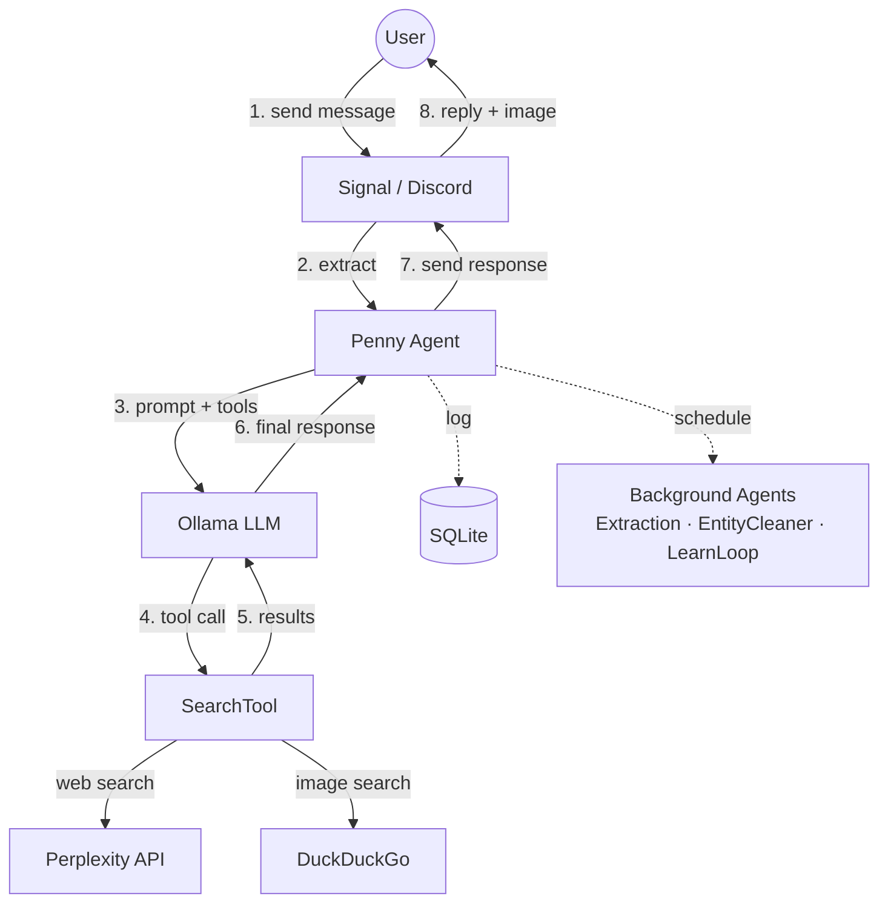

# CLAUDE.md — Penny Chat Agent

## Architecture Overview



- **Channels**: Signal (WebSocket + REST) or Discord (discord.py bot)
- **Ollama**: Local LLM inference (default model: gpt-oss:20b)
- **Vision**: Optional vision model (e.g., qwen3-vl) for processing image attachments from Signal
- **Image Generation**: Optional image model (e.g., x/z-image-turbo) for generating images via `/draw` command
- **Perplexity**: Web search — Penny always searches before answering, never uses model knowledge alone
- **DuckDuckGo**: Image search — runs in parallel with Perplexity, attaches a relevant image to every response
- **SQLite**: Logs all prompts, searches, and messages; stores thread history via parent-child links

## Directory Structure

```
penny/
  penny.py            — Entry point. Penny class: creates agents, channel, scheduler
  config.py           — Config dataclass loaded from .env, channel auto-detection
  config_params.py    — ConfigParam definitions for runtime-configurable settings
  constants.py        — System prompt, research prompts, personality prompts, all constants
  startup.py          — Startup announcement message generation (git commit info)
  datetime_utils.py   — Timezone derivation from location (geopy + timezonefinder)
  agents/
    base.py           — Agent base class: agentic loop, tool execution, Ollama integration
    models.py         — ChatMessage, ControllerResponse, MessageRole, ToolCallRecord
    message.py        — MessageAgent: handles incoming user messages
    extraction.py     — ExtractionPipeline: unified entity/fact/preference extraction from search results and messages
    entity_cleaner.py — EntityCleaner: periodic merge of duplicate entities
    learn_loop.py     — LearnLoopAgent: adaptive background research driven by interest scores
  scheduler/
    base.py           — BackgroundScheduler + Schedule ABC
    schedules.py      — PeriodicSchedule, AlwaysRunSchedule, DelayedSchedule implementations
    schedule_runner.py — ScheduleExecutor: runs user-created cron-based scheduled tasks
  commands/
    __init__.py       — create_command_registry() factory
    base.py           — Command ABC, CommandRegistry
    models.py         — CommandContext, CommandResult, CommandError
    config.py         — /config: view and modify runtime settings
    debug.py          — /debug: show agent status, git commit, system info
    index.py          — /commands: list available commands
    profile.py        — /profile: user info collection (name, location, DOB, timezone)
    learn.py          — /learn: express active research interest in a topic
    preferences.py    — /like, /dislike, /unlike, /undislike: explicit preference management
    personality.py    — /personality: customize Penny's tone and behavior per user
    schedule.py       — /schedule: create, list, delete recurring background tasks
    test.py           — /test: isolated test mode for development
    draw.py           — /draw: generate images via Ollama image model (optional)
    bug.py            — /bug: file GitHub issues (optional, requires GitHub App)
    email.py          — /email: search Fastmail email via JMAP (optional)
  tools/
    base.py           — Tool ABC, ToolRegistry, ToolExecutor
    models.py         — ToolCall, ToolResult, ToolDefinition, SearchResult
    builtin.py        — SearchTool (Perplexity text + DuckDuckGo images, run in parallel)
    email.py          — SearchEmailsTool, ReadEmailTool (Fastmail JMAP)
  jmap/
    client.py         — JmapClient: Fastmail JMAP API client (httpx)
    models.py         — JmapSession, EmailAddress, EmailSummary, EmailDetail
  channels/
    __init__.py       — create_channel() factory, channel type constants
    base.py           — MessageChannel ABC, IncomingMessage, shared message handling
    signal/
      channel.py      — SignalChannel: httpx for REST, websockets for receive
      models.py       — Signal WebSocket envelope Pydantic models
    discord/
      channel.py      — DiscordChannel: discord.py bot integration
      models.py       — DiscordMessage, DiscordUser Pydantic models
  database/
    database.py       — Database: SQLite via SQLModel, thread walking, preference/personality/entity storage
    models.py         — SQLModel tables (see Data Model section)
    migrate.py        — Migration runner: file discovery, tracking table, validation
    migrations/       — Numbered migration files (0001–0018)
  ollama/
    client.py         — OllamaClient: wraps official ollama SDK async client
    models.py         — ChatResponse, ChatResponseMessage
  tests/
    conftest.py       — Pytest fixtures for mocks and test config
    mocks/
      signal_server.py  — Mock Signal WebSocket + REST server (aiohttp)
      ollama_patches.py — Ollama SDK monkeypatch (MockOllamaAsyncClient)
      search_patches.py — Perplexity + DuckDuckGo SDK monkeypatches
    agents/           — Per-agent integration tests
      test_message.py, test_extraction.py, test_entity_cleaner.py, test_learn_loop.py
    channels/         — Channel integration tests
      test_signal_channel.py, test_signal_reactions.py, test_signal_vision.py, test_startup_announcement.py
    commands/         — Per-command tests
      test_commands.py, test_debug.py, test_config.py, test_draw.py, test_email.py,
      test_learn.py, test_preferences.py, test_personality.py,
      test_schedule.py, test_bug.py, test_system.py, test_test_mode.py
    database/         — Migration validation tests
      test_migrations.py
    jmap/             — JMAP client tests
      test_client.py
    tools/            — Tool tests
      test_search_redaction.py, test_tool_timeout.py, test_tool_not_found.py, test_missing_tool_params.py
Dockerfile            — Python 3.12-slim
pyproject.toml        — Dependencies and project metadata
```

## Agent Architecture

### Agent Base Class (`agents/base.py`)
The base `Agent` class implements the core agentic loop:
- Builds message context with system prompt and history
- Calls Ollama with available tools
- Executes tool calls via `ToolExecutor` with parameter validation
- Handles duplicate tool call prevention
- Appends source URLs to responses when model omits them
- Injects per-user personality prompts from database (if set via `/personality`)
- Transforms responses through personality prompt before sending

### Specialized Agents

**MessageAgent** (`agents/message.py`)
- Handles incoming user messages
- Prepares thread context from quoted messages
- Returns response with parent_id for thread linking
- Vision captioning: when images are present and vision model is configured, captions the image first, then forwards a combined prompt to the foreground model

**ExtractionPipeline** (`agents/extraction.py`)
- Unified background task replacing the former EntityExtractor and PreferenceAgent
- Processes both SearchLog entries and MessageLog entries in a single pipeline
- Three phases per execution: search log extraction → message extraction → embedding backfill
- **Search log extraction**: Two-pass entity/fact extraction (identify entities → extract facts per entity) from search results
- **Message extraction**: Extracts entities/facts from user messages AND preferences from messages+reactions
- Pre-filters messages before LLM calls: skips short messages (< 20 chars) and slash commands
- Creates MESSAGE_MENTION engagements when entities are found in user messages
- Links new preferences to existing entities via embedding similarity
- Fact dedup: normalized string match (fast) then embedding similarity (paraphrase detection, threshold=0.85)
- Facts track provenance via `source_search_log_id` or `source_message_id`
- Sends batched preference notifications via channel
- All content processed newest-first (ORDER BY timestamp DESC)

**EntityCleaner** (`agents/entity_cleaner.py`)
- Background task: periodically merges duplicate entities in the knowledge base
- Enforces minimum interval between runs (default 24h) via DB-stored timestamp in RuntimeConfig
- Sends entity name list to LLM, which identifies groups of duplicates and picks canonical names
- Merge executed in Python-space: combines deduplicated facts, reassigns entity_search_log refs, deletes duplicates
- Uses Ollama structured output with Pydantic schemas (`MergeGroups`, `MergeGroup`)

**LearnLoopAgent** (`agents/learn_loop.py`)
- Background task: adaptive research driven by entity interest scores
- Picks the highest-priority entity across all users each cycle
- Priority scoring: `interest × (1/fact_count) × staleness_factor` (Python-space, no LLM)
- Two modes: **enrichment** (< 5 facts, broad search) and **briefing** (5+ facts, novelty check)
- Skips entities with negative interest or recently verified facts (< 1 day)
- Uses SearchTool directly (not the agentic loop) for Perplexity searches
- Extracts facts via `ollama_client.generate()` with structured output (Pydantic schema)
- Two-pass fact dedup: normalized string match (fast) then embedding similarity (threshold 0.85)
- Confirms existing facts by updating `last_verified` timestamps
- Composes casual message about novel findings and sends via channel
- Triggered by `/learn` command (creates LEARN_COMMAND engagement with high strength)
- Scheduled as `PeriodicSchedule` (idle-only, default 300s interval)

**ScheduleExecutor** (`scheduler/schedule_runner.py`)
- Background task: runs user-created cron-based scheduled tasks
- Checks every 60 seconds for due schedules (based on user timezone)
- Executes the schedule's prompt text via the agentic loop
- Sends results to the user via channel

## Scheduler System

The `scheduler/` module manages background tasks:

### BackgroundScheduler (`scheduler/base.py`)
- Runs tasks in priority order (schedule → extraction → entity_cleaner → learn_loop)
- Tracks global idle threshold (default: 300s)
- Notifies schedules when messages arrive (resets timers)
- Only runs one task per tick
- Passes `is_idle` boolean to schedules (whether system is past global idle threshold)
- Suspends background tasks while foreground messages are being processed

### Schedule Types (`scheduler/schedules.py`)

**AlwaysRunSchedule**
- Runs regardless of idle state at a configurable interval
- Used for ScheduleExecutor (60s interval)
- Not affected by idle threshold — scheduled tasks run even during active conversations

**PeriodicSchedule**
- Runs periodically while system is idle at a configurable interval
- Used for extraction pipeline, entity cleaner, and learn loop (default: 300s)
- Tracks last run time and fires again after interval elapses
- Resets when a message arrives

**DelayedSchedule**
- Runs after system becomes idle + random delay
- Available for future use (not currently used by any agent)

## Channel System

### MessageChannel ABC (`channels/base.py`)
- Defines interface: `listen()`, `send_message()`, `send_typing()`, `extract_message()`
- Implements shared logic: `handle_message()`, `send_response()`, `_typing_loop()`
- Holds references to message agent, database, and scheduler

### SignalChannel (`channels/signal/channel.py`)
- WebSocket connection for receiving messages
- REST API for sending messages and typing indicators
- Handles quote-reply thread reconstruction

### DiscordChannel (`channels/discord/channel.py`)
- Uses discord.py for bot integration
- Listens to a single configured channel
- Handles 2000-character message limit by chunking
- Typing indicators auto-expire (no stop needed)

### Channel Factory (`channels/__init__.py`)
- `create_channel()` creates appropriate channel based on config
- Auto-detects channel type from credentials if not explicit

## Command System

Penny supports slash commands sent as messages (e.g., `/debug`, `/config`). Commands are handled before the message reaches the agent loop.

### Architecture (`commands/`)
- **Command ABC** (`base.py`): Each command implements `name`, `description`, `aliases`, and `async execute(context) → CommandResult`
- **CommandRegistry** (`base.py`): Maps command names/aliases to handlers, dispatches messages starting with `/`
- **Factory** (`__init__.py`): `create_command_registry()` registers all built-in commands

### Built-in Commands (always registered)
- **/commands** (`index.py`): Lists all available commands with descriptions
- **/debug** (`debug.py`): Shows agent status, git commit, system info, background task state
- **/config** (`config.py`): View and modify runtime settings (e.g., `/config idle_seconds 600`)
- **/profile** (`profile.py`): View or update user profile (name, location, DOB). Derives IANA timezone from location. Required before Penny will chat
- **/learn** (`learn.py`): Express active interest in a topic for background research. `/learn` lists tracked entities; `/learn <topic>` searches via SearchTool, discovers entities from results via LLM entity identification, creates them with LEARN_COMMAND engagements. Works for both specific entities (`/learn kef ls50`) and broad topics (`/learn travel in china 2026`). Falls back to creating a single entity from topic text if no SearchTool is configured
- **/like**, **/dislike**, **/unlike**, **/undislike** (`preferences.py`): Explicitly manage preferences
- **/personality** (`personality.py`): View, set, or reset custom personality prompt per user. Affects Penny's tone and behavior
- **/schedule** (`schedule.py`): Create, list, and delete recurring cron-based background tasks (uses LLM to parse natural language timing)
- **/test** (`test.py`): Enters isolated test mode — creates a separate DB and fresh agents for testing without affecting production data. Exit with `/test stop`

### Conditional Commands (registered based on config)
- **/draw** (`draw.py`): Generate images via Ollama image model (requires `OLLAMA_IMAGE_MODEL`)
- **/bug** (`bug.py`): File a bug report on GitHub (requires GitHub App config)
- **/email** (`email.py`): Search Fastmail email via JMAP (requires `FASTMAIL_API_TOKEN`)

### Runtime Configuration
- `/config` reads and writes to a `RuntimeConfig` table in SQLite (migration `0002_add_runtime_config_table.py`)
- `ConfigParam` definitions in `config_params.py` declare which settings are runtime-configurable, with types and validation
- Config values are read on each use (not cached), so changes take effect immediately
- Configurable params: `MESSAGE_MAX_STEPS`, `IDLE_SECONDS`, `MAINTENANCE_INTERVAL_SECONDS`, `LEARN_LOOP_INTERVAL`

## Message Flow

1. Channel receives message → `extract_message()` → `IncomingMessage`
2. Channel calls `handle_message()`:
   - Checks for slash commands first (dispatches via `CommandRegistry`)
   - Notifies scheduler (resets idle timers, suspends background tasks)
   - Starts typing indicator loop
   - Calls `MessageAgent.handle()` which:
     - Finds parent message if quote-reply (via `external_id` lookup)
     - Walks thread history for context
     - Runs agentic loop with tools
   - Logs incoming message to DB
   - Sends response via `send_response()` (logs + sends)
   - Stops typing indicator, resumes background tasks

## Thread/Context System

- Quote-replying continues a conversation thread
- `MessageLog.parent_id` creates a chain of messages
- `Database.get_thread_context()` walks the chain (up to 20 messages)

## Key Design Decisions

- **Always search**: System prompt forces search on every message — no hallucinated answers
- **One search per message**: System prompt tells model it only gets one search, so it combines everything into a single comprehensive query
- **Parallel search + images**: Single `SearchTool` runs Perplexity (text) and DuckDuckGo (images) concurrently via `asyncio.gather`, image failures degrade gracefully to text-only. `skip_images` flag disables image search
- **URL extraction**: URLs extracted from Perplexity results, appended as Sources list so the model can pick the most relevant one
- **URL fallback**: If the model's final response doesn't contain any URL, the agent appends the first source URL
- **Duplicate tool blocking**: Agent tracks called tools per message to prevent LLM tool-call loops
- **Tool parameter validation**: Tool parameters validated before execution; non-existent tools return clear error messages
- **Specialized agents**: Each task type (message, extraction, entity cleaning, learn loop) has its own agent subclass
- **Priority scheduling**: Schedule → extraction → entity_cleaner → learn_loop
- **Always-run schedules**: User-created schedules run regardless of idle state; extraction/learn wait for idle
- **Global idle threshold**: Single configurable idle time (default: 300s) controls when idle-dependent tasks become eligible
- **Background suspension**: Foreground message processing suspends background tasks to prevent interference
- **Vision captioning**: When images are present and `OLLAMA_VISION_MODEL` is configured, the vision model captions the image first with a vision-specific system prompt, then a combined prompt is forwarded to the foreground model. Search tools are disabled for image messages
- **Per-user personality**: Users can set custom personality prompts that transform Penny's responses via LLM rewrite
- **Channel abstraction**: Signal and Discord share the same interface; easy to add more platforms
- **Async throughout**: asyncio, httpx.AsyncClient, ollama.AsyncClient, discord.py
- **Host networking**: Docker container uses --network host for simplicity (all services on localhost)
- **Pydantic everywhere**: All external data validated with Pydantic models
- **Table-to-bullets**: Markdown tables converted to bullet points in Python (saves model tokens vs. prompting "no tables")
- **Normal casing**: All user-facing strings (status messages, error messages, acknowledgments) use standard sentence casing — not all lowercase

## Dependencies

- `websockets`, `httpx`, `python-dotenv`, `pydantic`, `sqlmodel`, `ollama`, `perplexityai`, `duckduckgo-search`, `discord.py`, `psutil`, `dateparser`, `timezonefinder`, `geopy`, `pytz`, `croniter`, `PyJWT`
- Dev: `ruff` (lint/format), `ty` (type check), `pytest`, `pytest-asyncio`, `aiohttp` (mock Signal server)
- Python 3.12+

## Database Migrations

File-based migration system in `database/migrations/` (currently 0001–0018):
- Each migration is a numbered Python file (e.g., `0001_add_reaction_fields.py`) with a `def up(conn)` function
- Two types: **schema** (DDL — ALTER TABLE, CREATE INDEX) and **data** (DML — UPDATE, backfills), both use `up()`
- Runner in `database/migrate.py` discovers files, tracks applied migrations in `_migrations` table
- Runs on startup before `create_tables()` in `penny.py`
- `make migrate-test`: copies production DB, applies migrations to copy, reports success/failure
- `make migrate-validate`: checks for duplicate migration number prefixes (also runs in `make check`)
- Rebase-only policy: if two PRs create the same migration number, the second must rebase and renumber
- Run standalone: `python -m penny.database.migrate [--test] [--validate] [db_path]`

Notable migrations:
- 0007: `Schedule` table for user-created recurring tasks
- 0008: Drop `parent_summary` (removed SummarizeAgent)
- 0009: `PersonalityPrompt` table for per-user personality customization
- 0010–0011: `ResearchTask` and `ResearchIteration` tables (deprecated, dropped by 0018)
- 0012: `Entity` and `entity_extraction_cursor` tables for entity knowledge base
- 0013: `entity_search_log` join table (replaces cursor; tracks entity-to-search provenance)
- 0014–0016: Facts restructure, embedding columns, engagement table (knowledge system phases 1–3)
- 0017: `source_message_id` on `fact` table (message-sourced fact provenance)
- 0018: Drop `research_tasks` and `research_iterations` tables (replaced by learn loop)

## Extending

- **New tool**: Subclass `Tool` in tools/, implement `name`, `description`, `parameters`, `async execute()`, add to agent's tool list in penny.py
- **New channel**: Implement `MessageChannel` ABC, create models, add to `create_channel()` factory
- **New agent type**: Subclass `Agent`, implement `execute()` for background tasks or custom `handle()` for message processing
- **New command**: Subclass `Command` in commands/, implement `name`, `description`, `execute()`, register in `create_command_registry()`
- **New schedule type**: Subclass `Schedule`, implement `should_run()`, `reset()`, `mark_complete()`
- **New LLM**: Match `OllamaClient` interface (`async chat()`, `async generate()`)

## Test Infrastructure

Strongly prefer end-to-end integration tests over unit tests. Test through public entry points with mocks for external services. Prefer folding new assertions into existing tests over adding new test functions — only add a new test when no existing test covers the relevant code path.

**Mocks** (in `tests/mocks/`):
- `MockSignalServer`: WebSocket + REST server using aiohttp, captures outgoing messages and typing events
- `MockOllamaAsyncClient`: Monkeypatches `ollama.AsyncClient`, configurable responses via `set_default_flow()` or `set_response_handler()`
- `MockPerplexity`, `MockDDGS`: Monkeypatches Perplexity and DuckDuckGo SDKs

**Fixtures** (in `tests/conftest.py`):
- `TEST_SENDER`: Standard test phone number constant
- `signal_server`: Starts mock Signal server on random port
- `mock_ollama`: Patches Ollama SDK with configurable responses
- `make_config`: Factory for creating test configs with custom overrides
- `running_penny`: Async context manager for running Penny with cleanup (uses WebSocket detection, not sleep)
- `setup_ollama_flow`: Factory to configure mock Ollama for message + background task flow
- `wait_until(condition, timeout, interval)`: Polls a condition every 50ms until true or timeout (10s default)

**Test Timing** — never use `asyncio.sleep(N)` in tests:
- Use `wait_until(lambda: <condition>)` to poll for expected side effects (DB state, message count, etc.)
- `scheduler_tick_interval` is set to 0.05s in test config (vs 1.0s production) so scheduler-dependent tests complete quickly
- `running_penny` detects WebSocket connection via `signal_server._websockets` instead of sleeping
- For negative assertions (nothing should happen), verify immediately — don't sleep to "make sure"

**Test Flow**:
1. Start mock Signal server (random port)
2. Monkeypatch Ollama and search SDKs
3. Create Penny with test config pointing to Signal mock
4. Push message through mock Signal WebSocket
5. `wait_until` the expected side effect (outgoing message, DB change, etc.)
6. Assert on captured messages, Ollama requests, DB state

**Performance**: Test suite runs in ~30s (`scheduler_tick_interval` set to 0.05s in tests)
