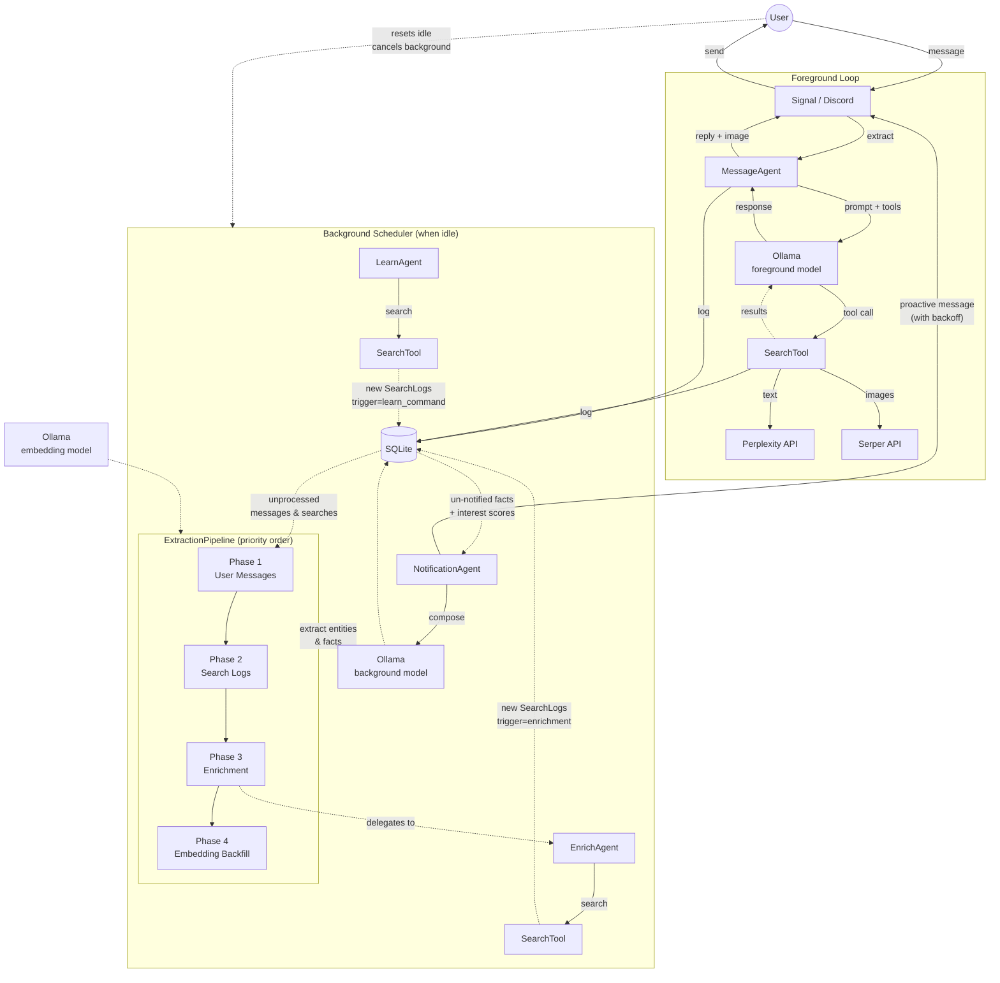

# CLAUDE.md — Penny Chat Agent

## Architecture Overview



- **Channels**: Signal (WebSocket + REST) or Discord (discord.py bot)
- **Ollama**: Local LLM inference (default model: gpt-oss:20b)
- **Vision**: Optional vision model (e.g., qwen3-vl) for processing image attachments from Signal
- **Image Generation**: Optional image model (e.g., x/z-image-turbo) for generating images via `/draw` command
- **Embedding Model**: Optional dedicated embedding model (e.g., nomic-embed-text) for semantic validation, dedup, and entity context injection
- **Perplexity**: Web search — Penny always searches before answering, never uses model knowledge alone
- **Serper**: Image search (Google Images) — runs in parallel with Perplexity, attaches a relevant image to every response
- **SQLite**: Logs all prompts, searches, and messages; stores thread history via parent-child links

## Directory Structure

```
penny/
  penny.py            — Entry point. Penny class: creates agents, channel, scheduler
  config.py           — Config dataclass loaded from .env, channel auto-detection
  config_params.py    — ConfigParam definitions for 38 runtime-configurable settings
  constants.py        — System prompt, research prompts, engagement/trigger enums
  interest.py         — Interest score computation (pure function, half-life decay)
  prompts.py          — LLM prompt templates (extraction, learn queries, notifications)
  responses.py        — All user-facing response strings (PennyResponse class)
  startup.py          — Startup announcement message generation (git commit info)
  datetime_utils.py   — Timezone derivation from location (geopy + timezonefinder)
  agents/
    base.py           — Agent base class: agentic loop, tool execution, Ollama integration
    models.py         — ChatMessage, ControllerResponse, MessageRole, ToolCallRecord, GeneratedQuery
    message.py        — MessageAgent: handles incoming user messages
    extraction.py     — ExtractionPipeline: unified entity/fact extraction from search results and messages (no notifications)
    enrich.py         — EnrichAgent: adaptive background research driven by interest scores (no notifications)
    learn.py          — LearnAgent: scheduled worker for /learn command — one search step per tick
    notification.py   — NotificationAgent: interest-ranked fact discovery notifications with backoff
  scheduler/
    base.py           — BackgroundScheduler + Schedule ABC
    schedules.py      — PeriodicSchedule, AlwaysRunSchedule, DelayedSchedule implementations
    schedule_runner.py — ScheduleExecutor: runs user-created cron-based scheduled tasks
  commands/
    __init__.py       — create_command_registry() factory
    base.py           — Command ABC, CommandRegistry
    models.py         — CommandContext, CommandResult, CommandError
    github_issue.py   — GitHubIssueCommand base class for /bug and /feature
    config.py         — /config: view and modify runtime settings
    debug.py          — /debug: show agent status, git commit, system info
    index.py          — /commands: list available commands
    profile.py        — /profile: user info collection (name, location, DOB, timezone)
    learn.py          — /learn: express active research interest in a topic
    memory.py         — /memory: view/manage knowledge base entities and facts (ranked by interest)
    schedule.py       — /schedule: create, list, delete recurring background tasks
    test.py           — /test: isolated test mode for development
    draw.py           — /draw: generate images via Ollama image model (optional)
    bug.py            — /bug: file GitHub issues (optional, requires GitHub App)
    feature.py        — /feature: file GitHub feature requests (optional, requires GitHub App)
    email.py          — /email: search Fastmail email via JMAP (optional)
  tools/
    base.py           — Tool ABC, ToolRegistry, ToolExecutor
    models.py         — ToolCall, ToolResult, ToolDefinition, SearchResult
    builtin.py        — SearchTool (Perplexity text + Serper images, run in parallel)
    email.py          — SearchEmailsTool, ReadEmailTool (Fastmail JMAP)
  jmap/
    client.py         — JmapClient: Fastmail JMAP API client (httpx)
    models.py         — JmapSession, EmailAddress, EmailSummary, EmailDetail
  channels/
    __init__.py       — create_channel() factory, channel type constants
    base.py           — MessageChannel ABC, IncomingMessage, shared message handling
    signal/
      channel.py      — SignalChannel: httpx for REST, websockets for receive
      models.py       — Signal WebSocket envelope Pydantic models
    discord/
      channel.py      — DiscordChannel: discord.py bot integration
      models.py       — DiscordMessage, DiscordUser Pydantic models
  database/
    database.py       — Database: SQLite via SQLModel, thread walking, entity storage
    models.py         — SQLModel tables (see Data Model section)
    migrate.py        — Migration runner: file discovery, tracking table, validation
    migrations/       — Numbered migration files (0001–0023)
  ollama/
    client.py         — OllamaClient: wraps official ollama SDK async client
    models.py         — ChatResponse, ChatResponseMessage
    embeddings.py     — Embedding utilities (serialize, deserialize, find_similar, build_entity_embed_text, token_containment_ratio)
  tests/
    conftest.py       — Pytest fixtures for mocks and test config
    test_interest.py, test_embeddings.py, test_periodic_schedule.py, test_scheduler.py
    mocks/
      signal_server.py  — Mock Signal WebSocket + REST server (aiohttp)
      ollama_patches.py — Ollama SDK monkeypatch (MockOllamaAsyncClient)
      search_patches.py — Perplexity + Serper image search monkeypatches
    agents/           — Per-agent integration tests
      test_message.py, test_extraction.py, test_enrich.py, test_notification.py
    channels/         — Channel integration tests
      test_signal_channel.py, test_signal_reactions.py, test_signal_vision.py,
      test_signal_formatting.py, test_startup_announcement.py
    commands/         — Per-command tests
      test_commands.py, test_config.py, test_debug.py, test_draw.py, test_email.py,
      test_feature.py, test_learn.py, test_memory.py,
      test_schedule.py, test_bug.py, test_system.py, test_test_mode.py
    database/         — Migration validation tests
      test_migrations.py
    jmap/             — JMAP client tests
      test_client.py
    tools/            — Tool tests
      test_search_redaction.py, test_tool_timeout.py, test_tool_not_found.py, test_missing_tool_params.py
Dockerfile            — Python 3.12-slim
pyproject.toml        — Dependencies and project metadata
```

## Agent Architecture

### Agent Base Class (`agents/base.py`)
The base `Agent` class implements the core agentic loop:
- Builds message context with system prompt and history
- Calls Ollama with available tools
- Executes tool calls via `ToolExecutor` with parameter validation
- Handles duplicate tool call prevention
- Appends source URLs to responses when model omits them

### Shared Ollama Client Instances

All OllamaClient instances are created centrally in `Penny.__init__()` and shared across agents and commands:

- `foreground_model_client`: Fast model for user-facing messages (MessageAgent, commands)
- `background_model_client`: Smart model for background tasks (ExtractionPipeline, NotificationAgent)
- `vision_model_client`: Optional vision model for image understanding
- `embedding_model_client`: Optional embedding model for semantic validation, dedup, and entity context injection
- `image_model_client`: Optional image generation model for `/draw` command

### Specialized Agents

**MessageAgent** (`agents/message.py`)
- Handles incoming user messages
- Prepares thread context from quoted messages
- Returns response with parent_id for thread linking
- Vision captioning: when images are present and vision model is configured, captions the image first, then forwards a combined prompt to the foreground model

**ExtractionPipeline** (`agents/extraction.py`)
- Unified knowledge pipeline that runs as a single scheduled background task
- Processes in strict priority order (four phases per execution):
  1. **User messages** (highest priority): freshest signals, processed first
  2. **Search logs** (drain backlog): entity/fact extraction from search results
  3. **Enrichment** (gated): only runs when phases 1 & 2 are fully drained — delegates to EnrichAgent
  4. **Embedding backfill**: backfills missing embeddings for facts and entities
- Enrichment creates new SearchLog entries (trigger=penny_enrichment) that feed back into phase 2 on the next cycle
- Does NOT process `/learn` prompts — that's the LearnAgent's job
- **Search log extraction**: Two-pass entity/fact extraction (identify entities → extract facts per entity) from search results. Checks `trigger` field to determine mode — full extraction (user-triggered, creates entities with validation) vs known-only (penny-triggered, facts only)
- **Post-fact semantic pruning**: After fact extraction, LLM checks if extracted facts are semantically relevant to the entity; removes irrelevant facts
- **Entity validation**: New entity candidates pass structural filter (word count, LLM artifacts, URLs, numbers, dates, locations) then semantic filter (embedding similarity to query, threshold ~0.50)
- **Insertion-time dedup**: Before creating a new entity, checks all existing entities using dual-threshold detection — token containment ratio (TCR >= 0.60) as fast lexical pre-filter, then embedding cosine similarity (>= 0.85) for confirmation. Both must pass. Routes to existing entity instead of creating a duplicate
- **Message extraction**: Extracts entities/facts from user messages
- Pre-filters messages before LLM calls: skips short messages (< 20 chars) and slash commands
- Creates MESSAGE_MENTION engagements when entities are found in user messages
- Creates USER_SEARCH engagements for entities found in user-triggered searches
- Extracts sentiment from user messages (explicit opinions about entities → engagement signals)
- Fact dedup: normalized string match (fast) then embedding similarity (paraphrase detection, threshold=0.85)
- Facts track provenance via `source_search_log_id` or `source_message_id`
- Facts from user messages and USER_MESSAGE searches are pre-marked with `notified_at` (user already knows)
- Does NOT send notifications — the NotificationAgent handles all proactive messaging
- Learn prompts and their searches processed oldest-first (ORDER BY created_at/timestamp ASC)

**LearnAgent** (`agents/learn.py`)
- Scheduled worker that processes `/learn` prompts one search step at a time
- Runs on its own PeriodicSchedule (after ExtractionPipeline in priority order)
- **Gated by unextracted learn search logs** — won't start a new search until all previous `learn_command` searches have been extracted, ensuring topics flow through the pipeline one step at a time (search → extract → notify)
- Each `execute()` call: finds the oldest active LearnPrompt, generates one query, executes one search, decrements `searches_remaining`
- Previous results reconstructed from DB via `get_search_logs_by_learn_prompt()` (no in-memory state)
- Query generation: initial query from topic text, followup queries informed by previous search results
- Marks LearnPrompt as completed when `searches_remaining == 0` or LLM returns empty query
- Uses `foreground_model_client` for query generation (structured output via `GeneratedQuery` schema)
- Creates SearchLog entries with `trigger=learn_command` and `learn_prompt_id` for provenance

**EnrichAgent** (`agents/enrich.py`)
- Adaptive research agent driven by entity interest scores
- Runs on its own PeriodicSchedule (lowest priority — only runs when all other agents have no work)
- Picks the highest-priority entity across all users each cycle
- Priority scoring: `interest × (1/fact_count)` (Python-space, no LLM)
- Two modes: **enrichment** (< 5 facts, broad search) and **briefing** (5+ facts, novelty check)
- Skips entities with negative interest
- Uses SearchTool directly (not the agentic loop) for Perplexity searches
- Extracts facts via `ollama_client.generate()` with structured output (Pydantic schema)
- Two-pass fact dedup: normalized string match (fast) then embedding similarity (threshold 0.85)
- Stores facts with `notified_at=NULL` — the NotificationAgent surfaces them
- Exponential backoff (in-memory): 300s initial, doubles up to 3600s max
- Backoff resets when any user sends a message or command

**NotificationAgent** (`agents/notification.py`)
- Single agent that owns ALL proactive messaging to users
- Runs on its own PeriodicSchedule (highest background priority — announces before new work starts)
- Queries for un-notified facts (`notified_at IS NULL`), groups by entity
- Picks the highest-interest entity using `compute_interest_score()`
- Composes ONE message per cycle via `_compose_user_facing()` with image search
- Exponential backoff per user (in-memory): 60s initial, doubles up to 3600s max
- Backoff resets to eager (0s) when user sends a message or command
- At max backoff, stays at that cadence until user re-engages
- Marks facts as notified (`notified_at = now`) after sending
- Uses `FACT_DISCOVERY_NEW_ENTITY_PROMPT` for new entities, `FACT_DISCOVERY_KNOWN_ENTITY_PROMPT` for known
- Learn-aware variants: includes `/learn` topic context when facts originate from a learn command
- Sends learn completion announcement when all searches for a `/learn` topic finish extraction

**ScheduleExecutor** (`scheduler/schedule_runner.py`)
- Background task: runs user-created cron-based scheduled tasks
- Checks every 60 seconds for due schedules (based on user timezone)
- Executes the schedule's prompt text via the agentic loop
- Sends results to the user via channel

## Scheduler System

The `scheduler/` module manages background tasks:

### BackgroundScheduler (`scheduler/base.py`)
- Runs tasks in priority order (schedule executor → notification → extraction → learn → enrich)
- **Skips agents with no work**: when an agent returns False, continues to the next eligible schedule in the same tick. Only breaks when an agent does real work.
- Tracks global idle threshold (default: 60s)
- Notifies schedules when messages arrive (resets timers)
- Passes `is_idle` boolean to schedules (whether system is past global idle threshold)
- **Cancels active background task** when a foreground message arrives (`notify_foreground_start()` calls `task.cancel()`), freeing Ollama immediately for the user's message. Cancelled tasks are idempotent — unprocessed items stay in their queues and are re-picked up on the next cycle
- Commands do NOT interrupt background tasks — they run cooperatively

### Schedule Types (`scheduler/schedules.py`)

**AlwaysRunSchedule**
- Runs regardless of idle state at a configurable interval
- Used for ScheduleExecutor (60s interval)
- Not affected by idle threshold — scheduled tasks run even during active conversations

**PeriodicSchedule**
- Runs periodically while system is idle at a configurable interval
- Used for the knowledge pipeline and notification agent (default: 10s, near-continuous while idle)
- Tracks last run time and fires again after interval elapses
- Resets when a message arrives

**DelayedSchedule**
- Runs after system becomes idle + random delay
- Available for future use (not currently used by any agent)

## Channel System

### MessageChannel ABC (`channels/base.py`)
- Defines interface: `listen()`, `send_message()`, `send_typing()`, `extract_message()`
- Implements shared logic: `handle_message()`, `send_response()`, `_typing_loop()`
- Holds references to message agent, database, and scheduler

### SignalChannel (`channels/signal/channel.py`)
- WebSocket connection for receiving messages
- REST API for sending messages and typing indicators
- Handles quote-reply thread reconstruction

### DiscordChannel (`channels/discord/channel.py`)
- Uses discord.py for bot integration
- Listens to a single configured channel
- Handles 2000-character message limit by chunking
- Typing indicators auto-expire (no stop needed)

### Channel Factory (`channels/__init__.py`)
- `create_channel()` creates appropriate channel based on config
- Auto-detects channel type from credentials if not explicit

## Command System

Penny supports slash commands sent as messages (e.g., `/debug`, `/config`). Commands are handled before the message reaches the agent loop.

### Architecture (`commands/`)
- **Command ABC** (`base.py`): Each command implements `name`, `description`, `aliases`, and `async execute(context) → CommandResult`
- **CommandRegistry** (`base.py`): Maps command names/aliases to handlers, dispatches messages starting with `/`
- **Factory** (`__init__.py`): `create_command_registry()` registers all built-in commands

### Built-in Commands (always registered)
- **/commands** (`index.py`): Lists all available commands with descriptions
- **/debug** (`debug.py`): Shows agent status, git commit, system info, background task state
- **/config** (`config.py`): View and modify runtime settings (e.g., `/config idle_seconds 600`). Reads/writes RuntimeConfig table in SQLite; changes take effect immediately
- **/profile** (`profile.py`): View or update user profile (name, location, DOB). Derives IANA timezone from location. Required before Penny will chat
- **/learn** (`learn.py`): Express active interest in a topic for background research. `/learn` lists tracked entities; `/learn <topic>` creates a LearnPrompt DB record and acknowledges. The scheduled LearnAgent worker picks up pending prompts and processes them one search step at a time, generating queries via LLM and executing Perplexity searches. Works for both specific entities (`/learn kef ls50`) and broad topics (`/learn travel in china 2026`)
- **/memory** (`memory.py`): Browse and manage Penny's knowledge base. `/memory` lists all entities ranked by interest score (with score and fact count); `/memory <number>` shows entity details and facts; `/memory <number> delete` removes an entity and its facts
- **/schedule** (`schedule.py`): Create, list, and delete recurring cron-based background tasks (uses LLM to parse natural language timing)
- **/test** (`test.py`): Enters isolated test mode — creates a separate DB and fresh agents for testing without affecting production data. Exit with `/test stop`

### Conditional Commands (registered based on config)
- **/draw** (`draw.py`): Generate images via Ollama image model (requires `OLLAMA_IMAGE_MODEL`)
- **/bug** (`bug.py`): File a bug report on GitHub (requires GitHub App config)
- **/feature** (`feature.py`): File a feature request on GitHub (requires GitHub App config)
- **/email** (`email.py`): Search Fastmail email via JMAP (requires `FASTMAIL_API_TOKEN`)

### Runtime Configuration
- `/config` reads and writes to a `RuntimeConfig` table in SQLite (migration `0002_add_runtime_config_table.py`)
- `ConfigParam` definitions in `config_params.py` declare 38 runtime-configurable settings with types and validation
- Three-tier lookup chain: DB override → env override → ConfigParam.default
- Config values are read on each use (not cached), so changes take effect immediately
- Categories: engagement strengths, extraction thresholds, entity dedup settings, learn parameters, notification backoff, scheduling intervals, and more

## Knowledge System

Penny learns what the user likes, finds information about those things, and proactively grows that knowledge over time. The system is built on three core principles:

1. **Entity creation is user-gated** — only user-triggered actions (messages, `/learn`) create new entities
2. **Fact extraction is universal** — any search result can produce facts about known entities
3. **Penny's enrichment is fact-only** — background searches deepen knowledge, never widen it

### Data Model

- **Entity** (`database/models.py`): Named things Penny knows about (products, people, places). Has optional embedding for similarity search
- **Fact**: Individual facts with full provenance — tracks `source_search_log_id` or `source_message_id`, plus `learned_at` and `notified_at` timestamps. `notified_at=NULL` means not yet communicated to user
- **Engagement**: User interest signals (searches, mentions, reactions, explicit statements). Each has `engagement_type`, `valence` (positive/negative/neutral), and `strength` (0.0–1.0)
- **LearnPrompt**: First-class learning prompt with lifecycle tracking — enables provenance chain: prompt → searches → facts → entities. Has `announced_at` for learn completion notifications

### Engagement Types

| Type | Source | Strength |
|---|---|---|
| `USER_SEARCH` | User search or `/learn` command | 1.0 |
| `MESSAGE_MENTION` | Entity mentioned in user message | configurable |
| `EXPLICIT_STATEMENT` | User expresses clear opinion | configurable |
| `EMOJI_REACTION` | Emoji reaction (positive/negative) | 0.3 normal, 0.5 proactive, 0.8 proactive negative |
| `FOLLOW_UP_QUESTION` | User asks follow-up about entity | configurable |
| `SEARCH_DISCOVERY` | Entity discovered in search results | configurable |

### Interest Scores (`interest.py`)

Pure function: `compute_interest_score(engagements, half_life_days) → float`

Formula: `sum(valence_sign × strength × recency_decay)` with configurable half-life (default: 30 days). Drives research priority in the learn agent, ranking in `/memory`, and notification entity selection.

### Search Trigger Tracking

Every SearchLog has a `trigger` field determining extraction behavior:

| Trigger | New entities? | New facts? | Engagements? |
|---|---|---|---|
| `user_message` | Yes | Yes | Yes |
| `learn_command` | Yes | Yes | Yes |
| `penny_enrichment` | No | Yes | No |

### Two-Mode Extraction

The ExtractionPipeline checks each SearchLog's trigger to determine mode:
- **Full mode** (user-triggered): Identifies new AND known entities, validates candidates before creation
- **Known-only mode** (penny-triggered): Only matches against known entities, never creates new ones

### Entity Validation

New entity candidates pass through three filters before creation:
1. **Structural filter** (deterministic): Rejects names > 8 words, LLM output artifacts, URLs, markdown, bare numbers, dates, locations
2. **Semantic filter** (embedding-based): Rejects candidates with low cosine similarity to the triggering query (threshold ~0.50)
3. **Post-fact pruning** (LLM-based): After fact extraction, checks if facts are semantically relevant to the entity

### Entity Dedup (Insertion-Time)

Before creating a new entity, checks all existing entities using dual-threshold detection:
- **Token containment ratio (TCR >= 0.60)**: Fast lexical pre-filter
- **Embedding cosine similarity (>= 0.85)**: Confirmation via paraphrase detection
- Both must pass; routes to existing entity instead of creating a duplicate

### Fact Discovery Notifications

Notifications are decoupled from extraction. The ExtractionPipeline stores facts silently (with `notified_at=NULL` for discoverable facts, or `notified_at=now` for user-sourced facts). A separate NotificationAgent runs on its own schedule, queries for un-notified facts, picks the highest-interest entity, composes one message, and marks the facts as notified. Uses per-user exponential backoff: each message without a user reply doubles the delay. User engagement resets backoff to zero.

The NotificationAgent also sends learn completion announcements when all searches for a `/learn` topic finish extraction, summarizing discovered entities with fact counts.

## Message Flow

1. Channel receives message → `extract_message()` → `IncomingMessage`
2. Channel calls `handle_message()`:
   - Checks for slash commands first (dispatches via `CommandRegistry`)
   - Notifies scheduler (resets idle timers, suspends background tasks)
   - Starts typing indicator loop
   - Calls `MessageAgent.handle()` which:
     - Finds parent message if quote-reply (via `external_id` lookup)
     - Walks thread history for context
     - Runs agentic loop with tools
   - Logs incoming message to DB
   - Sends response via `send_response()` (logs + sends)
   - Stops typing indicator, resumes background tasks

## Thread/Context System

- Quote-replying continues a conversation thread
- `MessageLog.parent_id` creates a chain of messages
- `Database.get_thread_context()` walks the chain (up to 20 messages)

## Key Design Decisions

- **Always search**: System prompt forces search on every message — no hallucinated answers
- **One search per message**: System prompt tells model it only gets one search, so it combines everything into a single comprehensive query
- **Parallel search + images**: Single `SearchTool` runs Perplexity (text) and Serper (images) concurrently via `asyncio.gather`, image failures degrade gracefully to text-only. `skip_images` flag disables image search
- **URL extraction**: URLs extracted from Perplexity results, appended as Sources list so the model can pick the most relevant one
- **URL fallback**: If the model's final response doesn't contain any URL, the agent appends the first source URL
- **Duplicate tool blocking**: Agent tracks called tools per message to prevent LLM tool-call loops
- **Tool parameter validation**: Tool parameters validated before execution; non-existent tools return clear error messages
- **Specialized agents**: Each task type (message, extraction, learn, notification) has its own agent subclass
- **Priority scheduling**: Schedule executor → notifications → extraction → learn → enrichment (agents with no work are skipped each tick)
- **Always-run schedules**: User-created schedules run regardless of idle state; knowledge pipeline waits for idle
- **Global idle threshold**: Single configurable idle time (default: 60s) controls when idle-dependent tasks become eligible
- **Background cancellation**: Foreground message processing cancels active background tasks (`task.cancel()`) to free Ollama immediately; cancelled work is idempotent and retried next cycle
- **Commands don't interrupt background**: Slash commands run cooperatively without cancelling the active background task
- **Vision captioning**: When images are present and `OLLAMA_VISION_MODEL` is configured, the vision model captions the image first with a vision-specific system prompt, then a combined prompt is forwarded to the foreground model. Search tools are disabled for image messages
- **Channel abstraction**: Signal and Discord share the same interface; easy to add more platforms
- **Async throughout**: asyncio, httpx.AsyncClient, ollama.AsyncClient, discord.py
- **Host networking**: Docker container uses --network host for simplicity (all services on localhost)
- **Pydantic everywhere**: All external data validated with Pydantic models
- **Table-to-bullets**: Markdown tables converted to bullet points in Python (saves model tokens vs. prompting "no tables")
- **Normal casing**: All user-facing strings (status messages, error messages, acknowledgments) use standard sentence casing — not all lowercase
- **Organic engagement over explicit preferences**: Interest signals come from natural interactions (searches, mentions, emoji reactions, sentiment extraction) rather than explicit `/like`/`/dislike` commands

## Dependencies

- `websockets`, `httpx`, `python-dotenv`, `pydantic`, `sqlmodel`, `ollama`, `perplexityai`, `discord.py`, `psutil`, `dateparser`, `timezonefinder`, `geopy`, `pytz`, `croniter`, `PyJWT`
- Dev: `ruff` (lint/format), `ty` (type check), `pytest`, `pytest-asyncio`, `aiohttp` (mock Signal server)
- Python 3.12+

## Database Migrations

File-based migration system in `database/migrations/` (currently 0001–0023):
- Each migration is a numbered Python file (e.g., `0001_add_reaction_fields.py`) with a `def up(conn)` function
- Two types: **schema** (DDL — ALTER TABLE, CREATE INDEX) and **data** (DML — UPDATE, backfills), both use `up()`
- Runner in `database/migrate.py` discovers files, tracks applied migrations in `_migrations` table
- Runs on startup before `create_tables()` in `penny.py`
- `make migrate-test`: copies production DB, applies migrations to copy, reports success/failure
- `make migrate-validate`: checks for duplicate migration number prefixes (also runs in `make check`)
- Rebase-only policy: if two PRs create the same migration number, the second must rebase and renumber
- Run standalone: `python -m penny.database.migrate [--test] [--validate] [db_path]`

Notable migrations:
- 0007: `Schedule` table for user-created recurring tasks
- 0008: Drop `parent_summary` (removed SummarizeAgent)
- 0010–0011: `ResearchTask` and `ResearchIteration` tables (deprecated, dropped by 0018)
- 0012: `Entity` and `entity_extraction_cursor` tables for entity knowledge base
- 0013: `entity_search_log` join table (replaces cursor; tracks entity-to-search provenance)
- 0014–0016: Facts restructure, embedding columns, engagement table (knowledge system phases 1–3)
- 0017: `source_message_id` on `fact` table (message-sourced fact provenance)
- 0018: Drop `research_tasks` and `research_iterations` tables (replaced by learn agent)
- 0019: `LearnPrompt` table + `trigger`/`learn_prompt_id` columns on `SearchLog` (knowledge system v2)
- 0020: `notified_at` on `fact` table (notification decoupling)
- 0021: Drop `fact_last_verified` column (fact verification deprecated)
- 0022: Drop `preference` table (organic engagement replaces explicit preferences)
- 0023: `announced_at` on `LearnPrompt` table (learn completion notifications)

## Extending

- **New tool**: Subclass `Tool` in tools/, implement `name`, `description`, `parameters`, `async execute()`, add to agent's tool list in penny.py
- **New channel**: Implement `MessageChannel` ABC, create models, add to `create_channel()` factory
- **New agent type**: Subclass `Agent`, implement `execute()` for background tasks or custom `handle()` for message processing
- **New command**: Subclass `Command` in commands/, implement `name`, `description`, `execute()`, register in `create_command_registry()`
- **New schedule type**: Subclass `Schedule`, implement `should_run()`, `reset()`, `mark_complete()`
- **New LLM**: Match `OllamaClient` interface (`async chat()`, `async generate()`)

## Test Infrastructure

Strongly prefer end-to-end integration tests over unit tests. Test through public entry points with mocks for external services. Prefer folding new assertions into existing tests over adding new test functions — only add a new test when no existing test covers the relevant code path.

**Mocks** (in `tests/mocks/`):
- `MockSignalServer`: WebSocket + REST server using aiohttp, captures outgoing messages and typing events
- `MockOllamaAsyncClient`: Monkeypatches `ollama.AsyncClient`, configurable responses via `set_default_flow()` or `set_response_handler()`
- `MockPerplexity`: Monkeypatches Perplexity SDK; `search_image` mocked via AsyncMock

**Fixtures** (in `tests/conftest.py`):
- `TEST_SENDER`: Standard test phone number constant
- `signal_server`: Starts mock Signal server on random port
- `mock_ollama`: Patches Ollama SDK with configurable responses
- `make_config`: Factory for creating test configs with custom overrides
- `running_penny`: Async context manager for running Penny with cleanup (uses WebSocket detection, not sleep)
- `setup_ollama_flow`: Factory to configure mock Ollama for message + background task flow
- `wait_until(condition, timeout, interval)`: Polls a condition every 50ms until true or timeout (10s default)

**Test Timing** — never use `asyncio.sleep(N)` in tests:
- Use `wait_until(lambda: <condition>)` to poll for expected side effects (DB state, message count, etc.)
- `scheduler_tick_interval` is set to 0.05s in test config (vs 1.0s production) so scheduler-dependent tests complete quickly
- `running_penny` detects WebSocket connection via `signal_server._websockets` instead of sleeping
- For negative assertions (nothing should happen), verify immediately — don't sleep to "make sure"

**Test Flow**:
1. Start mock Signal server (random port)
2. Monkeypatch Ollama and search SDKs
3. Create Penny with test config pointing to Signal mock
4. Push message through mock Signal WebSocket
5. `wait_until` the expected side effect (outgoing message, DB change, etc.)
6. Assert on captured messages, Ollama requests, DB state

**Performance**: Test suite runs in ~30s (`scheduler_tick_interval` set to 0.05s in tests)
